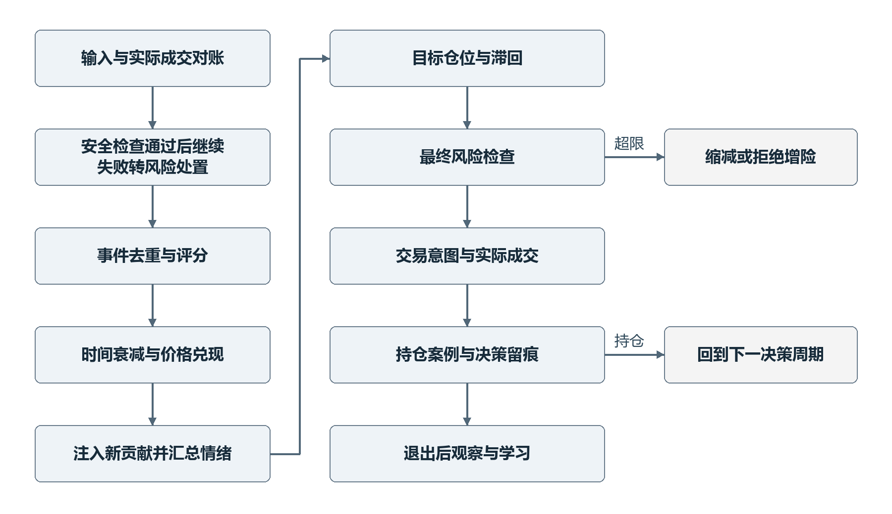
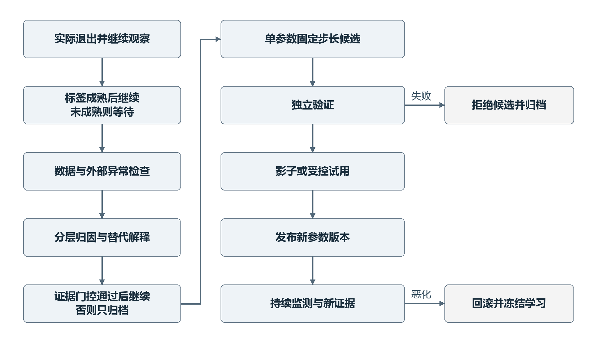
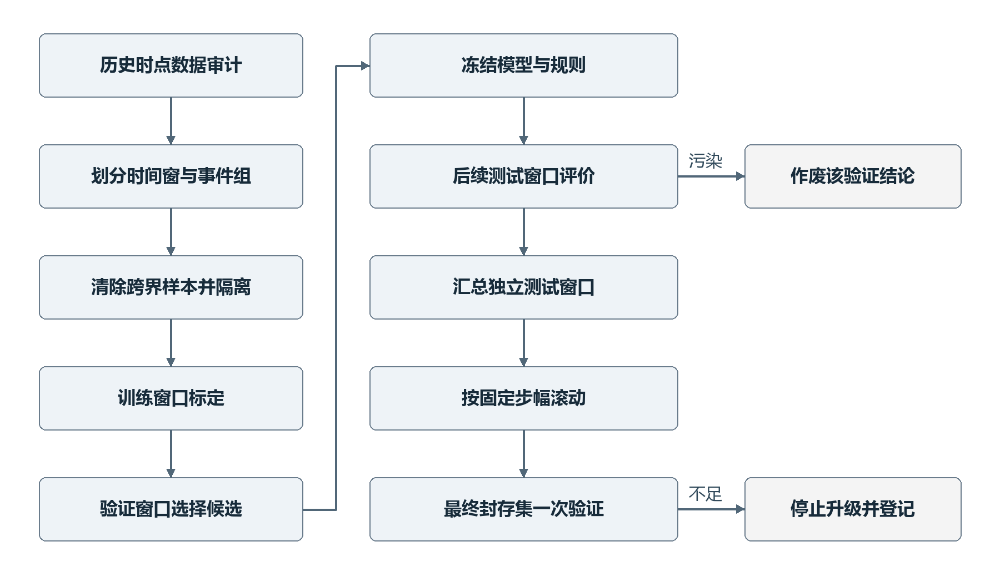

# AI 多因子情绪驱动自适应交易系统要求分析式样书

文档编号：FF-SRS-001

版本：1.0　日期：2026年9月21日　状态：待评审

项目名称：Factorforge

需求来源：doc/用户需求.md，概念需求规格 v0.1。

本文定义交易理论、状态与数学关系、决策流程、风险体系、归因学习、验证方法和验收依据，供需求负责人确认，并作为后续设计、开发与测试的共同基线。核心原则是先评估尚未兑现的情绪，再在独立风险约束下决定仓位；只有证据充分且能够定位误差来源时，才允许有限调整对应参数。

本文的数学模型是供验证的初始规范，不代表交易假设已经得到数据证实。标为“待标定”的数值须通过预先登记的研究与验证流程确定；标为“待确认”的业务选择须在相应阶段准入前确定。任何示例数值均不构成生产参数。

## 目录

<!-- TOC -->

- [1 文档约定与需求管理](#1-文档约定与需求管理)　5
  - [1.1 标准参照与适用边界](#11-标准参照与适用边界)　5
  - [1.2 规范用语与来源属性](#12-规范用语与来源属性)　5
  - [1.3 版本与确认责任](#13-版本与确认责任)　5
- [2 目标与范围](#2-目标与范围)　6
  - [2.1 业务目标](#21-业务目标)　6
  - [2.2 系统边界](#22-系统边界)　6
  - [2.3 运行阶段与参与者](#23-运行阶段与参与者)　6
- [3 术语与数学约定](#3-术语与数学约定)　7
  - [3.1 核心术语](#31-核心术语)　7
  - [3.2 符号与单位](#32-符号与单位)　7
  - [3.3 信息可用性与假设](#33-信息可用性与假设)　8
- [4 系统状态与完整决策流程](#4-系统状态与完整决策流程)　8
  - [4.1 全局状态](#41-全局状态)　8
  - [4.2 决策次序](#42-决策次序)　9
- [5 事件理解与信息增量](#5-事件理解与信息增量)　10
  - [5.1 事件分类与证据](#51-事件分类与证据)　10
  - [5.2 去重与新颖度模型](#52-去重与新颖度模型)　10
  - [5.3 提前计价模型](#53-提前计价模型)　10
  - [5.4 情绪评分数学模型](#54-情绪评分数学模型)　11
- [6 情绪池与生命周期](#6-情绪池与生命周期)　11
  - [6.1 状态转移方程](#61-状态转移方程)　11
  - [6.2 价格兑现函数与防重复消耗](#62-价格兑现函数与防重复消耗)　11
  - [6.3 事件失效与状态不变量](#63-事件失效与状态不变量)　12
  - [6.4 计算示例](#64-计算示例)　12
- [7 市场状态与辅助因子](#7-市场状态与辅助因子)　13
  - [7.1 市场状态识别](#71-市场状态识别)　13
  - [7.2 多因子使用边界](#72-多因子使用边界)　13
- [8 目标仓位与交易行为](#8-目标仓位与交易行为)　13
  - [8.1 情绪映射与滞回](#81-情绪映射与滞回)　13
  - [8.2 风险投影与实际交易量](#82-风险投影与实际交易量)　14
  - [8.3 决策解释与行为规则](#83-决策解释与行为规则)　14
- [9 波动与独立止损](#9-波动与独立止损)　15
  - [9.1 正常噪声估计](#91-正常噪声估计)　15
  - [9.2 止损与规模联动](#92-止损与规模联动)　15
- [10 全局风险控制与异常处置](#10-全局风险控制与异常处置)　15
  - [10.1 风险优先级与限额](#101-风险优先级与限额)　15
  - [10.2 单日最大亏损机制](#102-单日最大亏损机制)　16
  - [10.3 连续亏损与紧急保护](#103-连续亏损与紧急保护)　16
- [11 交易案例与退出后观察](#11-交易案例与退出后观察)　17
  - [11.1 业务记录与关联](#111-业务记录与关联)　17
  - [11.2 观察窗口](#112-观察窗口)　17
- [12 归因与反事实分析](#12-归因与反事实分析)　18
  - [12.1 归因类别与误差定义](#121-归因类别与误差定义)　18
  - [12.2 分层归因流程](#122-分层归因流程)　18
  - [12.3 置信度与多事件贡献](#123-置信度与多事件贡献)　19
  - [12.4 反事实规则](#124-反事实规则)　19
  - [12.5 初始标签与误差计算基线](#125-初始标签与误差计算基线)　19
- [13 受限负反馈与参数学习](#13-受限负反馈与参数学习)　20
  - [13.1 可学习参数与禁止事项](#131-可学习参数与禁止事项)　20
  - [13.2 误差积累与遗忘](#132-误差积累与遗忘)　20
  - [13.3 参数更新门控](#133-参数更新门控)　21
  - [13.4 固定步长更新与参数隔离](#134-固定步长更新与参数隔离)　21
  - [13.5 防震荡与防错误学习](#135-防震荡与防错误学习)　22
  - [13.6 候选验证与发布](#136-候选验证与发布)　22
  - [13.7 收敛与完整学习流程](#137-收敛与完整学习流程)　23
- [14 参数登记与质量要求](#14-参数登记与质量要求)　23
  - [14.1 参数登记表](#141-参数登记表)　23
  - [14.2 时效与可靠性](#142-时效与可靠性)　24
  - [14.3 可审计与变更安全](#143-可审计与变更安全)　24
- [15 评价指标与判定口径](#15-评价指标与判定口径)　25
  - [15.1 预测及子系统指标](#151-预测及子系统指标)　25
  - [15.2 交易和风险指标](#152-交易和风险指标)　25
  - [15.3 学习是否改善](#153-学习是否改善)　26
- [16 回测与滚动样本外验证](#16-回测与滚动样本外验证)　26
  - [16.1 数据与仿真要求](#161-数据与仿真要求)　26
  - [16.2 Walk Forward 流程](#162-walk-forward-流程)　26
  - [16.3 假设验证与停止条件](#163-假设验证与停止条件)　27
- [17 阶段准入与待确认事项](#17-阶段准入与待确认事项)　28
  - [17.1 阶段准入门](#171-阶段准入门)　28
  - [17.2 待确认决策登记](#172-待确认决策登记)　28
- [18 验收规格与需求覆盖](#18-验收规格与需求覆盖)　29
  - [18.1 验收规则](#181-验收规则)　29
  - [18.2 核心不变量检查](#182-核心不变量检查)　31
- [19 原始需求追踪与覆盖](#19-原始需求追踪与覆盖)　31
  - [19.1 用户章节到规格的映射](#191-用户章节到规格的映射)　31
  - [19.2 后续开发读取规则](#192-后续开发读取规则)　33
- [20 参考资料](#20-参考资料)　33

<!-- /TOC -->

## 1 文档约定与需求管理

### 1.1 标准参照与适用边界

本文按 ISO/IEC/IEEE 29148:2018 的需求工程思想组织范围、需求属性、可验证条件和追踪关系，参照 ISO/IEC 25010:2023 组织相关质量要求。此处为项目裁剪后的规格结构，不声明已获得标准认证或完成全条款符合性审计。标准与研究资料见第20章。

成果覆盖与具体技术无关的业务逻辑和数学关系，不规定编程语言、数据库、服务架构、API 或 UI。执行、输入和输出仅定义业务语义。风险约束优先于策略收益目标；无充分数据时允许不交易、不给出确定归因和不学习。

### 1.2 规范用语与来源属性

“必须”和“不得”表示验收约束；“应”表示有明确理由才可偏离的建议；“可以”表示可选能力。“待标定”不允许被实现方自行替换为未经验证的常量。“未知”不等于零，不得被解释为中性、无风险或已通过门控。

需求编号在版本变更后保持稳定，废止编号不复用。REQ 为业务及功能要求，NFR 为质量要求，AC 为验收用例，DEC 为待决事项，PAR 为参数族。每项编号所在小节的公式、边界规则和说明共同构成该项要求；第18章给出测试追踪。未特别标注优先级的编号均为 P0，即进入适用运行阶段前必须满足；研究扩展为 P2，不阻塞初始验证。

来源属性分为 U 和 D：U 表示从用户需求直接细化；D 表示为形成确定、可测试的闭环而补充的设计规则。U、D 均处于本版待评审状态，D 不得被描述为用户已经确认的具体决策。尚未选定的业务政策另列 DEC。

### 1.3 版本与确认责任

| 版本 | 日期 | 变更内容 | 确认状态 |
| --- | --- | --- | --- |
| 1.0 | 2026年9月21日 | 建立完整数学、决策、风控、反馈和验证规格 | 待评审 |

需求负责人确认目标、范围和待决业务政策；研究负责人确认模型可识别性、参数登记和统计验证；风险负责人确认硬限制与异常响应；测试负责人确认验收覆盖及证据。具体人员待指定，不预填审批结果。

REQ-GOV-001〔D，P0〕每次基线变更必须记录变更原因、影响的需求编号、模型与参数版本、验证结果、确认人和生效时间。MD 与 Word 必须使用同一内容基线；章节、正文、表格、公式、图示和附录不得出现语义差异，目录页码及页眉页脚属于版式信息。

## 2 目标与范围

### 2.1 业务目标

REQ-OBJ-001〔U，P0〕系统必须检验事件信息能否形成对后续市场运动有预测意义的剩余情绪状态，并检验根据该状态动态调整仓位是否优于预先定义的对照方案。不得以盈利总额代替对事件、情绪、仓位、执行及学习各模块的独立评价。

REQ-OBJ-002〔U，P0〕系统必须能够回答每次开仓、仓位大小、加减仓、止损、退出、归因、参数修改及不修改其他参数的原因，并以当时可用的数据和有效参数版本重放该解释。文字解释不得与实际触发规则相矛盾。

### 2.2 系统边界

范围内包括事件理解和分类、去重与新颖度、提前计价判断、独立标的情绪池、时间衰减与价格兑现、多因子辅助、目标仓位与滞回、独立止损和组合风险、执行结果对账、完整交易案例、交易后观察、反事实、归因、受限学习和样本外验证。

范围外包括收益承诺、市场操纵策略、具体技术选型、UI、API、部署结构，以及直接套用普通 PID 控制器。实际交易市场、资产类别、交易频率、资金规模和交易渠道尚未指定，须在 DEC-01 至 DEC-04 中确认。首个验证基线以具有连续正价格的线性现货类资产为数学适用域；非线性衍生品、负价格资产及复杂合约须扩展损益、风险与价格模型后另行验收。

### 2.3 运行阶段与参与者

| 阶段 | 主要任务 | 允许行为 | 退出条件 |
| --- | --- | --- | --- |
| R0 研究回放 | 清洗数据与检验核心假设 | 历史仿真，禁止真实委托 | 第16章验证通过 |
| R1 影子运行 | 检查实时信息可用性和决策稳定性 | 生成建议并记录，不发真实委托 | 数据与决策时效达标 |
| R2 模拟交易 | 验证持仓、执行和反馈闭环 | 受控模拟撮合 | 第18章全部适用 P0 通过 |
| R3 有限实盘 | 验证真实执行与成本偏差 | 经确认的小风险额度 | 事前登记观察期达标 |
| R4 受控扩展 | 扩大经验证的覆盖 | 按批准的风险预算逐步扩展 | 持续监测，无自动无限扩仓 |

REQ-GOV-002〔D，P0〕运行阶段不得因单次盈利自动升级。研究负责人负责模型证据，风险负责人负责交易准入，操作人员负责启停和异常处置；学习流程无权修改硬风险上限、运行阶段或审批权限。

## 3 术语与数学约定

### 3.1 核心术语

| 术语 | 定义 |
| --- | --- |
| 事件族 | 同一经济事实及其报道、转载、修订的归并集合 |
| 事件贡献 | 事件对单个标的、单个方向形成的可衰减情绪存量 |
| 情绪池 | 某标的所有有效贡献的有符号合计及组成账本 |
| 价格兑现 | 以可观测价格代理估计预期被吸收的程度，不等同于可证明的因果效应 |
| 归因 | 对预测或决策误差来源的证据分解，允许多原因或无法确定 |
| 独立样本单元 | 经事件族、时间重叠和共同驱动聚合后的证据单元 |
| 反事实 | 改变一个决策条件后的模拟路径，不计入真实损益 |
| 硬限制 | 不可由策略或学习解除的安全约束 |
| 参数快照 | 某次决策生效的完整参数集合及版本 |
| 成熟案例 | 已退出且观察窗口及必要标签均已结束的案例 |

### 3.2 符号与单位

| 符号 | 含义与域 |
| --- | --- |
| a、i、k、z | 标的、贡献、事件类型、市场状态索引 |
| t、Δt、h_i | 决策时刻、经过时间、半衰期；统一时间单位 |
| d_i | 事件方向，取 -1、0、+1 |
| b_i、m_i、S_a | 初始强度、剩余幅度、净情绪；均为情绪点 |
| c_i、r_i、n_i、u_i | 可信度、相关性、新颖度、未预期程度；取 [0,1] |
| w_k、g_z | 类型权重、状态修正；非负无量纲 |
| P_a、q_a、V | 价格、带符号实际数量、组合净资产 |
| x_a | 目标风险暴露占净资产比例；多为正，空为负 |
| θ_j、Δ_j | 第 j 个可学习参数及其固定更新步长 |
| clip(v,l,u) | 将 v 限制在闭区间 [l,u] |
| ε | 数值保护常量，仅用于数值稳定，不替代业务阈值 |

REQ-DAT-001〔D，P0〕所有时间必须同时保留统一时标与交易所业务日期，区分事件发生、首次公开、系统接收、完成理解、决策和成交时间。可用于决策的最早时刻为实际可用时间，不得用事件发生时间替代接收或处理时间。相同时间戳按预先固定的事件序和唯一编号排序。

REQ-DAT-002〔D，P0〕金额、收益、数量、汇率和情绪点必须显式区分单位。净资产、价格或关键输入无效时禁止计算新增风险仓位。前复权价格只可按当时已知的公司行动构造；撮合和损益必须采用当时可交易价格及相应数量调整。

### 3.3 信息可用性与假设

事件评分、市场状态、波动估计和基准回归仅使用决策时刻以前可用的数据。事件未来有效性、持仓结果和交易后价格只能用于事后评价及成熟后的学习，不能回填历史决策。情绪不是可直接观测的真实物理量，其强度、生命周期和兑现误差均须声明代理标签与可识别范围。

## 4 系统状态与完整决策流程

### 4.1 全局状态

REQ-STA-001〔D，P0〕系统必须维护以下状态，并保存触发原因与解除依据。多条件同时发生时，执行更严格的动作约束。

| 状态 | 允许动作 | 进入与退出规则 |
| --- | --- | --- |
| 初始化 | 读取和校验、对账，不增加风险 | 必要数据、参数和持仓一致后进入正常 |
| 正常 | 按策略及全部风险限制决策 | 异常触发时立即退出 |
| 降级 | 可观察及按可靠数据减险，不增加风险 | 非核心能力失效；恢复需连续健康验证 |
| 风险锁定 | 取消增险意图，仅允许减险 | 日亏损或硬限触发；不得靠重启解除 |
| 紧急处置 | 按预定安全政策撤单和减仓 | 严重异常或人工紧急触发 |
| 恢复核验 | 对账与状态重建，不增加风险 | 数据、成交、风险锁及参数一致后才可恢复 |

REQ-STA-002〔D，P0〕每个标的必须同时维护实际仓位、未完成交易意图和策略目标仓位。策略目标变化不代表已成交；风险判断必须包含实际持仓和仍可能成交的未完成增险量。每个贡献保存剩余幅度、生命周期状态、价格高水位和历史扣减；每个案例独立记录持仓状态与观察学习状态。

### 4.2 决策次序

REQ-STA-003〔U+D，P0〕每个决策周期必须按以下顺序处理：先接收成交并对账，检查硬风险和保护性止损；再锁定本周期可用的数据快照，处理去重、失效及新信息；对旧贡献按时间衰减和价格兑现更新，再注入本周期新贡献；随后汇总情绪、识别状态、计算滞回仓位、施加风险上限、形成交易意图，并记录解释。新贡献不得消耗其可用时间之前已经发生的价格变动。

图1路径定义：输入与成交对账 → 安全检查。安全检查失败 → 风险处置 → 留痕与恢复核验；通过 → 事件去重与理解 → 情绪状态更新 → 仓位与滞回 → 最终风控 → 交易意图与实际成交 → 案例记录。持仓期间回到下一决策周期；退出后转入观察归因与受控学习。

REQ-STA-004〔D，P0〕同一时点出现止损、新利好和加仓信号时，必须先执行保护动作。本周期不得因情绪增强重新建立刚被强制关闭的风险暴露。重新进入至少要求风险状态恢复、重入冷却结束，并形成新的有效决策依据。

## 5 事件理解与信息增量

### 5.1 事件分类与证据

REQ-EVT-001〔U，P0〕事件分类必须可扩展，并为每类保存独立参数和版本。完整候选分类包括公司业绩、业绩指引、分析师评级、产品发布、重大订单、供应链变化、管理层变化、资本支出、股票回购、融资、监管事件、诉讼、宏观经济数据、货币政策、财政政策、行业景气、竞争对手事件、技术突破、地缘政治、市场异常事件。初期启用的少量类型由 DEC-05 确定，未启用类型记录但不自动交易。

REQ-EVT-002〔U+D，P0〕每个事件必须保留原始证据、来源标识、时间、事实摘要、目标标的、类型、方向、基础强度、可信度、相关性、新颖度、未预期程度和预期影响期限。AI 必须分别给出事实证据与推断，不得将自述置信度直接作为经过校准的概率。字段缺失、超界、证据无法核验或输出矛盾时，事件进入隔离状态，不得形成新增情绪。

### 5.2 去重与新颖度模型

REQ-EVT-003〔U+D，P0〕去重必须先匹配发行主体、经济事项、发生期间和关键事实，再评估文本近似程度。相同事件族的转载、译文和摘要只更新来源记录，不得再次完整注入。单一文本相似度不得覆盖语义差异；“传闻”“官方确认”“金额修订”“事件撤销”必须保存事实版本关系。

新颖度定义为新增事实权重占本次事实总权重的比例：n_i = 新增且可核验事实权重之和 / 本次可核验事实权重之和。分母为零时 n_i 无效并隔离。事实权重由类型评分量表确定，量表只能在训练阶段标定。完全重复的 n_i = 0；同一事实增加媒体数量不构成新事实。

REQ-EVT-004〔D，P0〕仅提升可信度的官方确认可以重新评估该事件族当前剩余贡献，但不得重置年龄或价格高水位。修订影响必须作为带版本的差额调整记录：修订后剩余值由原始有效时间和已发生消耗重新计算，调整量等于修订后与修订前剩余值之差。实质新增事实建立关联子贡献，计入事件族幅度上限；撤销旧事实须先将相关旧贡献失效，再单独评价新事实，防止双重记账。

### 5.3 提前计价模型

REQ-EVT-005〔U+D，P0〕提前计价判断必须同时记录事前预期证据与事件可用前的价格异常运动。基本式为 u_i = (1-e_i) × (1-p_i)，其中 e_i 是基于当时公开预期与事件意外程度的预期覆盖率，p_i 是尚未由 e_i 覆盖的事前价格反应比例；两者均取 [0,1]。不得将同一条价格证据同时写入 e_i 和 p_i。缺少事前共识或可靠价格时不得默认 u_i = 1。

初始价格代理为 r_pre = ln(P_available/P_pre) - β × r_benchmark；p_i = clip(max(0,d_i × r_pre)/ρ_pre,k,0,1)。P_pre 是预先规定观察窗的起点价格；ρ_pre,k > 0 是训练段内标定的充分反应尺度；β 和基准选择在事前冻结。没有有效基准时可使用绝对收益代理，但须单独标记并验证。该代理不证明价格由该事件造成。

未知 e_i 或 p_i 时记录区间 [u_low,u_high]；初始交易规则采用 u_low。区间下界无法建立时不凭该事件增加风险；研究回放可以保留完整区间做敏感性分析。与原始“利好”标签相比，u_i 较低必须降低而不能提高新增正向情绪。

### 5.4 情绪评分数学模型

REQ-EVT-006〔U+D，P0〕在贡献生效时计算 A_i = min(A_cap,k, b_i × c_i × r_i × n_i × u_i × w_k × g_z)，初始有符号贡献为 d_i × A_i。b_i ≥ 0，w_k ≥ 0，g_z ≥ 0，A_cap,k > 0。方向为零或任一乘数为零时不产生方向性注入；负面事件使用 d_i = -1，不允许负权重造成二次反向。

类型权重必须可区分正负方向、标的分组和市场状态，但初期只启用有足够独立样本支持的最少分组。无样本分组继承已验证的上层参数并标明继承关系，不能因分组稀疏任意放大权重。每类保存基础权重、典型持续时间、历史方向表现、正负不对称、状态有效程度与兑现速度。

REQ-EVT-007〔D，P0〕事件评分和所有参数必须在首次用于决策时冻结为快照。后续模型版本不得回写旧评分。单事件、事件族和标的总幅度均须设置上限；多个相关标的可共享事件证据，但不能被当作完全独立的学习样本。

## 6 情绪池与生命周期

### 6.1 状态转移方程

REQ-SEN-001〔U+D，P0〕每个标的必须维护贡献账本，不能只存净值。设周期开始时贡献剩余幅度为 m_i(t-) ≥ 0，采用连续时间指数衰减：m_i^time = m_i(t-) × 2^(-Δt/h_i)，h_i > 0。时间消耗 C_i^time = m_i(t-) - m_i^time。默认以自然经过时间计算，包含非交易时段；采用交易时间时须作为独立配置重新验证。

价格消耗完成后 m_i(t) = max(0,m_i^time-C_i^price)。已失效贡献直接置零并将差额记录为 C_i^invalid；新贡献在本周期旧贡献更新结束后建立。净情绪 S_a(t) = Σ_i d_i × m_i(t)。同时记录 S_plus = Σ_{d_i=+1} m_i、S_minus = Σ_{d_i=-1} m_i，故 S_a = S_plus-S_minus。

REQ-SEN-002〔U+D，P0〕反向事件只通过新建反向贡献抵消净情绪，不删除正向贡献或再额外扣减一次。例如 +60 与 -30 的净值为 +30，正负组成必须仍可查。价格、时间和失效各渠道对同一单位情绪不得重复扣除；剩余幅度不得变成负值，衰减不得将方向翻转。

### 6.2 价格兑现函数与防重复消耗

REQ-SEN-003〔U+D，P0〕初始价格兑现采用方向高水位增量代理。对每个贡献从其可用时刻起累计异常对数收益 R_i(t)；定义 H_i(t) = max(H_i(t-), max(0,d_i × R_i(t)))，初值为0，ΔH_i = H_i(t)-H_i(t-)。只有 ΔH_i > 0 时才有新的兑现证据。上涨、回撤、再涨到原高位不得对同一价格区间再次扣减；不利运动不自动补回已耗尽情绪。

多事件共享同一标的价格运动时，先按方向合并可用的新增证据 v_d = max_i ΔH_i；形成该方向本周期总消耗预算 B_d = κ_a,z × v_d，κ_a,z 为“情绪点/单位对数收益”。再在 ΔH_i > 0 的同向有效贡献中按 ω_i = m_i^time × η_k × ΔH_i 分配预算，η_k > 0 为相对兑现速度。C_i^price 不得超过 m_i^time；受限后余量按同一规则重新分配，直至预算用完或无可消耗贡献。若 Σω_i = 0，总消耗为0。

此模型要求 Σ C_i^price ≤ B_d，并防止每条新闻都完整解释同一段涨幅。多个事件的分配是待验证的估计，不能视为已确认的因果贡献；高重叠而不可识别的案例只可用于事件簇级评价。时间衰减先执行，价格预算只作用于衰减后的存量。η 的整体尺度必须固定：选定参考类型并令 η_ref = 1，禁止学习该锚点，其他类型相对其标定，避免整体缩放相对权重却不改变分配的不可识别性。仅单一类型有有效贡献时，η 不可识别，不得利用该样本更新 η。

REQ-SEN-004〔U+D，P0〕情绪兑现不得依赖是否真实持有仓位，空仓时同样更新；实际交易盈亏不进入上述消耗公式。价格缺失时继续计算时间衰减，暂停价格消耗和相关新增风险；数据恢复后仅处理未记录的高水位增量，不追溯修改已发出的真实决策。

### 6.3 事件失效与状态不变量

REQ-SEN-005〔U+D，P0〕事件被证伪、撤销、超过最大寿命或贡献低于经登记的清理阈值时，将其剩余值按原因清除并留存完整历史。部分失效须引用被撤销的事实及比例；不得因交易止损就认定事件失效。已失效贡献不得由旧消息重放复活。

贡献账本必须满足：期末幅度 = 期初幅度 + 新注入 + 修订净调整 - 时间消耗 - 价格消耗 - 失效清除。差额超过 PAR-NUM 容差即为情绪模型异常，阻止该标的新增风险。饱和上限超出部分单独登记为拒收量，不能被静默丢失或在未来恢复时再次注入。

### 6.4 计算示例

以下数值仅用于验收，不构成参数建议：初始正向贡献60，经过一个半衰期且无新消息后剩余30；随后本周期价格消耗预算10且仅有该贡献，则剩余20。另有新负向贡献12时，正向20、负向12、净值8。若正向事件随后被撤销，净值变为-12，而不是将整个池清零。

两个同向贡献分别为40和20，分配权重比为2比1，总价格预算12时分别消耗8和4，总消耗12。重复接收同一价格快照，高水位不变，总新增消耗必须为0。

## 7 市场状态与辅助因子

### 7.1 市场状态识别

REQ-REG-001〔U+D，P0〕市场状态必须采用多维描述，至少覆盖上涨、下跌、横盘，高波动、低波动，风险偏好增强或下降，行业强弱及极端异常。不同维度可同时成立，不把“上涨”和“高波动”错误地设为互斥类别。状态识别仅使用已完成且已可用的观察数据。

初始可检验模型为：趋势量 T = 已完成窗口累计基准收益/窗口波动尺度；波动量 W = 当前稳健波动/长窗稳健波动；风险偏好和行业相对强度使用预先登记的观测指标。各维度阈值、窗口和最小驻留时间归入 PAR-REG。状态不确定或样本不足时标记 UNKNOWN，采用已批准的最保守风险上限，不借用表现最好的状态参数。

REQ-REG-002〔D，P0〕状态切换必须有确认窗口或置信门槛与滞回，避免每根 K 线切换。切换后旧贡献不追溯放大；原始注入快照保持不变，新的风险修正可降低现有仓位。旧状态样本按遗忘机制降权；新状态样本不足时冻结自学习，直至积累足够新证据。

### 7.2 多因子使用边界

REQ-FAC-001〔U，P0〕辅助因子候选包括价格趋势、成交量、波动率、市场广度、行业走势、相关资产、指数、估值、资金流、期权市场、宏观数据和技术因子。每个启用因子必须声明用途：可信度修正、仓位修正、状态识别或提前计价。相同价格信息在多个环节使用时必须记录依赖，验证是否产生重复惩罚或虚假的独立证据。

REQ-FAC-002〔U+D，P0〕初期不为增加复杂度而扩大因子数量。新增因子必须有样本外增量收益或风险改善证据，经过移除该因子的对照试验，并登记数据可用时点、缺失政策和参数自由度。未通过者停用，其历史试验仍计入多重比较记录。

## 8 目标仓位与交易行为

### 8.1 情绪映射与滞回

REQ-POS-001〔U+D，P0〕目标方向由 S_a 的符号决定。初始映射采用有限等级 L = 0…K，仓位比例 v_0 = 0 ≤ v_1 < … < v_K；每级设进入阈值 U_l 与退出阈值 D_l，满足 0 ≤ D_l < U_l，且两组阈值均随等级递增。观察区与小情绪区均对应零仓位，可以记录不同观察标签。阈值和等级比例均待标定。

以 E = abs(S_a) 为输入：当前等级 l 上升时，只有 E ≥ U_(l+1) 才可升级；下降时，只有 E < D_l 才降级；跨越多级时可逐级计算到稳定等级。边界 E = D_l 时维持原等级。方向不变且处于滞回区内时，不得仅因小幅波动反复加减仓。若净方向翻转，旧方向目标先归零，实际平仓确认后才评估新方向等级。

REQ-POS-002〔U+D，P0〕初始候选暴露 x_raw = sign(S_a) × v_L × f_vol × f_liq × f_conf，其中各修正因子取 [0,1]。f_conf 应包含正负冲突折扣 abs(S_a)/(S_plus+S_minus+ε) 及有效证据质量；无冲突且证据充分时可取1。低波动不得通过修正因子无限放大仓位；仓位受硬上限约束，信号越强不代表必须增加风险。

初始函数为 f_vol = min(1,σ_ref/max(σ_current,ε))；f_liq = min(1,B_liq/max(V × v_L,ε))；f_conf = Q_pool × abs(S_a)/(S_plus+S_minus+ε)。σ_ref 为训练段冻结的基准波动，B_liq 为按近期有效成交额、批准的参与率及保守退出时间确定的可承受暴露金额，Q_pool 为按剩余幅度加权的事件证据合格评分。全部按同一周期和币种计算，缺少可靠成交或证据时相应修正取0；风险层仍需按实际未完成交易量再次检查流动性，不把此处折扣视为豁免。

### 8.2 风险投影与实际交易量

REQ-POS-003〔U+D，P0〕最终目标必须位于所有已批准风险限制的可行集合中。先逐标的裁剪单标的、流动性、止损损失和卖空能力上限，再对同时产生的候选新增风险应用统一比例缩减 α ∈ [0,1]，使组合总暴露、净暴露、行业与相关性分组限额及压力损失全部合格。选取满足约束的最大 α；新增风险为零仍违规时进入减险流程，不依靠新增对冲掩盖硬限。风险计算和缩减顺序必须确定且可重放。

目标数量 q_target = 按交易单位向零取整(x_target × V / P_a)。不同币种先按有效汇率换算为基础币种；费用、融资和空头借券条件纳入约束。新增交易意图 Δq = q_target-q_actual-q_pending_equivalent，其中未完成意图只计入同一目标下仍有效的预期数量；替换目标时先确认撤销或纳入最坏同时成交风险。不得把撤单申请当作撤单已成功。

REQ-POS-004〔D，P0〕目标净情绪为负而市场不允许卖空时，只可减少已有多仓到零并记录“卖空不可用”，不得模拟为真实空仓成交。最小交易单位导致目标无法实现时向低风险方向取整，实际零仓位可以与非零理论目标并存，原因必须明确。

### 8.3 决策解释与行为规则

REQ-POS-005〔U+D，P0〕每次决策必须输出事件与贡献编号、剩余情绪、提前计价依据、原等级与新等级、原始目标、每项风险裁剪、最终目标、实际与未完成数量、止损依据、参数版本及理由码。无交易也要记录原因，例如证据不足、滞回保持、量级不足、风险锁定或交易能力不足。

REQ-EXE-001〔D，P0〕交易意图必须可唯一识别，重复处理同一意图不得产生重复新增交易。实际状态须区分未执行、部分成交、全部成交、撤销、拒绝和结果未知。成交后按实际价格、数量和费用更新风险；结果未知时停止该标的新增风险并对账。

REQ-EXE-002〔D，P0〕普通仓位调整须满足最小调整量与冷却期，防止价格、净资产变化造成无意义频繁交易；硬止损和强制减险不受此限制。不得按理论止损价、收盘价或完整成交假设掩盖跳空、停牌、部分成交和流动性不足。未完成强制退出必须持续暴露实际剩余风险并告警。

## 9 波动与独立止损

### 9.1 正常噪声估计

REQ-STP-001〔U+D，P0〕止损模型必须独立于情绪强弱。正常波动基线仅使用已完成 K 线，先处理异常值、缺失和公司行动。初始候选尺度 N_a 为最近 W 根已完成 K 线的真实振幅相对前收盘比值的稳健分位数；真实振幅为当根高低差、最高与前收盘差的绝对值、最低与前收盘差的绝对值三者最大值。W 与分位数待标定。

初始距离比例 δ_a = max(k_stop × N_a, δ_micro)，k_stop > 0 为安全偏差，δ_micro 覆盖最小价格变动和可交易价差。初始止损距离 D_a = P_entry × δ_a。若 δ_a 超过获批的最大允许距离，不强行缩窄止损，而是降低数量或不交易。异常波动与正常噪声必须分开标记，不得将极端跳空直接用于放宽正常止损。

### 9.2 止损与规模联动

REQ-STP-002〔U+D，P0〕单笔预估损失 L_trade = abs(q) × D_a + 保守退出费用 + 滑点及跳空准备金。新增数量必须使该值及组合压力损失不超过相应预算。止损不是损失保证；无法估计可交易价格或预估退出损失时不得新增风险。

多仓触发条件为有效可执行卖价或已批准价格代理 ≤ P_entry-D_a；空仓为有效可执行买价或代理 ≥ P_entry+D_a。不同市场可用报价和触发口径在 DEC-04 中冻结。仅有 K 线的回放必须使用第16章的区间内成交保守规则。

REQ-STP-003〔D，P0〕初期对存续仓位不因亏损扩大止损距离。参数学习形成的新 k_stop 仅适用于生效后的新风险批次；存量仓位只能维持或收紧保护，收紧不得增加预估最大风险。加仓建立独立风险批次并重新检查组合预算；实际持仓可合并展示，保护与归因仍须保留批次关系。

REQ-STP-004〔U+D，P0〕止损触发必须保存正常振幅、距离、触发行情、实际成交、偏差成本和当时情绪组成。退出后进入观察，不自动清空仍有效的事件，也不自动修改方向或止损参数。是否为止损过窄须按第12章完成证据评价。

## 10 全局风险控制与异常处置

### 10.1 风险优先级与限额

REQ-RSK-001〔U，P0〕风险层优先级高于情绪、仓位和学习。至少配置单标的最大暴露、组合总与净暴露、单笔最大风险、单日最大亏损、连续亏损保护、异常波动保护、数据异常保护和情绪模型异常保护，并覆盖流动性、相关资产集中度与压力损失。限额不得由自学习流程自动放宽。

REQ-RSK-002〔D，P0〕组合总暴露使用 Σ abs(q_a × P_a)/V，净暴露使用 abs(Σ q_a × P_a)/V；按基础币种统一计算。杠杆、卖空、合约乘数及集中度按已批准资产规范处理。相关性估计不足时采用保守分组集中度限制，不假设资产相互独立。硬限检查包含所有可能成交的未完成增险意图。

### 10.2 单日最大亏损机制

REQ-RSK-003〔U+D，P0〕交易日损益以该风险日开始净资产 V_start 为基准，Π_day = V_marked(t)-V_start-净外部资金流入，亏损 L_day = max(0,-Π_day)。净资产包含已实现及未实现损益、费用、融资和有效汇率换算；日亏损比例为 L_day/V_start。不得通过平仓、转账、进程重启或拆分案例重置限额。

当 L_day 达到金额限额或比例限额中的任何一个有效阈值时，立即锁定本风险日，取消所有增险意图并拒绝新风险。价格失真或净资产无法可靠计算时按数据异常锁定，不将亏损当作零。风险日使用账户级统一时区和边界，多市场跨日不得获得额外预算。

REQ-RSK-004〔U+D，P0〕锁定后已有仓位如何处理由 DEC-06 在准入前选择并冻结：仅保留原保护且禁止增险；有序减至保守限额；或在可交易条件下全部退出。研究阶段必须比较三种政策。未选定政策时不得进入真实交易阶段；测试保守基线采用取消增险并按可交易性有序减仓。风险锁当日不得因浮盈恢复自动解除，下一风险日也须先完成对账和健康核验。

### 10.3 连续亏损与紧急保护

REQ-RSK-005〔U+D，P0〕连续亏损按预定交易案例聚合口径计算，不以部分成交拆单重复计数。达到阈值后进入冷却或降低风险额度，恢复依据为时间和健康检查，不能以“追回亏损”为目标加仓。突发跳空、流动性枯竭、价格无效、情绪账不平或参数损坏必须触发相应保护。

| 异常类别 | 即时处理 | 恢复证据 |
| --- | --- | --- |
| 新闻理解失效 | 隔离新事件，旧贡献继续可靠的衰减与风控 | 合格评分恢复且重复风险已核查 |
| 行情过期或断流 | 禁止新增风险，采用可验证的保护路径 | 时间连续、价格一致、持仓对账 |
| 情绪数值异常 | 冻结受影响标的决策与学习 | 账本重放一致且原因消除 |
| 执行状态未知 | 停止重复发出交易意图，核对实际成交 | 持仓及未完成意图一致 |
| 极端市场或流动性不足 | 按紧急政策撤单、减险并暴露未退出风险 | 流动性恢复且风险负责人允许恢复 |
| 参数或模型版本异常 | 冻结更新，回到已验证快照 | 快照完整与行为回放通过 |

REQ-RSK-006〔D，P0〕人工紧急停止不得被策略自动解除。重启必须恢复风险锁、实际仓位、未完成意图、贡献账本、观察案例和参数快照；任何重建不一致进入恢复核验。异常期间仍须保留日志，不能以日志失败为由继续增险。

## 11 交易案例与退出后观察

### 11.1 业务记录与关联

REQ-CAS-001〔U+D，P0〕完整案例以一次方向性持仓周期为主体，包含期间各风险批次，并关联事件族。相同经济事件引起的多资产或重复入场案例必须归入关联组，不能作为相互独立的训练样本。无真实持仓的影子决策同样保存，但须与真实交易明确区分。

| 记录对象 | 必须保存的信息 |
| --- | --- |
| 事件及评分 | 原始证据、时间、族与修订关系、类型、各评分因子、评分与模型版本 |
| 决策快照 | 交易前市场状态、情绪总值及组成、提前反应、目标与实际仓位、全部裁剪原因 |
| 持仓过程 | 入场理由、止损依据、新事件、情绪变化、价格兑现、实际成交与费用 |
| 退出与表现 | 退出原因、净损益、最大有利与不利运动、最大风险、交易后表现 |
| 反馈证据 | AI 归因、证据和置信度、多原因及未知、反事实、标签可用时间 |
| 参数决策 | 是否调整、门控结果、未调整原因、参数前后值、版本、回滚关联 |

REQ-CAS-002〔D，P0〕案例退出以实际相关持仓归零为准，不能以发出平仓指令为准。部分退出保留在同一案例下。价格表现与成交损益分别记录，前者按价格路径计算，后者使用实际数量、费用和资金变动。

### 11.2 观察窗口

REQ-OBS-001〔U+D，P0〕每个案例在入场时冻结退出后观察窗口规则：H_obs = clip(λ_obs × h_ref,H_min,H_max)，h_ref 为当时主导事件的半衰期；无单一主导事件则使用已登记的组合规则。实际观察截止为退出时刻加 H_obs。窗口不得因结果好坏事后缩短或延长以获得理想标签。

窗口内记录方向调整后的价格路径、基准相对收益、最大有利与不利运动、恢复时间、新外部事件及可交易性。停止数据覆盖、退市或观察窗未结束时标记删失或未成熟，不能当作零收益。标签成熟前不得进入参数更新证据池。

REQ-OBS-002〔U+D，P0〕止损后恢复原方向只能提高“止损过窄或时机不当”的可能性，不能单凭该现象确诊；盈利退出后继续上涨也不能自动确认兑现过快。须同时检查新事件、市场状态、成本和基准运动，不能将事后新信息归功于旧模型。

## 12 归因与反事实分析

### 12.1 归因类别与误差定义

REQ-ATR-001〔U，P0〕归因至少允许：方向正确或错误、强度高估或低估、生命周期高估或低估、兑现速度错误、开仓过早或过晚、止损过窄或过宽、正常市场噪声、市场状态改变、外部突发事件、重复新闻误判、提前计价遗漏、执行问题及无法确定。可存在多个候选原因；“无法确定”是有效结果，不得强制选取唯一解释。

REQ-ATR-002〔D，P0〕每类可调整误差须有预先冻结的代理目标和符号定义：方向误差来自事件后固定窗的成本门槛外异常收益方向；强度误差来自初始情绪预测的收益代理与观测代理之差；生命周期误差来自影响持续时间代理之差；兑现误差来自退出后原事件可解释的剩余运动。代理无法识别时该项误差记为未知，不可用真实盈亏代替。

方向代理的中性带、强度到收益的映射、生命周期终止条件和观察窗在 PAR-LABEL 中登记。方向正确率必须同时报告可判定覆盖率；只评价易判断案例而隐藏未知样本不合格。止损误差需在相同入场信息与匹配风险预算下比较保护方案，不把更宽止损带来的更大风险误认为模型改善。

### 12.2 分层归因流程

REQ-ATR-003〔U+D，P0〕归因顺序固定为：数据与执行真实性检查 → 外部异常与制度变化检查 → 去重及提前计价检查 → 方向与强度 → 生命周期与兑现 → 入场退出时机 → 止损。先发现的问题不必然排除其余原因，但未排除的上游污染必须阻止相关下游参数更新。

图2路径定义：实际退出 → 交易后观察 → 标签成熟检查。未成熟则等待；成熟后进行分层归因 → 证据门控。证据不足或原因不明则只归档；通过后生成单参数候选 → 独立验证 → 影子或受控试用 → 生效监测。验证不通过则拒绝候选，生效后恶化则回滚；所有路径保留证据与版本。

### 12.3 置信度与多事件贡献

REQ-ATR-004〔U+D，P0〕归因置信度不得由 AI 的单一自评值决定。初始门控置信度 C_attr = min(C_data,C_label,C_isolation,C_stability)，分别衡量数据质量、标签可靠性、与其他原因分离程度及结论稳健性，均为经过核验的 [0,1] 评分。具体量表必须与人工审核样本校准，未校准时只生成候选解释、不自动学习。该最小值是保守质量门槛，不声明等于真实因果概率。

REQ-ATR-005〔U+D，P0〕重叠事件首先按共同经济驱动聚类。可识别时使用预先设定的背景基准与逐簇移除对照估计边际贡献；不可识别时只保存簇级误差或未知。多事件的分配总量不得超过该案例可分配的观测运动，剩余量归为市场或未知，不强行分尽。贡献解释的排列或基准选择改变即翻转的结论须降低 C_stability。

### 12.4 反事实规则

REQ-CFT-001〔U+D，P0〕至少支持四类反事实：无策略止损但仍受硬风险约束、延迟入场、提前或延迟退出、更宽止损且按同一风险预算降低仓位。每次只改变一个被研究的决策因素，保留其他事前条件、费用、流动性和执行延迟，记录情景假设。

REQ-CFT-002〔U+D，P0〕反事实必须与真实结果分别保存、分别汇总；不得进入真实净值、收益或胜率。反事实可以利用完整事后路径形成诊断标签，但任何模拟决策在其模拟时刻仍只能使用当时可用的信息，不得在全路径最高点选择“最佳退出”。没有逐笔数据时须给出价格路径歧义上下界，歧义足以改变归因时不更新参数。

REQ-CFT-003〔D，P0〕反事实属于观察性证据，不能单独证明因果关系。新外部事件、状态突变或不可成交使情景失真时，标记无效或降低置信度。安全止损从不因反事实结果而取消；反事实“无止损”仅用于研究且保留硬风险边界。

### 12.5 初始标签与误差计算基线

方向标签以事件可用时刻 τ 为起点，取事前登记的 H_label，计算 Y = ln(P_(τ+H_label)/P_τ)-β × r_benchmark。若 abs(Y) ≤ 成本门槛加噪声带，则标为中性；否则标签为 sign(Y)。方向评价只在标签可用后执行。预测方向与标签相同为正确，不同为错误，中性与删失不进入准确率分母，但必须计入覆盖率分母。

强度预测代理为 Y_hat = d_i × γ_k × A_i，γ_k ≥ 0 在训练段拟合后冻结。初期只对可隔离事件或事件簇评价，误差为 abs(Y_hat)-max(0,d_i × Y)；方向明显错误时优先归入方向问题，不借由单纯降低强度掩盖方向错误。γ_k 与 w_k 不得同时在线学习，否则强度尺度不可识别。

生命周期初始代理使用固定分桶的方向异常收益序列。将大于噪声带的正向桶收益累加，累计达到观察窗内总正向桶收益的预设比例 χ 时的经过时间记为 H_proxy；χ ∈ (0,1)，在训练前登记。模型代理时长 H_hat = -h_i × log2(1-χ)。总正向运动不足、后续外部事件占主导或窗口末仍持续显著运动时记为未知或右删失，不能据此更新 h。该定义衡量运动集中时间，不宣称测得真实情绪寿命。

退出兑现代理取 Z_post = d_i × [ln(P_(exit+H_obs)/P_exit)-β × r_benchmark,post]，只使用无重大新事件且原因可分离的观察段。Z_post 持续大于成本与噪声门槛支持“退出过早”的候选解释；反向运动支持退出较及时，但仍需与入场时机、h 和仓位映射的替代解释区分。

置信度初始量表将每个 C 分量定义为预先列明的核验项加权通过率；任一关键核验项失败则对应分量为0。C_data 核验时间、证据、价格与成交完整性；C_label 核验成熟性、非删失和代理稳定；C_isolation 核验共同驱动及替代解释；C_stability 核验合理窗口、成本与基准扰动下修正方向的一致性。核验项、权重和关键项由审核样本冻结，AI 不能自行声称核验通过。

## 13 受限负反馈与参数学习

### 13.1 可学习参数与禁止事项

REQ-LRN-001〔U+D，P0〕初期可学习集合限制为事件类型权重 w_k、半衰期 h_k、价格兑现尺度 κ、相对兑现速度 η_k 和止损安全偏差 k_stop；实际启用子集须登记。评分校准、仓位等级或状态识别参数的改变作为独立研究版本，不与在线小步学习混在同一周期。硬风险上限、日亏损锁、业务权限及数据真实性规则永不进入学习集合。

所有可学习参数必须具有初值、单位、上下限、固定 Δ_j、证据门槛、更新周期、最大累计漂移、冷却期、版本和回滚点。没有完整登记的参数只能用于隔离研究，不能自动生效。正负方向、事件类型、标的分组和状态的层次应尽量少；置信不足时优先维持或继承，禁止为解释每笔亏损新增参数。

### 13.2 误差积累与遗忘

REQ-LRN-002〔U+D，P0〕每个参数 j 的误差来源只接受已经成熟、归因合格且具有对应敏感性的独立样本单元。将代理误差转成有界修正压力 e_j,g ∈ [-1,1]：正值表示有证据需要增大该参数，负值表示需要减小，零为死区内误差。转换尺度和死区事前固定，极端误差截断，不能因为损失极大产生更大的更新步长。

证据权重 a_g(t) = C_attr,g × Q_g × 2^(-age_g/H_forget) × R_regime,g，其中 Q_g 为数据合格权重，R_regime,g ∈ [0,1] 为状态相关度。由同一事件或重叠窗口派生的多个案例先合并成一个 g；不通过质量门控的权重为零。

累计偏差 E_j = Σ_g a_g × e_j,g / max(Σ_g a_g,ε)。有效样本数 N_eff = (Σ_g a_g)^2 / max(Σ_g a_g^2,ε)，独立组数另行记录。遗忘半衰期只影响未来决策时的证据权重，不修改历史决策。E_j 有界，避免类似积分饱和；初期不引入未经验证的误差微分项。

对可用连续代理，先定义有符号差值 z_j,g，使正值表示应增大参数，再取 e_j,g = 0（abs(z_j,g) ≤ δ_j）；否则 e_j,g = sign(z_j,g) × min(1,(abs(z_j,g)-δ_j)/s_j)，其中 s_j > 0 为训练段冻结的稳健尺度。权重 w 的 z 为实际方向运动减预测幅度，h 的 z 为 H_proxy-H_hat，κ 或 η 的 z 为负的可归属 Z_post。止损 k_stop 的 z 为在相同风险预算下扩大保护的独立效用改善，效用须含尾部损失惩罚；没有明确效用改善则不得仅因反弹加宽。δ_j、s_j 和效用权重均登记后冻结。

### 13.3 参数更新门控

REQ-LRN-003〔U+D，P0〕一次候选更新必须同时满足以下条件，任何条件失败均记录拒绝原因并维持参数：

1. 相关案例及标签已经成熟，事件族、数据和执行记录可复核。
2. 归因对应到该参数，C_attr 达到登记门槛，且无未排除的主要替代解释。
3. 独立组数、有效样本数、同方向重复误差组数均达到 PAR-GATE 门槛。
4. abs(E_j) 超出误差死区，按相关组进行区块重采样后的预设置信区间支持同一修正方向。
5. 当前市场状态稳定且与证据适用域一致，异常样本未污染正常训练集合。
6. 参数未处于冷却或回滚隔离期，累计漂移预算未用尽，且候选不会突破边界。
7. 新证据满足刷新要求，未仅复用上次更新所消费的相同证据再次推动更新。
8. 候选通过独立验证且风险约束不劣化，运行阶段允许该类变更生效。

条件1至7是候选生成门，图2中的证据门控指此部分；条件8是候选验证后的生效门。只有两道门都通过，才允许修改有效版本。

样本数量门槛不等于统计显著性保证。置信水平、区块定义、重复试验控制和最小实际改善幅度须在研究计划中预先登记，不允许看见结果后下调门槛。

### 13.4 固定步长更新与参数隔离

REQ-LRN-004〔U+D，P0〕候选更新为 θ_j,candidate = clip(θ_j,current + sign(E_j) × Δ_j, lower_j, upper_j)。Δ_j 为该参数专属固定值；置信度决定能否更新，不在本基线中放大步长。到达边界造成实际变化小于 Δ_j 时保存实际步长；变化为零不生成有效新版本。

| 证据方向 | 允许的候选修改 | 不得直接联动的参数 |
| --- | --- | --- |
| 事件强度持续高估且生命周期可信 | w_k 减少 Δ_w | 止损偏差和硬风险上限 |
| 事件影响持续短于估计 | h_k 减少 Δ_h | 方向评分与全部类型权重 |
| 退出过早且原事件剩余运动可识别 | κ 或对应 η 减少各自 Δ | 同时修改仓位与止损 |
| 正常噪声反复触发且更宽保护风险匹配有效 | k_stop 增加 Δ_stop | 事件方向及日亏损额度 |
| 原因不明或执行异常 | 不修改策略参数 | 所有自学习参数 |

REQ-LRN-005〔U+D，P0〕每次只允许一个参数或一个事先验证不可分割的参数组进入试用。高度相关参数例如 w、h、κ 不能用同一批不可识别误差同时调整。若可同等解释误差的参数不止一个，须先通过敏感性分析或隔离实验区分；不能区分则冻结。每次必须解释为何修改该参数以及为何保持其他参数不变。

### 13.5 防震荡与防错误学习

REQ-LRN-006〔U+D，P0〕系统必须设置更新冷却、反向更新更高门槛、滚动累计漂移上限和最小新证据比例。旧证据在更新后标记为已消费；仍可用于监测长期偏差，但不能独自触发下一次同向或反向修改。连续符号反转达到阈值时停止自动学习并转研究复核。

REQ-LRN-007〔U+D，P0〕外部冲击、数据错误和制度突变样本保留用于压力测试，不用于正常参数更新；若研究确认其形成稳定新制度，应建立新状态证据池并重新验证，而非立即修改全局长期参数。盈利案例也须经过相同归因门控；盈利但方向逻辑错误不得强化原模型。

### 13.6 候选验证与发布

REQ-LRN-008〔D，P0〕参数生命周期为：有效版本 → 候选 → 独立验证 → 影子或受控试用 → 生效 → 持续监测；失败分支为拒绝或回滚。提出候选的证据不得兼任其唯一验收证据。初期允许自动提出候选，但真实运行的参数发布模式须由 DEC-09 确认，未确认时须由指定负责人审核后才可生效。

比较对象为相同信息边界、风险预算和费用下的冻结参数版本。候选必须满足预设最小改善量、风险不劣化容忍度、稳定性及分状态覆盖标准；不确定时保留旧版本。多次尝试必须记入实验总数，不能删除失败候选后宣称单次验证成功。

REQ-LRN-009〔U+D，P0〕回滚只改变未来决策采用的参数快照，不修改历史评分、真实成交、损益或已消费证据。存续贡献继续按其登记的适用版本处理；存续仓位遵守第9章不放宽保护的规则。回滚后冻结该参数，直到完成原因复核并积累新的有效证据。

版本适用范围明确如下：w、g、h 和 η 在贡献建立时冻结，新版本只作用于新贡献；可信度修订仍按原有效时间做差额更新。标的级 κ 在发布后下一周期前瞻生效，用于该周期唯一的价格消耗总预算，旧周期不重算，剩余情绪不补回。κ 回滚同样只影响后续预算；任何生效版本都必须通过下一周期仓位和风险检查。k_stop 的存量适用规则固定为第9章的“不放宽保护”。

### 13.7 收敛与完整学习流程

REQ-LRN-010〔U+D，P0〕系统不得承诺非平稳市场下参数必然收敛。操作性稳定定义为：在预登记的稳定市场状态窗口内，更新频率、参数总变差和反向次数均低于阈值，样本外质量与风险约束未恶化，且证据覆盖达到要求。停止更新可能意味着证据不足，不能自动视为已收敛。

完整流程为：建立少量参数及保守边界 → 训练段标定初值 → 冻结规则完成样本外验证 → 影子或模拟交易 → 退出并观察 → 成熟标签归因 → 门控累计证据 → 固定 Δ 候选 → 独立验证 → 小范围生效 → 监测稳定和风险 → 保持、继续积累或回滚。核心假设不成立时终止该研究路径，不通过不断增加 AI 复杂度掩盖失败。

## 14 参数登记与质量要求

### 14.1 参数登记表

REQ-PAR-001〔U+D，P0〕所有参数必须保存取值域、单位、初值来源、标定数据段、版本及适用状态。下表中的数值统一待标定，逻辑域为不可违反的约束。启用运行前必须形成无空值的参数快照；不适用项须标明理由，不得保留隐式默认值。

| 参数族 | 内容及约束 | 标定或确认依据 |
| --- | --- | --- |
| PAR-EVT | b、c、r、n、u 的量表，类型与方向权重，A_cap；乘数范围见第5章 | 经审核事件集与训练段 |
| PAR-PRE | 事前窗、ρ_pre > 0、基准与 β、未知值区间政策 | 提前计价代理的样本外检验 |
| PAR-SEN | h > 0、最大寿命、清理阈值、事件族与标的幅度上限 | 生命周期代理与账本边界 |
| PAR-REA | κ ≥ 0、η > 0、η 归一尺度、价格代理与基准 | 兑现对照与识别性检验 |
| PAR-POS | 等级 K、U 与 D、v、修正量、最小调整量与冷却 | 换手和风险匹配验证 |
| PAR-STP | 窗口 W、振幅分位数、k_stop > 0、δ_micro、距离上限 | 噪声覆盖与同风险止损对照 |
| PAR-RSK | 仓位、总净暴露、集中度、单笔与单日损失、压力及连续亏损限额 | 风险负责人确认，禁止自学习 |
| PAR-REG | 趋势波动窗、阈值、确认期、驻留期、UNKNOWN 政策 | 状态稳定性与分状态表现 |
| PAR-OBS | λ_obs、H_min、H_max，且 0 < H_min ≤ H_max | 标签充分性与观察成本 |
| PAR-LABEL | 中性带、代理映射、标签时间窗和删失规则 | 独立人工复核及训练段 |
| PAR-GATE | C_attr 门槛、独立组数、N_eff、重复次数、死区、置信水平 | 统计功效与误更新容忍度 |
| PAR-LEARN | 各参数 Δ > 0、上下限、遗忘期、漂移上限、冷却及新证据比例 | 防震荡与稳定性实验 |
| PAR-VAL | 各窗长度、隔离期、成本压力、主指标、改善与不劣化门槛 | 事前登记的研究方案 |
| PAR-OPS | 时效、容量、恢复目标、保留期、数据质量门槛 | 运行市场与频率确认后验收 |
| PAR-NUM | 账本、金额和数学核对容差及舍入规则 | 数值尺度与交易单位 |

### 14.2 时效与可靠性

NFR-001〔D，P0〕时效须区分新闻接收至可用评分、决策快照至意图、保护触发至动作、成交回报至对账。分别登记 P95、P99 预算和最长允许数据年龄，测试负载须覆盖最大标的数与事件突发量。任一保护时效超标或关键数据过期进入降级；不得在未确定频率时虚构毫秒级承诺。

NFR-002〔D，P0〕同一输入序列、可用时间、参数快照及成交事实必须产生相同业务状态与决策结果，数值差异不超过 PAR-NUM。具有随机性的 AI 输出须在首次使用时固化并保留模型、提示版本与可用证据，重放不重新抽样。任何缺失成交或风险记录必须先对账，不能带着不确定仓位恢复新增交易。

### 14.3 可审计与变更安全

NFR-003〔D，P0〕需求、数据、事件、贡献、决策、交易、案例、归因和参数变更必须双向可追踪。审计记录不得被普通策略操作覆写；发现更正时追加更正记录。原始证据访问和修改权限分离，保留期限由数据许可与研究复现要求共同确认。

NFR-004〔D，P0〕AI 输入中的新闻正文、外部评论和模型解释仅为待分析数据，不具有修改规则、放宽风险或调用交易行为的权力。结构化评分校验、硬风控和权限控制必须独立检查；外部内容要求绕过保护时应隔离并记录，不得影响规则优先级。

NFR-005〔D，P0〕系统必须能够以业务记录重建情绪和风险状态，恢复点及时间目标归入 PAR-OPS。恢复后须证明交易与账本一致，不能因恢复快速而跳过检查。扩展事件类型、标的和因子时必须复用同一风险、版本、去重及验收约束。

## 15 评价指标与判定口径

### 15.1 预测及子系统指标

REQ-MET-001〔U+D，P0〕评价报告必须同时给出样本期、独立样本量、缺失及未知比例、状态分层和置信区间。指标分母为零时报告不可计算，不填零；不同长度观察窗口的数据不得直接混合比较。模型代理指标与真实交易指标须分列。

| 评价对象 | 指标口径 | 必须同时披露 |
| --- | --- | --- |
| 事件方向 | 正确非中性预测数/可判定方向预测数 | 可判定覆盖率、方向分布 |
| 情绪强度 | 预测收益代理与实际代理的 MAE 或预登记损失 | 映射版本、不可识别比例 |
| 生命周期 | 预测影响时长与可识别代理时长的误差 | 删失比例与窗口边界 |
| 价格兑现 | 预测剩余运动与观察期可归属剩余运动的误差 | 新事件排除及归因区间 |
| 入场退出 | 预设固定延迟对照中的成本后表现差 | 相同预算、禁止事后最优点 |
| 止损 | 触发率、噪声触发代理率、实际尾部损失和滑点 | 风险匹配、跳空及未成交 |
| 去重新颖度 | 经审核样本中的重复漏判与新事实误拒率 | 事件族而非报道条数 |
| 参数稳定 | 单位时间更新数、Σ abs(θ_new-θ_old)、反向次数 | 按参数尺度归一化与状态分层 |

### 15.2 交易和风险指标

REQ-MET-002〔U+D，P0〕净收益须扣除全部可识别成本。平均盈利为盈利案例净损益均值，平均亏损为亏损案例净损益绝对值均值，同时报告数量和胜率；最大回撤为现金流调整净值从此前高点下降的最大比例。最大有利与不利运动使用同一报价代理和方向调整，不能替代真实可成交盈利。

风险调整收益至少包括按统一收益频率计算的 Sharpe 型指标及其不确定性，并披露无风险基准、年化系数和序列相关处理；存在自相关时不得无说明地仅乘平方根年化。还须报告换手、成本占比、尾部损失、风险预算利用、限额触发和执行偏差。不同市场状态、事件类型、标的组及多空方向均单独展示，不以总体盈利掩盖单组失效。

### 15.3 学习是否改善

REQ-MET-003〔U+D，P0〕学习前后比较必须使用同步冻结基线或同一时间段对照，不能将牛市中的新模型与熊市中的旧模型直接比较。主指标在研究前确定；候选的改善需同时满足最小实际收益或预测改善、风险不劣化、参数稳定和独立样本覆盖。若收益改善置信区间跨越无效区间，结论为证据不足。

需同时报告无学习、仅时间衰减、无价格兑现、无滞回和完整模型的消融结果。加入学习后提高收益却显著放大风险、漂移或验证集依赖，不视为合格改善。

## 16 回测与滚动样本外验证

### 16.1 数据与仿真要求

REQ-VAL-001〔U+D，P0〕历史数据必须保留当时可获得的版本与时间戳，包括新闻修订、财务数据发布日期、交易日历、退市标的、交易能力及公司行动。标的池按历史时点重建，防止幸存者偏差。事件在可用时刻之后加上预设处理和执行延迟才可产生模拟交易，不能用当天收盘后新闻成交在当天收盘之前。

REQ-VAL-002〔D，P0〕回放必须包含价差、手续费、滑点、融资或借券成本、部分成交、容量限制、撤单不确定性、交易暂停和跳空。K 线内同时满足止损与有利退出且先后未知时采用保守路径或报告上下界；仅有 OHLC 数据不得宣称精确的逐笔成交。策略结果对成本、延迟、缺失及异常行情必须做压力测试。

REQ-VAL-003〔U+D，P0〕AI 历史评估须检查模型训练知识可能包含后续事件的污染。历史文本输入必须屏蔽未来信息，评分证据必须限定当时可用材料，并保存版本。无法证明历史知识边界时，将该试验标为可能污染，不能作为实盘准入的唯一证据；须用模型冻结后的前瞻影子数据补充验证。

### 16.2 Walk Forward 流程

REQ-VAL-004〔U+D，P0〕采用严格时间顺序的训练、候选验证与测试窗口。训练窗用于评分、初始参数和候选规则；验证窗用于候选筛选；测试窗仅用于一次独立评价。窗口长度、移动步幅、扩展窗或滚动窗形式以及测试窗是否允许受限学习在试验开始前登记。

图3路径定义：时点数据审计 → 划分时间窗与事件组 → 清除跨界样本并隔离 → 训练标定 → 验证选择 → 冻结规则 → 后续测试 → 汇总独立测试窗。按预定步幅向前滚动，每轮拟合前必须先完成清除与隔离；历史测试数据只有在时间已经过去后才可成为下一轮训练数据，最终封存测试集只在方案定稿后使用一次。

REQ-VAL-005〔U+D，P0〕划分窗口必须清除特征或结果观察区间与验证、测试标签区间重叠的训练样本，并按最大标签跨度、事件影响跨度和信息发布延迟设置隔离边界。事件族及共同驱动组不得跨边界泄漏。不得仅按交易开始日期分割而把退出后观察结果留在训练中。

REQ-VAL-006〔U+D，P0〕冻结策略测试保持参数不变；自适应策略测试可以更新参数，但必须严格模拟当时已经成熟的证据、更新门控、验证、冷却和生效延迟，不能在整个测试窗结束后一次重学再重跑并称为原测试。两种模式须明确分列，测试期间的规则不允许人工按结果修改。

### 16.3 假设验证与停止条件

| 假设编号 | 待验证问题 | 预定对照与可接受证据 |
| --- | --- | --- |
| H01 | 事件能否形成方向预测信息 | 与无事件或打乱事件时序的对照比较，保留成本和时间边界 |
| H02 | 情绪强弱是否对应后续收益 | 预设强度分组的样本外单调关系及区间，控制状态差异 |
| H03 | 事件是否有可测生命周期 | 按类型比较预设窗代理，报告删失与识别失败 |
| H04 | 价格能否代理情绪兑现 | 完整模型与只做时间衰减的同预算对照 |
| H05 | 类型兑现速度是否稳定不同 | 分类型样本外复现，避免对同一测试集反复分组 |
| H06 | 动态仓位是否优于固定仓位 | 同一风险预算、成本与容量下比较 |
| H07 | 自适应是否改善长期表现 | 同期冻结版本与严格时序自适应版本比较 |
| H08 | 是否出现漂移或过拟合 | 多窗口、成本压力、参数扰动及独立测试表现 |

REQ-VAL-007〔U+D，P0〕上述假设须事前确定主要指标、零假设、最小可接受效应和统计功效要求。不能把“不显著”写成“已证明无效”或“已通过”。记录全部候选和失败实验；采用与相关性相容的区块检验及多重比较控制。PBO 等研究方法可作为过拟合风险诊断，不能替代严格的前瞻或时间顺序验证。

REQ-VAL-008〔U+D，P0〕若核心事件信息或兑现假设在已登记的充分样本研究中未得到支持，则停止进入下一交易阶段，记录不通过或证据不足。不得反复修改测试窗、删除亏损标的或增加因子直到结果好看。首次完整样本外评估不通过时，新的研究方案必须新登记并使用新的封存数据。

## 17 阶段准入与待确认事项

### 17.1 阶段准入门

REQ-REL-001〔D，P0〕R0 准入要求数据许可、信息时间和参数初始登记完整；R1 准入要求无泄漏验证与核心假设有足够支持；R2 准入要求实时数据质量及行为重放通过；R3 准入要求全部安全验收通过、风险限额和交易政策确认、模拟执行偏差受控；R4 准入要求有限实盘观察期达标并取得额度变更确认。

每次准入应保留参数快照、数据边界、验证报告、失败用例处置和角色确认。收益好看不能代替安全门；高置信度归因不能替代交易授权。任何待决项若影响当前阶段的行为确定性，必须在进入该阶段前关闭。

### 17.2 待确认决策登记

| 编号 | 待确认内容 | 责任角色 | 最晚关闭时点 |
| --- | --- | --- | --- |
| DEC-01 | 首批市场、标的池、资产类别及卖空能力 | 需求负责人 | R0 开始前 |
| DEC-02 | 交易周期、决策频率、观察窗量级 | 研究负责人 | 数据准备前 |
| DEC-03 | 资金规模、基础币种、风险日时区和外部资金流口径 | 风险负责人 | 风险仿真前 |
| DEC-04 | 数据来源与许可、报价和成交代理、执行能力及成本 | 研究与风险负责人 | 可信回测前 |
| DEC-05 | 首批事件类型、辅助因子及允许学习的最小参数集 | 研究负责人 | 首次标定前 |
| DEC-06 | 日亏损锁定后的现有仓位处置与次日恢复政策 | 风险负责人 | R2 完整验收前 |
| DEC-07 | 硬风险限额、极端保护、连续亏损与重新入场政策 | 风险负责人 | R2 完整验收前 |
| DEC-08 | 主指标、最小效应、功效、样本量、各验证门槛 | 研究与测试负责人 | 独立验证前 |
| DEC-09 | 参数发布审核或自动发布边界及回滚责任 | 需求与风险负责人 | 参数试用前 |
| DEC-10 | 时效、容量、恢复、数据保留与审计权限 | 需求与测试负责人 | R1 验收前 |

这些事项不会改变本版对闭环行为的完整定义，但决定具体运行配置。尚未关闭的数值和政策不能由后续 AI 自行设为已确认值；允许在隔离研究中建立有明确标签的实验配置。

## 18 验收规格与需求覆盖

### 18.1 验收规则

REQ-TST-001〔D，P0〕每个 AC 必须保留输入、当时可用时间、配置快照、预期状态、实际结果和证据。功能验收须同时覆盖正常、边界、异常和恢复路径；随机或仿真收益不替代确定性安全用例。数值示例仅为测试夹具。全部适用 P0 通过且待决项关闭后才能形成该阶段的通过结论。

| 用例 | 输入或条件 | 预期结果与关联要求 |
| --- | --- | --- |
| AC-01 基线与解释 | 比较两种文档；抽取一次交易及一次不交易 | 正文同源且版本一致；可重放原因。GOV-001、OBJ-001～002 |
| AC-02 运行边界 | 尝试绕过阶段、处理不支持的资产或缺关键输入 | 不自动升级，阻止不适用计算。GOV-002、DAT-001～002 |
| AC-03 状态优先 | 同时输入止损、利好与增仓，随后重启 | 保护先行，不立即重开；恢复状态一致。STA-001～004 |
| AC-04 事件理解 | 评分缺字段、超界、无证据；停用类型事件 | 隔离且不注入；保留分类参数。EVT-001～002 |
| AC-05 去重修订 | 同族10次转载、官方确认及事实撤销 | 转载无重复注入；修订差额留痕；年龄不重置。EVT-003～004 |
| AC-06 提前计价 | 同一利好分别给高、低及未知未预期程度 | 情绪不随计价增加而上升；未知不默认满分。EVT-005 |
| AC-07 评分与冻结 | 改变单一乘数至0；重放时替换模型 | 注入为0；旧评分不变，上限生效。EVT-006～007 |
| AC-08 衰减与抵消 | +60 经一个半衰期；+60 与 -30 并存 | 前者30；后者净30且保留组成。SEN-001～002 |
| AC-09 兑现分配 | 同向40与20，权重2比1，预算12，重复报价 | 消耗8与4；重复报价新增消耗0。SEN-003～004 |
| AC-10 失效与账平 | 撤销一个贡献、断流恢复、输入账本差额 | 只清关联贡献；恢复不重复兑现；异常阻止增险。SEN-005 |
| AC-11 状态和因子 | 状态在边界往返，新因子无独立改善 | 滞回或驻留生效；新因子不启用。REG-001～002、FAC-001～002 |
| AC-12 仓位滞回 | U=50、D=40，输入49、51、49、40、39 | 初始0；进入后在49和40维持，到39退出。POS-001 |
| AC-13 风险投影 | 信号增强但预算降低；卖空不可用；多个并发意图 | 最终不突破任何限额，正确向零取整并解释。POS-002～005 |
| AC-14 实际执行 | 重复意图、部分成交、撤单失败及未知回报 | 不重复增险，按实际对账；未知时冻结新增。EXE-001～002 |
| AC-15 正常止损 | 正常振幅1%，安全偏差2，入场100 | 距离2；若超预算降低数量；跳空按实际价格。STP-001～002 |
| AC-16 保护独立 | 学习放宽止损参数，原仓位仍存续 | 旧保护不放宽；止损后进入观察且不直接学习。STP-003～004 |
| AC-17 硬风险优先 | 强情绪但组合、单笔或集中度超限 | 拒绝增险并说明限制；含未完成量。RSK-001～002 |
| AC-18 日亏损锁 | V_start=100，当前94，净流入-2，限额4 | 当日损益-4，触限锁定；转账或重启不解除。RSK-003～004 |
| AC-19 异常与恢复 | 连亏触限、行情断流、手动停止、恢复账不平 | 进入保护；无健康与对账证据不恢复。RSK-005～006 |
| AC-20 案例与观察 | 部分退出、正式归零、观察未完或样本删失 | 案例关联完整；未成熟不学习；异常有标签。CAS-001～002、OBS-001～002 |
| AC-21 归因不确定 | 同期宏观冲击、重叠事件及止损后反弹 | 不强行单因归因；记录置信度与无法确定。ATR-001～005 |
| AC-22 反事实隔离 | 改宽止损、使用事后最高点、无可成交数据 | 风险匹配；禁止未来选择；不计真实净值。CFT-001～003 |
| AC-23 学习资格 | 申请修改硬限、未成熟样本、同族多笔交易 | 硬限不可学；未成熟不入池；同族不虚增样本。LRN-001～003 |
| AC-24 固定步长 | θ=1，Δ=0.05，正向证据通过；另测试上界1.02 | 候选1.05或上界1.02；置信度不放大步长。LRN-004～005 |
| AC-25 防震荡 | 重用旧证据、频繁反向、极端样本、状态切换 | 门控拒绝或冻结，保留正常与异常集合。LRN-006～007 |
| AC-26 发布回滚 | 候选验证失败；已生效版本风险恶化 | 拒绝或回滚未来版本，不改旧交易；不足不称收敛。LRN-008～010 |
| AC-27 参数与质量 | 空参数、压力负载、重复重放及恶意新闻指令 | 缺配置阻止准入；达时效；结果一致；不绕风控。PAR-001、NFR-001～005 |
| AC-28 指标完整 | 未知方向、零分母、现金流、相关收益序列 | 覆盖率公开；不可算不填零；正确成本与风险比较。MET-001～003 |
| AC-29 时点与撮合 | 晚到新闻、退市股、OHLC 顺序歧义、AI 知识污染 | 不未来成交；保留偏差；污染试验不能单独准入。VAL-001～003 |
| AC-30 滚动验证 | 标签跨窗、事件族跨窗、测试期在线学习 | 清除与隔离；只用当时成熟证据；测试规则冻结。VAL-004～006 |
| AC-31 假设失败 | 多次候选尝试，核心假设不成立或证据不足 | 全部试验留痕，停止升级，不调整测试求通过。VAL-007～008 |
| AC-32 准入确认 | P0 有失败、关键 DEC 未关闭或无验证证据 | 不通过相应阶段；保留责任与追踪。REL-001、TST-001 |

表中省略 REQ 前缀的编号均指同名 REQ 编号；例如 SEN-001 对应 REQ-SEN-001。范围编号包含其间所有顺序编号。

### 18.2 核心不变量检查

在任何路径中必须成立：情绪账平；贡献不为负；重复事件及重复报价不重复计量；未来信息不进入历史决策；真实与反事实损益不混合；硬限不被策略或学习绕过；实际未确认退出不当作空仓；参数修改有成熟证据、边界和回滚；不确定原因允许保持不更新。发现任一不变量破坏即为阻断性缺陷，不能被平均指标良好抵消。

## 19 原始需求追踪与覆盖

### 19.1 用户章节到规格的映射

| 用户需求章节 | 本文落点 | 主要需求族与验收 |
| --- | --- | --- |
| 1 项目目标 | 第2、15、16章 | OBJ、MET、VAL；AC-01、28、31 |
| 2 系统基本思想 | 第4、13章及图1、图2 | STA、LRN；AC-03、23～26 |
| 3 核心状态 | 第3、6章 | SEN；AC-08～10 |
| 4 情绪来源 | 第5、6章 | EVT、SEN；AC-04～10 |
| 5 事件分类体系 | 第5章 | EVT-001、007；AC-04、07 |
| 6 情绪生命周期 | 第6章 | SEN-001～005；AC-08～10 |
| 7 价格兑现模型 | 第6、12、16章 | SEN-003～004、ATR、VAL；AC-09、21、31 |
| 8 情绪与仓位 | 第8、10章 | POS、RSK；AC-13、17 |
| 9 仓位滞回 | 第8章 | POS-001；AC-12 |
| 10 开仓原则 | 第5、8章 | EVT-005、POS；AC-06、13 |
| 11 止损系统 | 第9章 | STP；AC-15～16 |
| 12 止损不等于失败 | 第9、11、12章 | STP-004、OBS、ATR；AC-16、20～21 |
| 13 全局风控 | 第10章 | RSK；AC-17～19 |
| 14 负反馈闭环 | 第12、13章及图2 | ATR、LRN；AC-21、23～26 |
| 15 结果归因 | 第12章 | ATR；AC-21 |
| 16 参数调整原则 | 第13、14章 | LRN、PAR；AC-23～27 |
| 17 更新门控 | 第13章 | LRN-003；AC-23 |
| 18 类 PID 定位 | 第13章 | LRN-002、006、010；AC-23、25～26 |
| 19 市场状态 | 第7、13章 | REG、LRN-007；AC-11、25 |
| 20 多因子概念 | 第7章 | FAC；AC-11 |
| 21 交易后观察 | 第11章 | OBS；AC-20 |
| 22 反事实分析 | 第12章 | CFT；AC-22 |
| 23 防止错误学习 | 第12、13、16章 | ATR、LRN、VAL；AC-21～26、29～31 |
| 24 交易案例 | 第11、14章 | CAS、NFR-003；AC-20、27 |
| 25 评价指标 | 第15章 | MET；AC-28 |
| 26 初期原则 | 第2、7、13、17章 | GOV-002、FAC、LRN、REL；AC-02、11、23、32 |
| 27 核心假设 | 第16章 H01～H08 | VAL-007～008；AC-31 |
| 28 后续详细任务 | 第4～18章及三张流程图 | 数学、决策、风险、反馈、验证全链；AC-01～32 |

原文第4章称情绪变化“至少包括四类来源”，其具体描述分散在第4章与第6章；本文统一为新事件注入、时间衰减、价格兑现、反向抵消和失效清除的完整账本处理，不遗漏原有语义。

### 19.2 后续开发读取规则

开发与测试必须以已确认版本的需求编号、参数登记和验收条件为依据。先核对适用阶段与 DEC，再实现状态不变量与风险优先级，再实现事件及情绪计算，最后启用归因学习。不得把演示数值、未经验证的假设或实验参数视为生产常量。

任何技术设计必须能追踪到本文的业务要求；新增业务行为需形成变更记录。AI 生成的解释、归因和实现建议不具有修改本规格的权力。验收完成后应将用例证据关联到需求编号，保持从用户需求到详细规格、实现与测试结果的双向追踪。

## 20 参考资料

R01 用户原始需求：doc/用户需求.md，标题为“AI 多因子情绪驱动自适应交易系统”，概念需求规格 v0.1。本版全部项目需求以该文件为来源。

R02 [ISO/IEC/IEEE 29148:2018 需求工程](https://www.iso.org/standard/72089.html)。用于本规格的需求组织、可验证性与追踪方法参照；不用于证明交易模型有效。

R03 [ISO/IEC 25010:2023 产品质量模型](https://www.iso.org/standard/78176.html)。用于质量属性组织参照；本项目已将适用属性转为第14章的可验收条件。

R04 [IEEE 对 29148 2018 的官方说明](https://standards.ieee.org/ieee/29148/6937/)。用于核验需求工程标准的范围与信息项定位。

R05 [The Probability of Backtest Overfitting](https://www.davidhbailey.com/dhbpapers/backtest-prob.pdf)，David H. Bailey、Jonathan M. Borwein、Marcos López de Prado、Qiji Jim Zhu。用于提示策略筛选中的过拟合和多重尝试风险；本文不把其诊断方法当作收益保证。

外部资料核验日期：2026年9月21日。本文具体的情绪点定义、兑现预算分配、置信门控和固定步长规则属于项目提出的可检验规范，均须经过本规格规定的验证，不声称来自上述标准或已被文献证实。
