# Factorforge SOXLUSDT 系统详细设计书

文档编号：FF-DDD-001  
版本：1.1（设计修订候选）  
日期：2026-09-27  
状态：可进入不依赖待决项的编码；各阶段准入仍受原文 DEC、D、标定结果及验收证据约束

## 0. 依据、效力与阅读约定

本设计逐条承接 [要求分析式样书 v1.1](要求分析式样书_v1.1.md)（FF-SRS-001）及 [SOXLUSDT 实盘系统完整开发规划书 v1.1](SOXLUSDT实盘系统完整开发规划书_v1.1.md)。两份上游文件的业务规则、阶段门和未决状态优先于本设计。本文的架构、表、接口和算法是实施方案；若实施发现冲突，冻结相关能力、登记 CR/ADR 并回到原基线评审，不能靠代码改变需求。本文附录的每行追踪表引用源文件行号，行号仅针对本次 v1.1 快照。

本次读取的源文件 SHA-256：SRS `c8a5390c760f85db2609d4c241b26692eb1add18a3bab2957f240754d66e94bc`；规划书 `4ae3e102827b65ddefa1525a2524e3e22393225c54d505cf3994fc0becfc1dbb`。上游文件变化后须重新审查追踪行和未决状态。

**已经确定的硬边界**：首期 SOXLUSDT、双向、7×24 小时时基、非传统时段两项次数门控；非实盘主试验名义绝对值 ≤4000 USDT，账户级日亏损/回撤/连亏为 `OBSERVE`；有限实盘名义绝对值 ≤400 USDT，账户级保护为 `ENFORCE`。金额是名义上限而非本金。L3 白名单参数经全部门控后自动在下一周期生效。`SIM` 与 `LIVE` 是可并行的运行实例，而 R0～R4 是各实例的准入阶段，二者不能互相替代。

**尚未确定的量一律无生产默认值**：本文用 `REQUIRED_UNSET` 表示必须登记并通过阶段验证的字段；`EXPERIMENT_ONLY` 仅限隔离研究配置。规划书建议的 60 秒周期、UTC 00:00 风险日、性能目标与保护时间窗均标注为待测工程候选，不转成业务确认值。`UNKNOWN` 是独立枚举，不等于 0、正常或通过。

### 0.1 设计产物及验收方式

交付代码应在每个变更中记录 `source_ids → ADR → package/API → symbol/commit → AC/TC → evidence`。本文附录给出静态映射；实施时由 `trace_links` 和测试报告补齐具体符号、提交号及证据 URI。所有适用 P0、AC-01～42 与 TC-01～24 必须有正常、边界、故障、恢复证据。设计完成不表示验证、账户能力或任何实盘准入已通过。

v1.1 修订聚焦分析信号的间接交易权限、逐 claim 证据、内部 Jev worker 边界与机器可验证的 API 契约。本次补充 `ApiScope`/`WorkloadCapability` 物理分离、确定性交易证据路由、研究/交易双队列以及数据库/API 故障下的人工作业预案；未更改两份 v1.1 上游文档的业务规则。第 4、7、8、11、13 章是规范落点，其他时序图引用同一状态与权限定义。

## A. Core Platform / 底层平台

### 1. 系统上下文、模块和部署

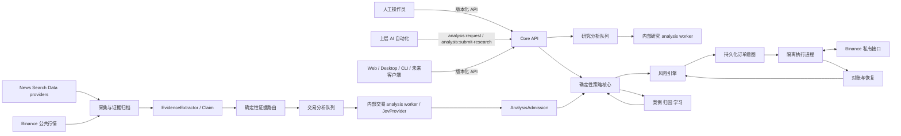

系统是**模块化单体 + 必要隔离进程**。`core-api` 持有业务服务与确定性核心，不持有交易所私钥；`execution-live` 是唯一读取 Binance 交易凭据的进程；`internal-analysis-worker` 与 `worker-ingest` 属于 Core Platform，以受限 service identity 调用 application/repository 端口，无交易凭据，也不能调用执行内部接口；`scheduler` 可与 core-api 同进程但单独任务池；`execution-sim` 只读取 SIM 命名空间。上层 `upper-ai` 只持有调用 API 的普通凭据，没有数据库 DSN。核心的纯函数无需 HTTP 化；客户端可调用的能力一律经 API/Command，禁止直接读写业务库、调用交易所或内部执行函数。数据库账户分别只授权所需 schema/表。

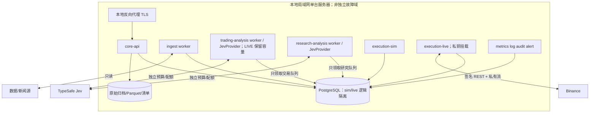

部署图中的两个内部 analysis worker → DB 是 Core 内部持久化访问，受各自 service identity、队列表权限及 application 用例约束；它们不是上层 AI 客户端。上层自动化、Web、桌面和 CLI 只能调用 Core API。内部 worker 不使用普通 API Key 冒充用户，也不持有 `trade:live`；信号准入由独立 `AnalysisAdmission` 完成，详见第 4 章。

进程边界由 `environment_id`、`account_id`、数据库角色、凭据目录和执行适配器共同约束。单主机故障时不承诺本地保护仍在线；启动前验证交易所侧已成立保护及告警/恢复路径。数据库使用 PostgreSQL 事务、追加式账本和事务 outbox；原始数据按许可进入不可改对象存储/Parquet，并用清单哈希固定。技术版本、容器摘要和依赖锁在 WP-03 固定；不引入 Kubernetes、分布式消息集群或远程微服务。

**依赖方向**：`domain` 不依赖 I/O、Jev、HTTP 或 Binance；`application` 依赖 `domain` 与端口接口；`adapters` 实现端口；`api` 只调用 application command/query；`workers` 消费持久化任务；`execution-live` 只处理经风险批准且未过期的意图。禁止反向依赖。建议包结构：

```text
factorforge/
  domain/             # 事件、情绪、仓位、止损、风险、状态机；纯函数
  application/
    analysis/          # TradingAnalysisDispatcher、EvidenceRoutingPolicy、AnalysisAdmission
    decision/          # 周期事务、风险审批、订单意图
    governance/        # 阶段门、权限、审计与配置
  ports/              # MarketData, EvidenceExtractor, AnalysisProvider, ExecutionAdapter,
                      # Clock, Repository, SecretProvider, AlertSink
  adapters/           # postgres, parquet, jev, mock, binance, simulation
  workers/            # ingestion, research_analysis, trading_analysis, scheduler, learning, reconciliation
  api/                # v1 路由、认证、授权、请求校验
  deployment/         # 示例配置与受控发布；真实配置在仓库外
  tests/              # AC/TC、契约、回放、故障注入
contracts/
  openapi/v1.json      # 已交付的唯一接口定义
  schemas/*.json       # DTO/消息字段的唯一规范源
  fixtures/            # 合约正反例
```

### 2. 运行实例、线程和隔离模型

`Environment = {SIM, LIVE}` 是安全域，不使用单个全局 mode 开关。`RunKey=(environment_id, account_id, strategy_id, instrument_id)` 贯穿数据对象、锁、幂等键、队列分区和审计。SIM 与 LIVE 可以引用同一**只读且许可允许**的公开行情/日历原始对象及其内容哈希；它们各自冻结可用时间、质量判定和输入清单。账户、资金、配置、参数发布、贡献、目标、订单、风险状态、PnL、审计、幂等及执行适配器隔离；SIM 不可获得 LIVE 凭据。实盘启动额外校验环境签名、账户指纹、SOXLUSDT 白名单、当前合约规则、阶段门、用户授权、保护能力和单写者租约；单个布尔变量无法开启 LIVE。

单进程内 I/O 使用有界异步任务池：采集、查询、周期决策、私有流处理、对账和告警分别有容量与超时；AI 进一步拆为独立的研究/交易持久队列、进程池和预算，LIVE 在交易池内保留容量。风险/保护优先队列不被新闻峰值占满。每个 RunKey 同一时刻仅一条决策提交线；不同环境可并行。调度器持久化 `cycle_id`，采用数据库唯一键抢占；晚到周期只补账本时间衰减与漏周期记录，绝不重发过期增险意图。成交、止损和执行异常触发即时保护用例，但新增风险仍只在主时基提交。消息按 `(available_at_utc, priority, source_sequence, event_id)` 稳定排序；同一时点保护优先于增险。

### 3. 核心接口与调用契约

```python
class AnalysisProvider(Protocol):
    async def analyze(self, request: AnalysisRequest) -> AnalysisCandidate: ...

class EvidenceExtractor(Protocol):
    async def extract(self, evidence: RawEvidence) -> ExtractedEvidence: ...

class NewsProvider(Protocol):
    async def fetch(self, cursor: str | None) -> list[RawEvidence]: ...

class EvidenceRoutingPolicy(Protocol):
    def evaluate(self, extracted: ExtractedEvidence, source: SourceSnapshot,
                 target: RunKey, policy: RoutingPolicySnapshot,
                 at_utc: datetime) -> RoutingDecision: ...

class TradingAnalysisDispatcher(Protocol):
    def dispatch(self, decision: RoutingDecision,
                 extracted: ExtractedEvidence) -> TradingAnalysisJob | Quarantine: ...

class ApiAuthorization(Protocol):
    def grant(self, principal: ApiPrincipal, scope: ApiScope,
              binding: EnvironmentAccountBinding) -> None: ...

class WorkloadAuthorization(Protocol):
    def require(self, workload: WorkloadIdentity, capability: WorkloadCapability,
                binding: EnvironmentAccountBinding) -> None: ...

class AnalysisAdmission(Protocol):
    def verify(self, candidate: AnalysisCandidate, extracted: ExtractedEvidence,
               provenance: ProviderProvenance) -> VerifiedAnalysis: ...
    def evaluate_eligibility(self, verified: VerifiedAnalysis, run_key: RunKey,
                             gate: SignalGateSnapshot) -> SignalEligibility: ...

class ExecutionAdapter(Protocol):
    async def submit(self, approved: ApprovedIntent) -> SubmissionOutcome: ...
    async def query_order(self, client_order_id: str) -> ExternalOrderState: ...
    async def query_protection(self, position_key: str) -> ProtectionState: ...
    async def query_account(self) -> AccountSnapshot: ...
    async def cancel_risk_increasing(self, run_key: RunKey) -> None: ...

class DeterministicCore(Protocol):
    def decide(self, snapshot: FrozenSnapshot, state: CoreState,
               params: ParameterSnapshot, at_utc: datetime) -> DecisionDraft: ...

class RiskEngine(Protocol):
    def project(self, draft: DecisionDraft, account: AccountSnapshot,
                pending: list[OrderIntent], limits: RiskSnapshot) -> RiskDecision: ...
```

所有端口都传入明确时间、版本、单位和环境；纯核心禁止隐式读当前时钟、网络、数据库或随机源。`ApprovedIntent` 只由应用层在风险检查事务中产生，带风险快照哈希、过期时刻、单写者 epoch 与不可改的数量上界。执行进程收到后再次核验 RunKey、权限、阶段、epoch、风险锁、过期与合约规则版本；这道检查不能提升额度或覆盖风险拒绝。若输入变动使批准不再成立，返回 `REVALIDATION_REQUIRED`，不尝试自行调整量。

### 4. 时点数据、证据与 Jev

采集链为 `News/Search/Data Provider → 原始证据归档 → 来源许可/时间核验 → EvidenceExtractor → Claim/Span → 事件族去重/修订 → EvidenceRoutingPolicy → TradingAnalysisDispatcher → trading-analysis queue → 内部 AnalysisProvider → AnalysisAdmission → 周期可用队列`。研究请求只进入独立 `research-analysis queue`。搜索是独立端口，Jev 不负责联网。每份原文保留来源、许可、内容哈希、发布时间、首次公开、接收、处理完成、修订关系和 UTC/交易所业务日；可用时间取全部必要证据及处理完成时间的约束上界。仅有事后抓取时间的材料不能伪作实时历史信号。原文不作为指令执行，隔离 Prompt 注入与恶意 URL；受限原文按许可存储和访问。

`EvidenceExtractor` 是 Core 的独立端口。输入为已归档且许可允许的 `RawEvidence`，输出为 `ExtractedEvidence={evidence_id,evidence_hash,extractor_id,extractor_version,claims[],extraction_status,errors[],completed_at_utc}`。每个 `Claim` 含稳定的 `claim_id`、`evidence_id`、`span_ids[]`、规范化事实 `normalized_fact`、实体及其当时可用映射 `entities[]`、带单位/币种/时点的 `numbers[]`、事实时间、抽取版本和 `extraction_status`；Span 保存原文偏移、片段哈希与来源许可。`claim_id` 从证据哈希、规范化事实版本与 span 标识确定；原文修订产生新 claim 版本，不能覆盖旧 claim。抽取器可以是规则、独立模型或人工流程，但 v1 具体实现、费用/许可、错误率及验收量表列为 **OD-01 待决**；MockExtractor 可先完成骨架与 SIM 测试。缺抽取器或关键 claim 无跨度时标记 `EXTRACTION_UNREADY/QUARANTINED`，不得进入可交易信号。抽取是否完整需要人工盲标集测漏抽率；“抽出几个正确 claim”不能证明未遗漏相反事实。

`EvidenceRoutingPolicy` 是**确定性、版本化**的纯函数，按 `(evidence_hash, source_registry_version, entity_mapping_version, event_family_version, routing_policy_version, target RunKey, evaluated_at_utc)` 计算 `RoutingDecision={route=LIVE_ANALYSIS|SIM_ANALYSIS|RESEARCH_ONLY|QUARANTINE, reason_codes[], input_manifest_hash, policy_version, available_at_utc}`。LIVE 路由必须逐项通过：由受信任采集连接器产生且来源在 LIVE allowlist、原文许可包含该用途、已核验的当时实体/标的映射指向目标 RunKey、证据与抽取版本完整、事件族属于已启用集合、首次公开/采集/处理时点可证、未超已登记的新鲜度窗口、事实版本不是已处理的转载/重复、没有修订撤销冲突。任一输入缺失或冲突返回有原因的隔离/研究路由，不猜测允许。窗口、来源、映射和事件族集合来自签名配置及原式样书 PAR-EVT/数据许可的待标定项；**这里不填写生产阈值或新增业务事件类型**。外部 `/analysis/jobs` 和 `/evidence/import-jobs` 创建的研究任务不能写入受信任采集来源字段，也不能触发 `TradingAnalysisDispatcher`。如同一证据可供 SIM/LIVE，分别产生绑定环境与账户的路由决策，不能复用资格。

`TradingAnalysisDispatcher` 只消费受信任 ingestion/outbox 中的已提交 `RoutingDecision`；事务内以 `(evidence_hash, target RunKey, policy_version, route)` 唯一键写路由审计与 `trading_analysis_job`，从不接受 API Key 请求作为直接输入。政策版本切换不偷偷重排旧 job；重评估创建关联的新决策并保留原决策。失败、过时或不明确的 job 进入隔离，不能为赶上主周期补造历史可用时间。伪代码：

```python
def route_for_trading(extracted, source, target, policy, at_utc):
    manifest = freeze(extracted, source, target, policy, at_utc)
    for check in (trusted_ingestion, source_allowed, license_allows,
                  target_maps_as_of, extraction_complete, family_enabled,
                  timestamps_proven, fresh_enough, not_duplicate_or_revoked):
        if not check(manifest):
            return RoutingDecision.quarantine_or_research(check.reason, manifest.hash)
    return RoutingDecision.for_environment(target.environment_id, manifest.hash,
                                           policy.version, manifest.available_at_utc)
```

`research_analysis_job` 与 `trading_analysis_job` 使用不同的持久队列表、领取 SQL、数据库角色和 worker 池；研究请求按 principal/账户限速并受独立并发、积压与每日 Provider 预算约束，超限 429 或保持研究 job 排队，不占交易队列槽。交易队列按 RunKey 分区，LIVE 保留独立 worker 并发与 Provider 配额，SIM 不得占满 LIVE 保留份额；保护/风险任务仍高于分析任务。两个队列分别记录最老等待时长、积压、超时与弃权并告警。资源预算、最大年龄和降级策略由 PAR-OPS 版本化配置并在目标部署压测；如果 Jev 上游不支持可验证的独立配额/凭据，不能声称跨上游的资源隔离已成立，G3 前须通过并发压力与限流试验证明 LIVE 不受研究洪泛饿死。Jev 整体不可用时既不伪造新事件，也不让旧研究 job 挤占恢复后的交易处理；旧贡献照既定规则衰减。

事件类型注册表照抄上游候选语义：公司业绩、业绩指引、分析师评级、产品发布、重大订单、供应链变化、管理层变化、资本支出、股票回购、融资、监管事件、诉讼、宏观经济数据、货币政策、财政政策、行业景气、竞争对手事件、技术突破、地缘政治、市场异常事件。代码保留稳定 ID、显示名、版本、方向量表和 `enabled_for_trading`；DEC-05 未确认的类型只记录不自动交易。规划书建议优先研究的三类只是实验候选，不能在配置中默认为已确认首批启用。市场状态采用正交维度 `trend(up/down/sideways)`、`volatility(high/low/unknown)`、`risk_appetite(up/down/unknown)`、行业强弱及极端异常标志；状态转换使用待标定确认窗与滞回，旧贡献不追溯放大。

Core 内部 `AnalysisProvider` 的默认实现为 `JevProvider`，但 `domain` 只消费经准入的 `VerifiedAnalysis`，不依赖 Jev。当前 TypeSafe 官方说明 Jev 为 typed decision 模型，提供 `Choice`、`Score`、`Noul` 类结构化判断；具体 SDK/协议在 WP-06 契约探针中按目标版本冻结，本文不假设供应商的稳定 wire format。[TypeSafe 官方介绍](https://typesafe.ai/blog/introducing-system-one-models-and-jev)；[TypeSafe 评测对 primitives 的说明](https://evals.typesafe.ai/)。`MockProvider` 用于离线和合成验收；新供应商需独立质量、延迟、成本、隐私/许可与版本漂移评测。真实 Prompt、拼接模板及模型缓存留在私有目录，缺失时显式 `EXAMPLE_OR_MOCK`，绝不静默使用真实分析或开启实盘。

Jev 问题集是**项目内部语义契约**，并非声称 Jev 原生返回此 JSON。一次请求可分多轮、每轮只附与问题有关的已可用证据，适配器将回答映射为下表；外部字段与概率分布保留原样供审计。事实摘要、金额、时间和证据片段由证据层抽取并带原文跨度，不由只做选择/评分的 Jev 凭空生成。

内部 `question_set_version=event-v1` 的问题定义由私有 Prompt Provider 实现。下例是**语义 DSL**，不是 TypeSafe API 的请求体；`strength_scale` 与时长分档来自 PAR-EVT，未标定时取 `REQUIRED_UNSET`，不能把示例变成生产常数。

```json
{
  "question_set_version": "event-v1",
  "state_fields": ["evidence_id", "evidence_hash", "claims", "entity_links_as_of", "prior_consensus_evidence_ids", "available_at_utc"],
  "questions": [
    {"id": "event_type", "kind": "Choice", "ask": "这组可核验事实属于哪一项已登记事件类型？", "options_source": "event_type_registry_version"},
    {"id": "direction", "kind": "Choice", "ask": "在已给证据和目标标的映射下，候选方向是什么？", "options": ["UP", "DOWN", "NEUTRAL", "UNKNOWN"]},
    {"id": "strength_band", "kind": "Score", "ask": "按已登记量表，这组事实的候选影响强度级别是什么？", "scale_source": "PAR-EVT"},
    {"id_template": "claim_supported:<claim_id>", "for_each": "claims[]", "kind": "Noul", "ask": "当前 claim 的规范化事实是否被该 claim 的原文跨度支持？"},
    {"id": "credibility_assessment", "kind": "Score", "ask": "仅依据已核验来源与事实，候选可信度属于哪一档？", "scale_source": "PAR-EVT"},
    {"id": "relevance", "kind": "Score", "ask": "已给当时经济联系对 SOXLUSDT 的相关程度如何？", "scale_source": "PAR-EVT"},
    {"id": "novelty", "kind": "Score", "ask": "相对已给事件族事实版本，有多少实质新增事实？", "scale_source": "PAR-EVT"},
    {"id": "unexpectedness", "kind": "Score", "ask": "相对当时已公开预期，这些事实有多未预期？", "scale_source": "PAR-EVT"},
    {"id": "impact_horizon_band", "kind": "Choice", "ask": "候选影响时间属于哪个已登记分档？", "options_source": "PAR-EVT"},
    {"id": "contradiction", "kind": "Noul", "ask": "候选方向、事实与引用之间是否存在无法消解的矛盾？"},
    {"id": "uncertainties", "kind": "Choice", "ask": "哪些已登记的不确定项仍存在？", "options_source": "PAR-EVT", "multiple": true}
  ]
}
```

内部 worker 针对每个 `claim_id` 实例化一条 `claim_supported:<claim_id>`，回答与对应 Span/Claim 成对保存。0 条 claim、缺 claim ID、回答数量与 claim 集不一致、同一 ID 重复或任一关键 claim 未通过证据核验，均进入隔离；不会把一个聚合概率分配给全部事实。程序还独立检查跨度确实来自引用的 `evidence_hash`、事实与原文数值/单位/时间是否一致，并记录人工复核或可信抽取器的结果。`Choice` 的分布与 `Score/Noul` 的概率只作为模型输出元数据，需在盲标样本上分类型、时段、方向校准，并保留弃权率；未经校准不填为系统 `c_i` 或 `C_attr`。Jev 不生成数学 `u_i/A_i`、风险通过结论、状态迁移或可执行订单。

| 内部字段 | 问题型候选 | 内部取值与校验 |
| --- | --- | --- |
| `event_type` | Choice | 已登记分类 + `OTHER/UNKNOWN`；未启用类别只记录 |
| `direction` | Choice | `UP/DOWN/NEUTRAL/UNKNOWN`；映射到 -1/0/+1 |
| `strength_band` | Score | 有界等级，经 PAR-EVT 量表映射 `b_i`，量表未就绪不交易 |
| `claim_results[claim_id].supported` | 每 claim 一个 Noul | 显式引用 claim/span；未核验为 UNKNOWN，任何关键 claim 失败则隔离 |
| `credibility_assessment` | Score | 仅候选，校准后才形成 `c_i`；供应商自述概率不直接使用 |
| `relevance` | Score | 目标 SOXLUSDT 的经济关系与当时成分信息校验为 `r_i` |
| `novelty` | Choice/Score | 先由事件族事实版本规则去重，再标定 `n_i` |
| `unexpectedness` | Score | 与事前共识、公告和价格证据分开记录；`e_i`,`p_i` 仍由规则计算 |
| `impact_horizon_band` | Choice | 映射到已标定半衰期候选，未知不得填常数 |
| `uncertainties` | 多个 Noul/Choice | 缺数据、矛盾、传闻、主体不明、价格代理不可靠等 |

`AnalysisRequest` 包含 `analysis_run_id`, `evidence_ids`, `evidence_hashes`, `claim_ids`, `available_at_utc`, `target_instrument`, `question_set_version`, `prompt_version`, `requested_model`, `schema_version`。`AnalysisCandidate` 保存回答、逐 claim 结果、原始分布/置信输出、所引跨度、`unknown_fields`, `latency_ms`, `cost`, `provider_trace_id`, `resolved_model_version` 及抽取器版本。字段的**唯一规范源**是 `contracts/schemas/analysis-candidate.json`，由 `contracts/openapi/v1.json` 引用；上面的 DSL 仅定义问题语义。Python DTO 由 schema 生成，或以契约测试逐字段证明等价，不能另维护一套可漂移的定义。校验依次检查 schema、枚举/区间、证据引用、事实与推断分离、跨项矛盾、数据许可、可用时间、去重版本；任一失败进入 `QUARANTINED` 并保存原因，不通过反复重试挑有利方向。请求超时或服务不可用时当前旧贡献照既定衰减与风险流程运行；新事件不注入，新闻积压有界且告警，恢复后以真实可用时间处理，不回填历史交易。

**信号准入**是独立、不可由公开候选写入端点选择的状态机：`UNTRUSTED/RESEARCH_ONLY → VERIFIED，然后分别判定 ELIGIBLE_FOR_SIM 与 ELIGIBLE_FOR_LIVE`。外部 `/analysis-candidates` 永远只创建 `RESEARCH_ONLY`，即使内容与内部结果相同也不能把该记录原位升级；要进入交易路径，内部受信任 worker 必须在已归档证据上独立重跑，生成新的 `analysis_run_id`，并由 `AnalysisAdmission` 核验 worker 身份、provider/模型/Prompt/抽取器版本、证据来源许可和哈希、逐 claim 结果、时点、分类启用状态、校准量表、阶段与 RunKey 绑定。`VERIFIED` 仅表示结构及来源合格，**不自动等于可交易**。SIM/LIVE 分别在各自阶段门下独立授予资格；LIVE 额外要求受信任数据源、实盘已批准的抽取器和 Provider 版本、前瞻验证以及有效账户/风险配置。资格凭证包含 `candidate_id, analysis_run_id, evidence_hashes, target_run_key, eligibility, gate_version, expires_at_utc`，事务写入且不可由客户端自报。撤销或证据修订使未来周期资格失效；已作出的旧决策不回写。Risk rejection 仍有最终优先权。

外部 `analysis:request` 只能请求研究分析已存在的证据 ID，不直接创建可交易信号；`EvidenceRoutingPolicy` 与 `TradingAnalysisDispatcher` 独立选择交易分析证据集，外部请求频率、选择或排序不能决定 LIVE 注入。`analysis:submit-research` 只存研究候选。只有 Core 内部 `WorkloadIdentity` 可调用资格发布用例，分别持有独立类型 `WorkloadCapability.signal:sim` 或 `signal:live`；它们不属于任何普通 API Key 的 `ApiScope`。内部工作身份泄漏、假造 provenance、跨环境资格复用和同证据多次注入均为阻断性测试场景。此准入设计不改变上游的情绪/风险业务规则，只把未受信任输入限制在其安全边界。

`u_i=(1-e_i)(1-p_i)` 中 `e_i` 与 `p_i` 引用不同证据用途；未知时保存区间并用下界，无法形成下界则禁止该事件增险。`A_i=min(A_cap,k,b_i c_i r_i n_i u_i w_k g_z)` 只在首次生效冻结。修订按原有效时间重算剩余并写差额，确认不重置年龄/高水位；撤销只清对应事实贡献。事件族、单事件和标的上限分别检查，拒收量单独入账。

可信度提升且无新增事实的修订使用 `revision_delta = recomputed_remaining(original_available_at, consumed_history, revised_facts) - current_remaining`，正负差额都记录为新账项；它不重置贡献的 `available_at`、价格高水位、已消费预算或订单历史。实质新增事实创建关联子贡献并受事件族总上限，撤销先使被撤销事实贡献失效。去重键先比较发行主体、经济事项、发生期间和关键事实，再使用文本近似作为辅助；转载/译文只增加来源记录。

### 5. 确定性决策与状态机

每周期同一数据库事务读取已冻结的输入清单、参数快照、账户对账序列及上一核心状态，执行以下顺序；不能因新闻到达直接跳到第 8 步。

```text
1 对账成交、订单、保护与资金；未知或冲突先锁定增险
2 检查阶段启用的硬保护、止损、被动超限及强制减险
3 固定 as_of 时间与可用输入清单，校验时点、报价、时段和规则
4 去重、失效和事实修订；旧贡献按真实经过时间衰减
5 按方向高水位新增量分配本周期唯一价格消耗预算
6 注入已通过验证且首次可用的新贡献；求 S+、S-、S
7 市场状态/辅助因子、滞回等级、原始目标和止损批次
8 逐资产裁剪与组合统一 α 投影；再应用非传统时段双次数门控
9 写 Decision、RiskDecision、解释、意图和 outbox；无交易也写原因
10 由执行进程按意图发送；实际成交回报即时更新账户与保护
```

同一时点止损与利好并存时，保护优先，周期内设置 `forced_exit_barrier`，禁止重建刚退出暴露；重入要求风险恢复、冷却结束和新有效依据。决策解释由规则码及参数/证据引用生成，AI 文本只能注释，不能取代实际触发规则。

情绪账本逐贡献保存 `opening + injection + revision - time_decay - price_consumption - invalidation = closing ≥ 0`，容差取 PAR-NUM；正负账独立保存，反向消息只建负贡献。价格高水位 `H_i=max(H_i_prev,max(0,d_i R_i))`，重复行情 `ΔH=0`。每方向预算 `B_d=κ_a,z * max_i ΔH_i`，权重 `ω_i=m_i^time η_k ΔH_i`；采用有界水填充分配并在贡献封顶后迭代，`ΣC_i^price≤B_d`。价格缺失仍时间衰减、暂停该次价格消耗及相关增险；恢复后只用未记高水位增量。空仓也计算兑现，实际盈亏不进入情绪公式。

`η` 的参考类型固定为 1 且不参与学习，其他类型只标定相对速度；只有单一有效类型的样本不能识别相对速度，不能据此更新 `η`。同一方向多个事件共用价格预算，不能每条新闻各自扣一次完整价格运动。贡献建立时冻结 `w,g,h,η`；发布新 `κ` 仅影响下一周期总预算，不补回旧消耗。

仓位先用 `S` 符号及 `U_l/D_l` 滞回确定 `L`，`x_raw=sign(S) v_L f_vol f_liq f_conf`，修正因子只在 `[0,1]`。风险引擎先逐标的裁剪，再对同时新增量求满足全部组合限制的最大统一 `α∈[0,1]`；若 `α=0` 仍违规，进入减险。未成交增险按最不利可能成交敞口占预算。卖空不可用仅降已有多仓到零；数量向低风险方向按有效 step/min notional 取整。普通调整遵守最小量/冷却；止损与强制减险豁免。止损距离独立于情绪，使用已完成 K 线稳健真振幅与冻结的 `k_stop`；新风险批次独立计算，存量保护不因学习而放宽。实际交易盈亏按合约单位、成交价格、费用、普通/特殊资金费和调整核算，不把 ETF 三倍目标再次乘入。

非传统时段计数在风险审批事务中执行：先按版本化市场日历取得窗口 ID；若是减险、保护维护或撤销增险，跳过两次数门控；若为新增风险，读取该窗口 `accepted_intent_count` 与 `closed_net_loss_case_count`，任一到经标定上限即拒绝。通过后为**业务意图**预占一次，拆单、重试和部分成交复用 reservation；明确未受理才释放，UNKNOWN 保留占额。完整净亏损案例按入场窗口/预登记的跨窗口归属规则只计一次；窗口关闭后成熟案例用于评估，不追溯改旧交易。窗口、两阈值和跨窗口规则都在 DEC-02/07 关闭前保持未设。该门控独立于 OBSERVE/ENFORCE 账户级亏损模式。

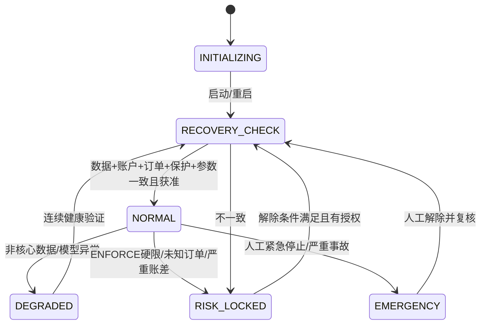

状态按动作权限取交集，`EMERGENCY`/`RISK_LOCKED` 不允许增险。OBSERVE 的账户级阈值只追加假设触发记录，不改变策略目标、风险日预算投影或运行状态；数据失真、订单未知、单笔止损和时段次数仍有效。LIVE 触限后对已有仓位执行哪一种处置及解除政策受 DEC-06 阻塞；实现只支持配置化 `HOLD_PROTECTED / ORDERLY_REDUCE / EXIT_IF_TRADABLE`，在未确认前 LIVE 准入失败，不在代码中选默认。手动 emergency stop 只能经授权恢复，不能被定时任务自动清除。

### 6. 执行、账户、对账和恢复

普通订单与条件保护单是两类资源，各有客户端 ID、外部 ID、状态、回报和查询/撤销接口。订单意图 `intent_id=hash(RunKey,cycle_id,decision_id,leg_no,action)`；外部客户端 ID 从意图确定性生成并满足交易所长度/字符约束，重试保持不变。状态与变更只追加，累计成交量单调；HTTP 失败/503/超时进入 `UNKNOWN`，先按客户端 ID 查询普通单、条件单、成交与持仓，再决定下一动作，绝不盲目重发。分批成交按外部成交 ID 唯一入账，费用/收入按交易所业务 ID 唯一入账。由多转空时先减仓并确认归零，再审批新的反向增险意图。

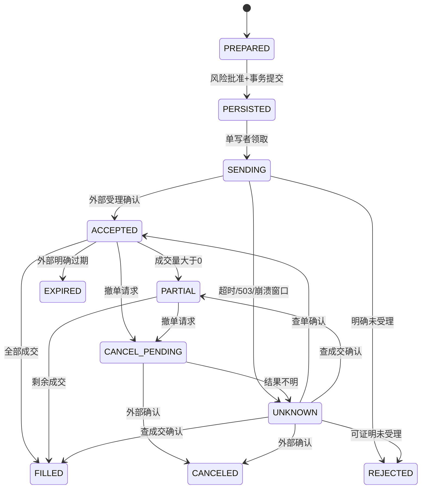

保护状态单独记录 `REQUIRED → SUBMITTED → QUERY_CONFIRMED → TRIGGERED → CHILD_ORDER_UNKNOWN/PARTIAL/FILLED → CLOSED`；只有查询确认且保护数量/方向/触发依据覆盖实际残仓才算受保护。成交后立即维护保护；新保护先确认再撤旧，不能并存时只走经账户实测验证的替代流程。`TRIGGERED` 不等于平仓。保护确认延迟超工程候选预算时立即禁止增险、告警并尝试仅减仓退出；时限须 WP-03/10 压测冻结。自动撤单只撤增险单，保留仍需的保护单。手动改仓、ADL、强平、转账及公司行动通过外部事实对账，暂停自动补仓并重算风险。

账户账本分解现金流、已实现、未实现、佣金、常规资金费、特殊分红资金费和其他调整；无法归类的收入进待核账，不计策略收益。`Π_day=V_marked - V_start - net_external_flow`，风险日边界配置版控且重启不重置；无有效净值为 UNKNOWN，禁增险。分红、拆并股、临时只减仓、保证金分档、强平/ADL、USDT 偏离和退市进入独立事件处理器。合约规则以生效区间版本化，不用今天规则重算历史。

重启/备份恢复顺序：隔离旧执行主、获取新 epoch → 默认 `RECOVERY_CHECK` → 读取最新一致备份和 WAL/事件账 → 按外部业务 ID 补订单/成交/收入 → 重建贡献、参数、案例与风险锁 → 比较交易所实际仓位、普通/条件单、保护和本地最不利敞口 → 时钟与数据质量验证 → 记录差异/审计 → 满足阶段门后由授权命令恢复。不能证明旧主已隔离时禁止任何新主发单；旧未发送且已过期意图标记失效，不补单。数据库丢失确认意图或业务记录时使用交易所与归档补账，仍不能解释的差异保持风险锁。恢复的 RPO/RTO 使用 PAR-OPS 待验；规划书 5 分钟/10 分钟/60 分钟仅工程候选目标。

### 7. 事务、一致性、调度与数据表

PostgreSQL 是 RunKey 状态的事务真源。一次决策提交同一事务写 `decision`、`risk_decision`、`order_intent`、`time_window_reservation`、`sentiment_entry`、`audit_event` 和 `outbox`；事务失败时无意图可执行。outbox worker 采用至少一次投递，消费者凭 RunKey/业务 ID 幂等；不使用内存队列承担安全事实。交易所调用在事务外；网络与数据库之间没有分布式原子事务，靠 UNKNOWN、稳定客户端 ID 和对账闭环。执行进程写成交与账务事务时以外部业务 ID 唯一去重。现金与持仓快照只作为投影，外部对账差异不能被本地投影覆盖。

锁：周期由 `(RunKey,cycle_id)` 唯一键；每 RunKey 用数据库 advisory lock/租约序列化决策；执行用 `writer_epoch` fencing token 与账户级单写者锁；意图领取 `FOR UPDATE SKIP LOCKED`，但一个账户的风险审批按版本 CAS 串行；参数发布在周期边界对 `active_parameter_version` 做 CAS；时段次数预占与意图同事务。租约过期不能证明旧进程已停止时，需执行凭据/网络隔离并对账。数据库健康不明、磁盘满或审计持久化失败时不增险。

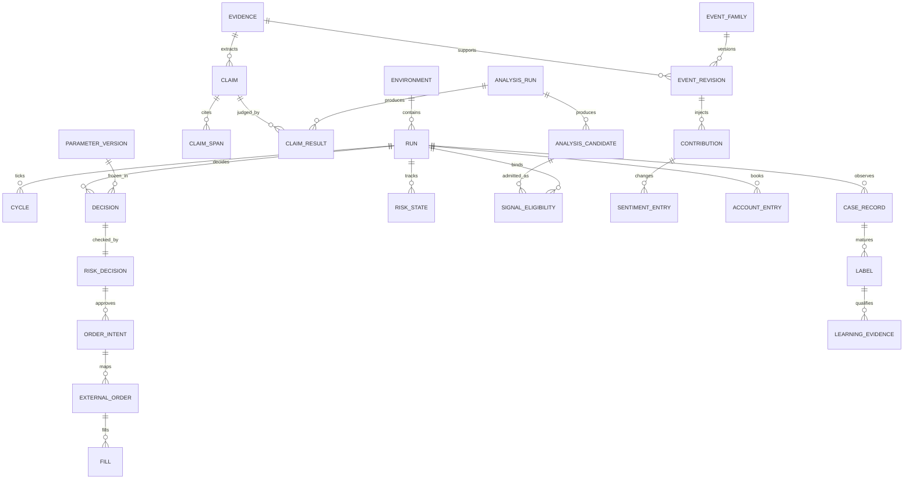

主要表（均有 `id`, `schema_version`, `created_at_utc`, `correlation_id`，环境敏感表含 RunKey；数值用精度明确的 DECIMAL/整数最小单位，不用二进制浮点记账）：

| 表/投影 | 关键列与约束 |
| --- | --- |
| `environment`, `run`, `capability_snapshot` | 环境/账户指纹/阶段/审批版本；LIVE 唯一账户绑定；能力 `DOCUMENTED/TESTED/UNSUPPORTED/UNKNOWN` |
| `instrument_spec`, `market_observation`, `calendar_version` | 合约单位/过滤器/时段/有效区间；价格类型与数据质量；生效区间不得重叠 |
| `raw_evidence`, `evidence_license`, `extraction_run`, `claim`, `claim_span`, `event_family`, `event_revision` | 内容哈希、来源许可、抽取器/事实版本、各时点、Span 与修订关系；原文引用受控 |
| `analysis_run`, `analysis_candidate`, `claim_result`, `signal_eligibility` | 内部/外部来源通道、原始模型回答、逐 claim 判断、provider provenance、RunKey 资格及隔离原因；外部候选永远研究态 |
| `contribution`, `sentiment_entry`, `regime_snapshot` | 冻结参数、方向/剩余/高水位、五类账项、拒收量；账平约束 |
| `cycle`, `decision`, `risk_decision`, `risk_state` | 输入清单哈希、规则码、目标/实际/待成交、风险版本、状态原因及解除证据 |
| `order_intent`, `external_order`, `protection_order`, `fill` | 唯一客户端 ID、外部 ID、状态、累计成交；外部成交 ID 唯一 |
| `account_entry`, `account_snapshot`, `reconciliation_run` | 外部业务 ID 唯一、分项账、交易所/本地差异及处置 |
| `case_record`, `risk_lot`, `observation`, `label`, `attribution`, `counterfactual` | 实仓周期/影子标记、批次、删失/成熟、共同驱动组；反事实与实盘净值隔离 |
| `parameter_registry`, `parameter_version`, `learning_candidate`, `learning_evidence` | 单位/边界/来源/冻结适用域/消费证据/回滚点；硬限不可学习 |
| `time_window`, `time_window_reservation`, `loss_case_count` | 非传统时段两个独立计数；未知委托继续占额；窗口版本化 |
| `api_principal`, `api_key`, `key_scope`, `workload_identity`, `workload_capability_grant` | 外部 API 身份/密钥/ApiScope 与内部服务身份/WorkloadCapability 分表；无跨表授权 FK |
| `research_analysis_job`, `trading_analysis_job`, `routing_decision` | 队列物理分离，路由输入清单/版本/拒绝码，环境与证据去重唯一键 |
| `idempotency_record`, `audit_event`, `outbox`, `job` | 同请求重放；审计追加；非分析通用有界任务 |

下面的约束是迁移脚本必须落实的**逻辑 DDL**；具体 DECIMAL 精度、索引分区和枚举存储方式须用目标合约 step/tick、PAR-NUM 与压力测试确定，不能从示例精度推导生产量化规则。

```sql
-- 公开密钥授权与内部服务能力是互不兼容的数据库类型。
CREATE TYPE api_scope AS ENUM (
  'read:market', 'read:events', 'read:portfolio', 'read:risk', 'read:audit',
  'analysis:request', 'analysis:submit-research', 'write:parameters',
  'write:strategy-control', 'trade:simulate', 'trade:live', 'ops:start',
  'ops:stop', 'ops:recover', 'ops:emergency-stop', 'admin:apikey', 'admin:permissions'
);
CREATE TYPE workload_capability AS ENUM ('signal:sim', 'signal:live');
CREATE TABLE key_scope (
  key_id uuid NOT NULL REFERENCES api_key(key_id),
  scope api_scope NOT NULL,
  PRIMARY KEY (key_id, scope)
);
CREATE TABLE workload_capability_grant (
  workload_identity_id uuid NOT NULL REFERENCES workload_identity(workload_identity_id),
  capability workload_capability NOT NULL,
  environment_id text NOT NULL,
  account_id text NOT NULL,
  deployment_digest text NOT NULL,
  PRIMARY KEY (workload_identity_id, capability, environment_id, account_id)
);
-- 不提供 key_scope → workload_identity 或 api_principal → workload_capability_grant 的 FK/视图/转换函数；
-- API 数据库角色对 workload_capability_grant 无 INSERT/UPDATE/DELETE 权限。
-- 所有环境敏感外键采用复合键，禁止只凭裸 ID 跨 SIM/LIVE 引用。
CREATE UNIQUE INDEX ux_cycle_run_id ON cycle
  (environment_id, account_id, strategy_id, instrument_id, cycle_id);
CREATE UNIQUE INDEX ux_intent_id ON order_intent
  (environment_id, account_id, intent_id);
CREATE UNIQUE INDEX ux_external_client_order ON external_order
  (environment_id, account_id, client_order_id);
CREATE UNIQUE INDEX ux_fill_business_id ON fill
  (environment_id, account_id, exchange_trade_id);
CREATE UNIQUE INDEX ux_account_business_id ON account_entry
  (environment_id, account_id, exchange_business_id);
CREATE UNIQUE INDEX ux_window_reservation ON time_window_reservation
  (environment_id, account_id, time_window_id, intent_id);
CREATE UNIQUE INDEX ux_idempotency ON idempotency_record
  (principal_id, environment_id, account_id, method, path, idempotency_key);
CREATE UNIQUE INDEX ux_claim_version ON claim
  (evidence_id, claim_id, extractor_version);
CREATE UNIQUE INDEX ux_claim_result ON claim_result
  (analysis_run_id, claim_id);
CREATE UNIQUE INDEX ux_signal_admission ON signal_eligibility
  (environment_id, account_id, strategy_id, instrument_id, analysis_run_id, gate_version);
CREATE UNIQUE INDEX ux_routing_decision ON routing_decision
  (evidence_hash, environment_id, account_id, strategy_id, instrument_id, policy_version, route);
CREATE UNIQUE INDEX ux_trading_analysis_job ON trading_analysis_job
  (routing_decision_id, environment_id, account_id);
ALTER TABLE contribution ADD CONSTRAINT ck_contribution_nonnegative
  CHECK (remaining_magnitude >= 0);
ALTER TABLE order_intent ADD CONSTRAINT ck_intent_nonnegative
  CHECK (approved_abs_quantity >= 0);
```

`analysis_run` 保存 `origin=INTERNAL_PROVIDER/EXTERNAL_RESEARCH`, `workload_identity`, `provider_id`, `requested_model`, `resolved_model_version`, `prompt_version`, `question_set_version`, `extractor_version`, `evidence_manifest_hash`, `started/completed_at_utc`, `status`；`claim_result` 的每行绑定 claim/span、模型判断、程序核验和隔离原因。`signal_eligibility` 是追加式凭证，不接受来自外部 API 的 `eligibility` 字段写入；它绑定 RunKey、gate/准入版本、有效时段及签发服务身份。上述三表的 insert 权限拆开：外部 API 只能通过应用层创建研究候选，内部 worker 可以写 analysis_run/candidate，只有 Admission 服务身份可以写资格。外部候选的 `analysis_run_id` 不可被内部 worker 复用。

`key_scope.scope` 的 PostgreSQL 类型只能是 `api_scope`，由 [api-scope.json](../../contracts/schemas/api-scope.json) 生成应用层 `ApiScope` 枚举并做迁移一致性测试；`workload_capability_grant.capability` 只能是另一 PostgreSQL 类型 `workload_capability`，由 [workload-capability.json](../../contracts/schemas/workload-capability.json) 生成 `WorkloadCapability`。`ApiKey`、创建/轮换和权限 PATCH 的 `scopes[]` 全部只引用 `ApiScope`；内部 Admission 使用独立 `WorkloadIdentity` 参数和授权库，不接受 `ApiPrincipal`、API Key 或字符串 scope 强制转换。数据库角色、外键域及 GRANT 保持同样分离；普通权限管理代码即使误传 `signal:live` 也无法插入 `key_scope`。上面 DDL 是结构约束，真实迁移还须补齐基础表、环境 FK、RLS、角色 GRANT 及升级/回滚测试。

`routing_decision` 至少存 `evidence_id/hash`, `source_registry_version`, `entity_mapping_version`, `event_family_version`, `policy_version`, `target_run_key`, `route`, `reason_codes`, `input_manifest_hash`, `available_at_utc`, `evaluated_at_utc`；查询和审计可见拒绝理由。`trading_analysis_job` 至少存 `routing_decision_id`, `target_run_key`, `environment`, `priority`, `deadline_at_utc`, `status`, `attempt`, `provider_budget_bucket`, `claimed_by`, `lease_until_utc`；`research_analysis_job` 另存请求 principal、研究证据清单、独立限流桶与相同生命周期字段。两个 worker 各自只 `SELECT ... FOR UPDATE SKIP LOCKED` 领取自己的表，不能在一张通用 `job` 表里仅凭可错写的字符串 `queue=trading` 区分权限。超过有效期的交易任务标记 `EXPIRED` 并告警，不强行延后时基；研究任务不会迁移到交易表。交易分析负载对 SIM/LIVE 再以环境独立池或硬保留配额隔离；上游 Jev 共享限流时，G3 必须给出可复现的最坏研究洪泛下 LIVE 延迟实测证据。

每个 `contribution` 行带 `event_revision_id`, `direction`, `initial_magnitude`, `remaining_magnitude`, `available_at_utc`, `last_decay_at_utc`, `price_high_water`, `parameter_version`, `fact_version`, `state_version`；`sentiment_entry` 带 `kind=INJECTION/TIME/PRICE/REVISION/INVALIDATION/REJECTED_CAP`, `amount`, `before`, `after`, `cycle_id`, `source_price_id`。`order_intent` 带 `risk_decision_id`, `approved_abs_quantity`, `worst_case_exposure`, `expires_at_utc`, `client_order_id`, `writer_epoch`, `state_version`。这些字段与组合唯一键是重放、并发和审计的最低要求。`audit_event` 只追加，数据库角色不授予普通业务 `UPDATE/DELETE`；更正追加 `corrects_event_id`。保留多版本数据时所有按 `as_of` 的查询都按当时有效区间过滤，避免使用最新合约规则、日历或参数重写旧决策。

```python
def commit_cycle(run_key, cycle_id, frozen_input, state_version):
    with serializable_transaction() as tx:
        tx.assert_single_writer_epoch(run_key)
        tx.assert_state_version(run_key, state_version)
        tx.insert_cycle_once(run_key, cycle_id, frozen_input.manifest_hash)
        state = tx.load_core_state_for_update(run_key)
        draft, ledger_entries = core.decide(frozen_input, state,
                                             tx.active_parameter_snapshot(run_key),
                                             frozen_input.cycle_at_utc)
        pending = tx.load_all_possible_increasing_intents(run_key)
        risk = risk_engine.project(draft, tx.reconciled_account(run_key),
                                   pending, tx.active_risk_snapshot(run_key))
        tx.reserve_nontraditional_window_if_increasing(run_key, risk)
        tx.append_sentiment_entries(ledger_entries)
        tx.insert_decision_and_risk_decision(draft, risk)
        tx.insert_approved_intents_and_outbox(risk.approved_intents)
        tx.append_audit(draft, risk, frozen_input.manifest_hash)
    # 网络调用只由隔离执行进程消费已提交 outbox；事务内不访问交易所。
```

分区按环境与风险日/业务日期，外键和 RLS 双重约束 RunKey；跨环境引用仅允许只读公开数据清单，其余 FK 带环境列。保存重放所需来源哈希、模型/Prompt/代码/参数/规则版本。归档保留期依许可及 PAR-OPS 登记，清理动作留删除清单与理由。缓存只用于公开行情、合约规则只读快照和幂等查询加速；风险/订单/权限决策每次从事务真源与带版本快照读取，缓存过期不能默默当有效。

### 8. API-first 合约

唯一外部业务边界为 `/api/v1`。机器规范交付在仓库根目录 [OpenAPI v1](../../contracts/openapi/v1.json) 与 [JSON Schemas](../../contracts/schemas/)；**这两者是 API 字段与类型的唯一 source of truth**。OpenAPI 3.1 从相对路径引用独立 JSON Schema 2020-12 文件；Python DTO 必须由 schema 生成，或在 CI 以契约测试证明逐字段等价。正文仅描述业务语义、状态和使用方法，不再另列一套规范性字段清单。旧 `doc/api/openapi-v1.json` 是 v1.0 历史产物，v1.1 的构建/校验不可引用它。v1.1 仍含部分通用 `Record` 查询投影；各 WP 在写该路由实现前须细化独立 schema 并通过契约检查，故本版足以启动骨架与已细化路由，不能据此宣称全部 API 可直接实现。兼容新增可选字段可在 v1 内发布 minor `schema_version`；删除/改语义/改单位或必填值需 `/api/v2` 与迁移窗口。未知安全关键字段、未知枚举和不支持的 schema_version 拒绝。所有上层客户端只通过 API，不接触 DB 或交易所。

通用头：`Authorization: Bearer <api_key>`；命令须 `Idempotency-Key`、`X-Correlation-Id`；服务端回 `trace_id`, `correlation_id`, `schema_version`, `server_time_utc`。`X-Environment-Id` 与路径环境一致，否则 409。所有时间 RFC3339 UTC `Z`，业务日期另列；金额及数量为带单位的十进制字符串。列表采用 `limit`（服务端上限由 API 策略登记）和不透明 `cursor`，稳定按 `(created_at_utc,id)` 排序；cursor 绑定过滤器/环境，失效报 400，不返回跨环境记录。查询超时不改变状态；命令超时返回 UNKNOWN/可查询 job，不承诺失败即未执行。429/503 只按 `Retry-After` 对可重试查询或同一幂等键命令退避；不能生成新的增险命令来重试。

统一成功 envelope：`{schema_version, data, meta:{correlation_id,trace_id,server_time_utc,as_of_utc,next_cursor?}}`；异步命令 202 返回 `{job_id,status_url}`。错误使用 `application/problem+json`：`{type,title,status,code,detail,correlation_id,trace_id,retryable,unknown_outcome,field_errors?}`，`detail` 不泄露凭据/Prompt。常见码：`VALIDATION_FAILED` 400、`UNAUTHENTICATED` 401、`FORBIDDEN` 403、`NOT_FOUND` 404、`VERSION_CONFLICT` 409、`IDEMPOTENCY_CONFLICT` 409、`PREREQUISITE_UNREADY` 422、`RATE_LIMITED` 429、`OUTCOME_UNKNOWN` 503、`DEPENDENCY_UNAVAILABLE` 503。401/403/所有命令请求及结果均审计；风险拒绝作为业务结果 `REJECTED_BY_RISK`，不会被 HTTP 重试消除。

API 键由管理员创建；服务端使用密码学安全随机 secret，仅创建/轮换的**首次成功响应**显示一次。数据库存 `key_id`, peppered KDF/hash, prefix/fingerprint, scopes, environment/account bindings, expires_at, revoked_at, description, created_by, last_used_at`，不存可恢复明文。创建/轮换命令同一幂等键重放时只返回已创建的 key 元数据和 `secret_available=false`，不生成第二把键，也不重新显示 secret；首次响应丢失时通过再次轮换取得新 secret。轮换建立新键与短期双键窗口（长度在私有配置登记），记录关联、随后撤旧；撤销立即使新请求失败。`last_used` 异步更新不参与授权。API Gateway 每次查有效状态或使用有短寿命且可撤销的授权缓存；权限降低与 emergency 撤销必须即时生效。LIVE 密钥还需环境/账户绑定、实盘阶段门和密钥持有人授权；普通 AI/新闻/研究 key 默认只读或申请研究分析，不能获得信号准入能力，更不能因身份为 AI 获得 `trade:live`。执行私钥是另一类凭据，不以普通 API Key 形式发给客户端。

下表仅列 **`ApiScope`**：它是公开 API Key/权限管理可授予的完整类型域，由 `contracts/schemas/api-scope.json` 固定。`signal:*` 不属于这个类型，不能出现在此表、公开 OpenAPI 权限枚举或 `key_scope` 列中。

| ApiScope | 能力 | 默认主体 |
| --- | --- | --- |
| `read:market`, `read:events`, `read:portfolio`, `read:risk`, `read:audit` | 对应 Query | 人工只读/特定 AI 最小集 |
| `analysis:request` | 申请对已归档证据进行研究分析；不决定 LIVE 调度或信号准入 | 上层 AI/研究人员 |
| `analysis:submit-research` | 提交外部候选，仅 `RESEARCH_ONLY`，永不原位提升 | 上层 AI/研究人员 |
| `write:parameters` | 提交白名单候选/查看验证；不能改硬限 | 学习服务/获授权人工 |
| `write:strategy-control` | 冻结/解冻学习、策略暂停命令 | 人工运营 |
| `trade:simulate` | SIM 交易控制命令 | SIM 自动化/人工 |
| `trade:live` | LIVE 交易控制命令；仍经风险 | 明确绑定的专用主体 |
| `ops:start`, `ops:stop`, `ops:recover`, `ops:emergency-stop` | 对应环境运行控制 | 人工运营；emergency 可单独赋权 |
| `admin:apikey`, `admin:permissions` | 密钥生命周期、授权策略 | 用户指定管理员 |

内部服务使用独立的 **`WorkloadCapability`** 类型与授权存储，不经公开 `/api/v1` 暴露授权入口：

| WorkloadCapability | 允许的内部用例 | 身份及绑定 |
| --- | --- | --- |
| `signal:sim` | Admission 对 SIM RunKey 发布资格 | 签名的 Core 工作负载身份、SIM 环境/账户/部署摘要 |
| `signal:live` | Admission 对 LIVE RunKey 发布资格 | 签名的 Core 工作负载身份、LIVE 环境/账户/部署摘要和阶段门 |

服务内机密到执行进程的最小权限 IPC 不作为上层调用入口；任何内部命令也带服务身份、环境及审计。`WorkloadCapability` 不能通过 `/api-keys` 或普通权限 PATCH 授予人/外部 AI；应用接口采用不同的枚举与 principal 类型，数据库采用不同的 enum、表与写入角色。一个 `ApiScope` 不隐含另一个，且不能转换为 `WorkloadCapability`；`trade:live` 不能调用 Admission 发布 LIVE 信号，也不包含 `ops:recover` 或 `admin:permissions`。内部 `signal:live` 本身也不能发单。对实盘参数、风险限额、阶段和账户权限的变更还要业务版本 CAS 与阶段授权，白名单自动学习通道无法触达这些资源。

### 8.1 Endpoint / Command catalog

下表 `E/A` 表示环境/账户路径参数；所有有副作用的 POST/PATCH/DELETE 必填幂等键、审计、`If-Match` 或 `expected_version`（仅创建无旧版本除外），并绑定 RunKey。Query 只读，`read:*` 按数据类型细分。`trade:*` 是命令提交权限，风控最终决定是否产生订单。

| 类 | Method + path | 返回/语义 | Scope 与关键失败 |
| --- | --- | --- | --- |
| Query | `GET /health/live`, `/health/ready` | 基础/依赖健康，不暴露敏感数据 | 本机探针；ready 不等于交易准入 |
| Query | `GET /environments`, `/environments/{E}/runs` | 隔离实例与阶段 | `read:risk`；按绑定过滤 |
| Query | `GET /market/instruments`, `/market/snapshots`, `/market/calendar` | 规则、分型价格、时段及质量 | `read:market`；过期显式标记 |
| Query | `GET /evidence`, `/evidence/{id}`, `/events`, `/events/{id}`, `/event-families/{id}` | 许可可见的证据、修订、隔离态 | `read:events`；原文另需许可 |
| Query | `GET /environments/{E}/accounts/{A}/portfolio`, `/positions`, `/orders`, `/intents`, `/protections` | 实际/目标/待成交、外部状态 | `read:portfolio`；结果带 as_of |
| Query | `GET /environments/{E}/accounts/{A}/risk`, `/risk-events`, `/time-windows` | 风险锁、OBSERVE 触发、两次数 | `read:risk` |
| Query | `GET /environments/{E}/accounts/{A}/decisions`, `/decisions/{id}`, `/sentiment`, `/cases`, `/labels`, `/attributions` | 可重放理由与案例/学习 | `read:portfolio` 或 `read:events` 按投影 |
| Query | `GET /parameters`, `/parameter-versions`, `/learning-candidates`, `/reports`, `/replay-runs` | 参数版本、实验与报告 | `read:risk`；敏感 Prompt 不返回 |
| Query | `GET /audit`, `/audit/{id}`, `/reconciliations` | 追加审计与账差 | `read:audit`；只读过滤 |
| Command | `POST /analysis/jobs` | 请求内部研究分析已归档证据，202；不触发 LIVE 信号调度 | `analysis:request`；请求体不含资格字段 |
| Command | `POST /analysis-candidates` | 外部候选固定 `RESEARCH_ONLY`，202 | `analysis:submit-research`；服务端拒绝资格/provenance 自报 |
| Command | `POST /evidence/import-jobs`, `/events/{id}/review` | 授权数据导入/研究复核，不提升交易资格 | `analysis:submit-research`；证据许可/版本冲突 |
| Command | `POST /environments/{E}/accounts/{A}/simulations`, `/replay-runs` | SIM/回放任务，202 | `trade:simulate`；E 必须 SIM |
| Command | `POST /environments/{E}/accounts/{A}/trade-requests` | 人工/自动化请求目标或减险；异步风险审批，202 | E=SIM `trade:simulate`；E=LIVE `trade:live`；不能直接给外部下单参数 |
| Command | `POST /environments/{E}/accounts/{A}/positions/{id}/reduce-requests` | 仅减险，经风险与保护核验 | 对应 `trade:*`；未知订单仍需对账 |
| Command | `POST /learning-candidates`, `/learning-candidates/{id}/validate` | 参数白名单候选/独立验证 | `write:parameters`；不允许硬限 |
| Command | `POST /environments/{E}/accounts/{A}/learning/freeze`, `/learning/resume` | 冻结/恢复学习 | `write:strategy-control`；不恢复交易锁 |
| Administrative | `POST /environments/{E}/accounts/{A}/start` | 阶段门+对账+单写者准入，202 | `ops:start` + LIVE 时 `trade:live`；未决项阻塞 |
| Administrative | `POST /environments/{E}/accounts/{A}/stop` | 禁增险、撤增险、保留保护；可选已批准退出政策 | `ops:stop`；不表示已空仓 |
| Administrative | `POST /environments/{E}/accounts/{A}/emergency-stop` | 即时置锁、撤增险、按批准政策处置 | `ops:emergency-stop`；不可自动解除 |
| Administrative | `POST /environments/{E}/accounts/{A}/recover` | 对账/核验 job，完成后仍检查恢复授权 | `ops:recover`；未解释账差 422 |
| Administrative | `POST /environments/{E}/accounts/{A}/reconcile` | 主动全量对账 job | `ops:recover` 或内部服务身份 |
| Administrative | `GET/POST /api-keys`, `GET /api-keys/{id}`, `POST /api-keys/{id}/rotate`, `POST /api-keys/{id}/revoke` | 密钥生命周期；secret 仅创建/轮换响应一次 | `admin:apikey`；撤销结果审计 |
| Administrative | `GET/PATCH /permissions/{principal_id}` | scope/绑定策略与版本 | `admin:permissions`；LIVE 绑定另审 |
| Administrative | `POST /config-proposals`, `/config-proposals/{id}/activate`, `POST /phase-gates/{id}/attest` | 风险/阶段/部署配置发布与签署 | `admin:permissions` + 专项授权；不能由学习发布 |
| Async | `GET /jobs/{id}`, `GET /jobs/{id}/events` | 排队/运行/完成/失败/未知与结果链接 | 与原命令相同主体或审计权限 |
| Streaming | `GET /events/stream?cursor=…` | 可选 SSE，只推投影变更/告警，不承载交易命令 | 对应 read scope；断线按 cursor 补 Query |

`trade-requests` 接受 `intent_type=STRATEGY_REEVALUATE | REDUCE | FLATTEN`、`reason` 与可选上限约束；不接受客户端指定绕风控的最终订单。`STRATEGY_REEVALUATE` 只请求下一周期评估，不可即时增险。`REDUCE/FLATTEN` 可即时进入保护用例。策略自动生成的意图仅经应用层内部命令总线，走相同风险、审计和执行审批。SSE 只用于监控；丢事件以 cursor/Query 恢复，不作为状态真源。

### 8.2 Schema、幂等和契约门

规范字段见 [analysis-candidate.json](../../contracts/schemas/analysis-candidate.json)、[analysis-request.json](../../contracts/schemas/analysis-request.json)、[claim.json](../../contracts/schemas/claim.json)、[signal-eligibility.json](../../contracts/schemas/signal-eligibility.json)、[trade-request.json](../../contracts/schemas/trade-request.json) 及 OpenAPI 所引用的其余 schema。`AnalysisCandidate` 记录 `analysis_run_id`, `question_set_version`, `prompt_version`, `requested_model`, `resolved_model_version`, `evidence_hashes`, `quoted_span_ids`, `claim_results`, `raw_probabilities`, `unknown_fields`, `provider_trace_id`, `latency_ms`, `cost`；`ClaimResult` 逐 claim 绑定回答与程序核验。外部提交使用独立 `research-candidate-submission.json`，不接受 `eligibility`, `origin`, `workload_identity` 或 provider attestation 自报字段。结构校验之外，分类量表、证据引用、许可、版本、时点和信号资格还必须由应用层核验。

CI 对 schema/OpenAPI 执行 lint、有效/无效夹具验证、相对于冻结基线的破坏性变更检查、Python server stub 生成与导入 smoke test。检查对象为仓库中的实际文件，不由正文样例重新生成。未知关键字段、缺 claim、伪造资格、跨环境绑定或旧 schema 失败时，返回有审计的 4xx/隔离结果；不能落到 LIVE 情绪池。

API idempotency 的唯一键为 `(principal_id,RunKey,method,path,Idempotency-Key)`，保存请求体哈希、状态与首次**非机密**结果；同键同体返回原 job/result，同键异体 409；API Key 创建/轮换使用上文的一次性 secret 例外。有效期至少覆盖业务恢复窗口，具体保留期由 PAR-OPS 关闭，过期后仍靠 `intent_id`/外部 ID 防重复。`correlation_id` 贯穿命令、决策、意图、外部请求、回报、job、审计；`trace_id` 用于技术跨进程追踪，不当作业务唯一键。

异步 job 状态为 `QUEUED → RUNNING → SUCCEEDED/FAILED/UNKNOWN/CANCELED`，仅 `QUEUED` 且未交给执行的非安全关键任务可取消；交易 job 的取消请求不等于外部撤单，必须使用减险/停机命令并对账。`UNKNOWN` 是非终态风险条件，可由对账转为确定结果；保留首次提交、最后检查、外部 ID、结果链接与错误，客户端按 `status_url` 查询。API 层、内部事务、AI/新闻外呼、交易所请求、对账和 SSE 心跳分别有 `PAR-OPS` 版本化截止时间与最大积压；超时不擅自推断未执行。查询可在超时后重试；命令只复用同一幂等键；交易所 UNKNOWN 先查询。API 审计行保存请求哈希、actor/key fingerprint、scope、RunKey、前后版本、风险判定、响应码、job/intent ID 和 UTC 时间，敏感正文只存受控引用。

### 9. 案例、归因、学习与研究

实际方向性持仓周期形成一个 `case_record`，部分退出仍属同案，只有实际归零才关闭；每次加仓独立 `risk_lot`。案例与事件族/共同驱动组关联；影子案例标注 `SHADOW` 并与真实净值隔离。退出时冻结观察窗口公式和起点，观察期未完、资料缺口、退市或重大新事件标 `UNMATURED/CENSORED/UNKNOWN`，不填零。归因按真实性→外部变化→去重与提前计价→方向/强度→寿命/兑现→时机→止损的顺序，多个原因可并列。AI 自评不等于 C_attr；`min(C_data,C_label,C_isolation,C_stability)` 只用已校准审核量表，未校准只产解释候选。反事实分别存四类场景，风险预算、信息时点和成本一致，不计真实 PnL，OHLC 歧义保留区间。

学习使用 L0 冻结对照、L1 候选、L2 独立验证、L3 自动发布。`learning_evidence` 按事件族/重叠窗口去重，成熟、归因、独立组数、有效样本数、区块重采样、状态稳定、冷却、漂移、新证据及独立验证八门全部通过才发布。每次只改一个参数或已证明不可分的组：`θ_candidate=clip(θ_current+sign(E)Δ,lower,upper)`，Δ 固定且不随 AI 置信放大。首批可学习族 `w,h,κ,η,k_stop` 的实际启用子集待 DEC-05；硬风险、账户权限、阶段、名义上限永不入白名单。`w,g,h,η` 对新贡献前瞻生效，κ 下周期前瞻生效，`k_stop` 不放宽存量保护；回滚不改历史交易或已消费证据。周期合理性检查间隔待标定；越权即时拒绝，不等报告。

研究使用三层数据：ETF/行业历史检验事件假设、真实合约历史检验成本/基差/资金费、冻结模型后的前瞻数据检验实际时效。训练/验证/封存测试严格时序，跨窗事件族、标签跨度及发布时间清除隔离；AI 历史知识污染无法排除时标记且不能单独作准入。保存 H01～H08、全部候选、失败试验、成本压力与分多空结果。统计门槛、最小实际改善、样本量和默认日亏损政策由 WP-04/14 事前登记，不能在本文填数。

## B. Upper Layer / 上层应用

### 10. AI、自动化和人工界面

上层由 `upper-ai` 自动化编排、外部新闻/搜索/数据 provider 的客户端配置、Web、桌面、CLI 和监控解释视图组成。它们只持有按环境/账户绑定的 API Key，通过 `/api/v1` 访问；展示层不得有数据库 DSN、交易所凭据、执行 IPC 地址或风险状态直写能力。`upper-ai` 仅可申请研究分析或提交 `RESEARCH_ONLY` 候选，不能构造 `ApprovedIntent`，也不能选择/发布 `ELIGIBLE_FOR_LIVE`。实际 `JevProvider` 和 `EvidenceExtractor` 运行于 Core Platform 的 `internal-analysis-worker`，使用受限 service identity 和 repository 端口。自动化即便有 `trade:live` 也只可提交受限交易请求，必须经过相同策略、风险、阶段及单写者门控。

控制台显著展示 `environment`, 账户指纹、R 阶段、最后健康时间、真实/目标/待成交仓位、保护查询确认状态、日损益/回撤、保证金风险、行情新鲜度、事件/情绪、参数版本、时段次数和最新告警。`Stop opening`、`Protected flatten`、`Freeze learning`、`Recover` 使用不同命令与确认结果；按钮成功只表示 job 已受理，终态以对账确认。LIVE/SIM 各有独立 stop、emergency stop、recovery 和风险锁。Web 的说明不暴露真实 Prompt 或受限新闻全文；对 AI 结果标明候选、隔离及未知。

## 11. 关键时序

下列图中 `API` 是所有上层调用边界；核心内部函数调用留在单体内。每条时序的 SIM/LIVE 都带 RunKey，未绘出时仍必须传递。

### 11.1 新闻 → Jev → 情绪 → LIVE 订单

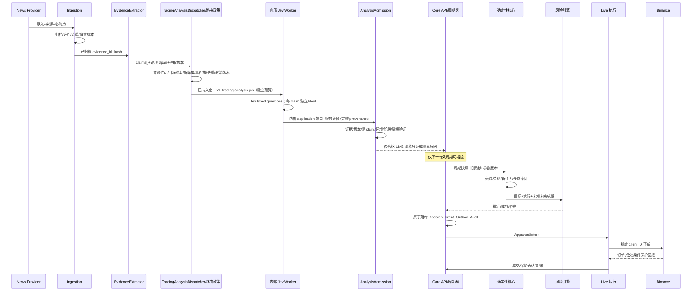

### 11.2 SIM 同路径与对照

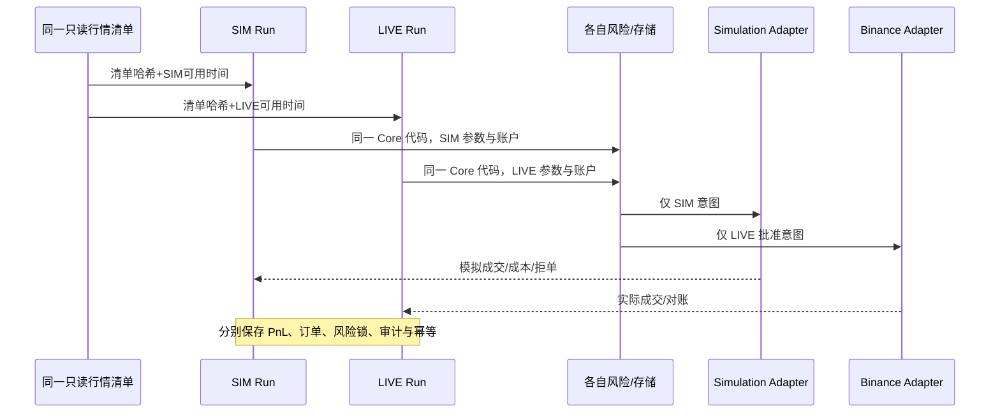

### 11.3 人工操作与 AI 自动化

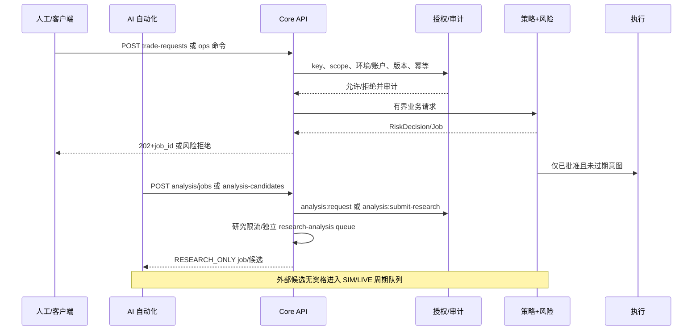

### 11.4 LIVE 启动、停止与 Emergency Stop

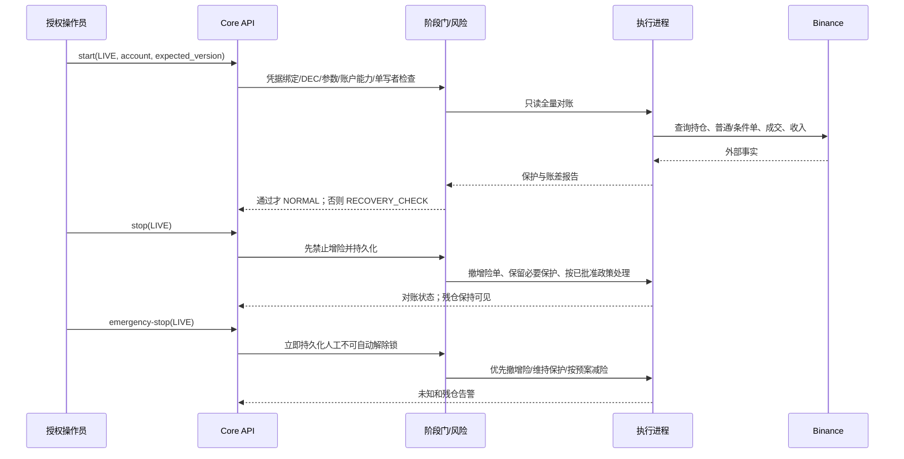

### 11.5 执行进程崩溃后的重启对账

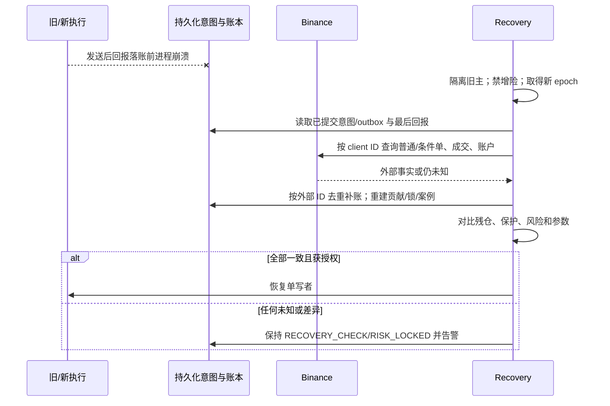

### 11.6 Binance 请求超时 / 状态未知

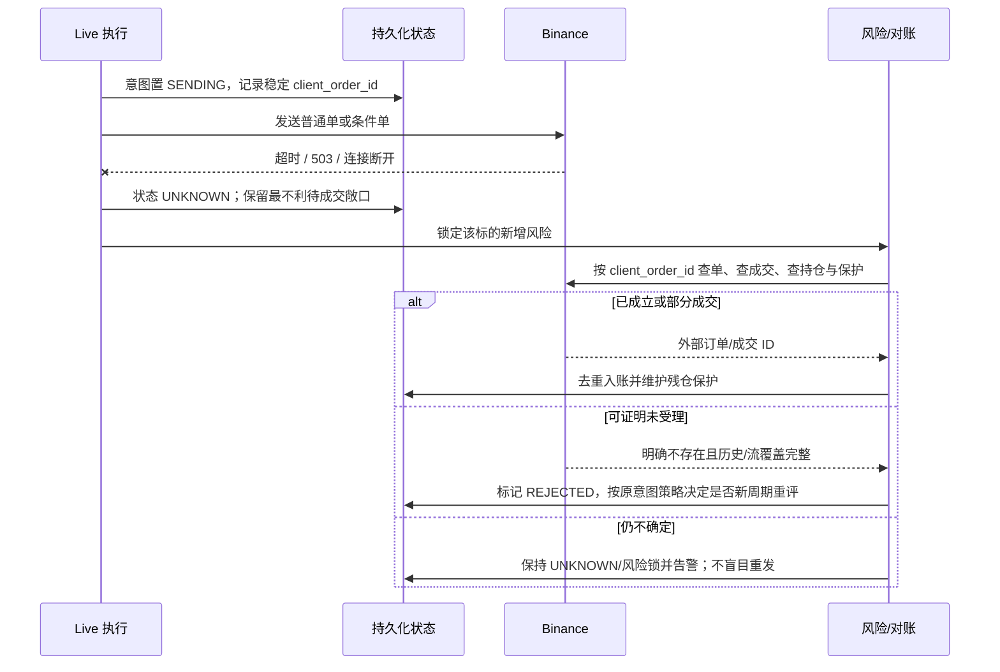

### 11.7 分离的 Jev 与新闻故障恢复

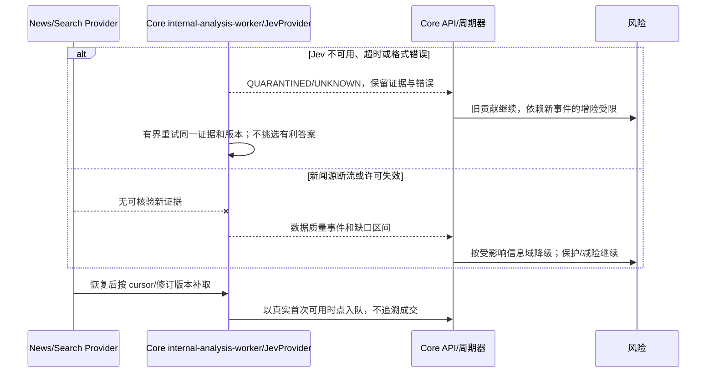

### 11.8 数据库备份恢复

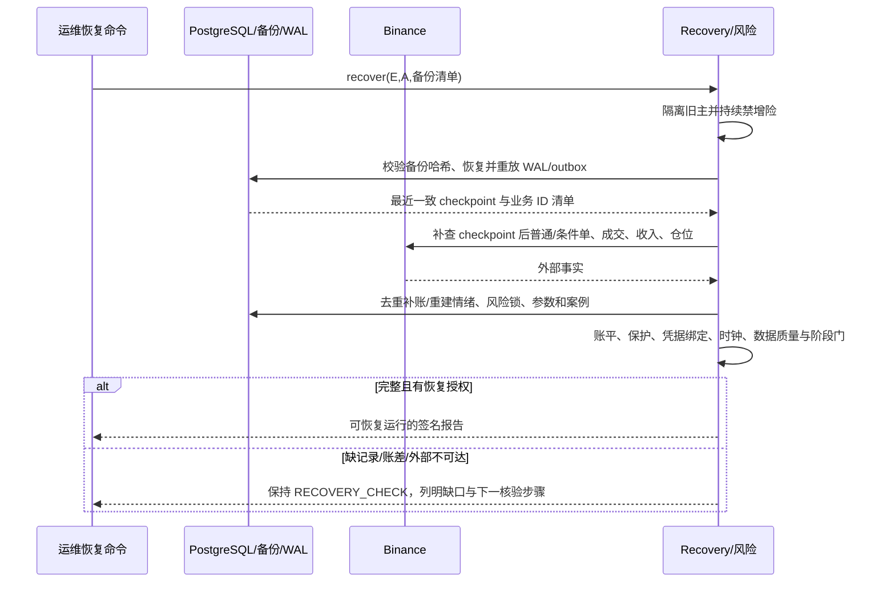

### 11.9 Core API/PostgreSQL 不可用时的 Break-glass 运维

这是**经事故指挥员启动的人工作业预案**，不是 Core API 后门，也不是常规自动执行路径。若 LIVE 有残仓而 `emergency-stop` 无法持久化/确认，先声明 SEV-1，冻结发布与自动恢复，按独立于 PostgreSQL 的部署控制切断旧 `execution-live` 的交易 API 凭据或出口网络，并核对交易所侧已有保护单是否仍有效。切断凭据前后都不得把“请求已发送”当作“交易所已停止”；如旧进程是否仍可发单不明，保持事故态并由运营人员在交易所界面确认。预先准备并演练官方界面的访问、备用设备/网络、账户指纹、MFA、值班人和第二复核人；凭据不可存进代码仓库或事故记录。

授权操作员使用**目标账户的交易所官方界面**查看实际仓位、普通单、条件保护单和最近成交，逐笔识别并取消可能增险的挂单；必要保护单不能因为“一键全撤”被误删。然后只按事故前已签署的 DEC-06/账户级处置政策决定保留保护、减仓或平仓，不根据失效的本地投影推算仓位，不下新的增险单。官方界面的“全部撤单/全部平仓”可能波及其他订单或以市价退出，具体可用性与作用范围须在目标账户/产品上实测并写入私有 runbook；[Binance 官方 Close-All 说明](https://www.binance.com/en-NZ/support/faq/detail/ef56e7d1f00948f0b0da68fdf8b82d13)仅证明通用界面存在此类功能，**不能替代 SOXLUSDT 目标账户能力验证**。若交易所界面、网络或账户访问也不可用，值班人升级至交易所官方支持与既定事故联系人，继续监测外部仓位/保护；不能使用未经审批的本地脚本猜测发单。严格 reduce-only 的离线工具仅作为未来单独 ADR/安全评审的备选，不纳入 v1.1 的可执行路径。

每一步在独立事故记录中保存 UTC、操作人/复核人、账户指纹、交易所订单/成交 ID、操作前后界面证据、不可用的系统组件和原因；受限截图加密存放。PostgreSQL/Core API 恢复后先置 `RECOVERY_CHECK`，导入**人工外部事实**，全量查询交易所订单、成交、仓位与保护，按外部 ID 去重补账和审计，校验风险锁/参数/时段预算；人工平仓不被解释成策略交易或自动补仓触发。只有旧执行主确已隔离、账差归零或有签署解释、保护可确认，且阶段门及授权恢复命令通过，才允许 LIVE 再次增险。DEC-06 未关闭时此 runbook 无法签署，仍阻塞 G3。

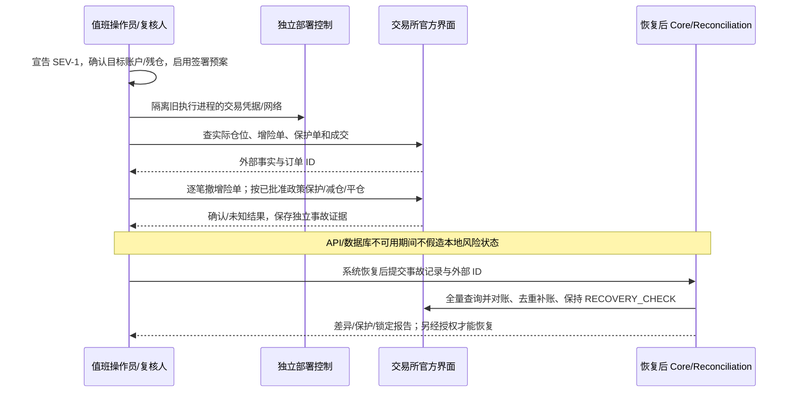

## 12. 安全、可观测、部署与测试

Secret Provider 从仓库外私有存储注入；只有 live execution 进程能读取交易签名密钥，API/Jev/研究/日志均不可读取。交易所密钥禁提币与转账、限制 IP 和目标账户；API Key 与交易密钥分离。所有启动/停机/密钥/权限/参数/风险/订单/对账命令以及失败拒绝写追加审计，审计含 actor、key_id、RunKey、before/after 版本、reason、correlation_id、时间及哈希链/离线校验清单；更正仅追加。审计写入失败、磁盘满或链断裂时禁增险。日志脱敏，不记录密钥、真实 Prompt、受限原文或完整模型缓存；敏感回放材料本地加密。公开版本由白名单目录生成，检查暂存、历史、分支/标签、镜像层、文档元数据与 Prompt 片段，许可证/仓库归属仍待确认。

Metrics 至少包含每 RunKey 的数据年龄/缺口、AI 隔离与超时率、`research_analysis_job`/`trading_analysis_job` 各自积压与最老等待时长、LIVE 保留并发/上游配额耗尽、路由拒绝码、周期延迟/漏周期、情绪账差、风险拒绝/OBSERVE 触发、实际+未知敞口、保护未确认时长、普通/条件单 UNKNOWN 数、对账差额、日损/保证金、时段两次数、学习候选与回滚、outbox/job 积压、API 401/403/429、时钟偏差、告警送达。Tracing 从 API/采集到周期/风险/订单/外部回报贯穿 correlation_id；外部供应商 trace ID 单独记录。告警 SEV-1 裸仓/未授权增险/严重账差/强平警戒，SEV-2 数据或私有流断开，SEV-3 报告延迟；断网时告警通道失败也作为事故记录。规划书工程目标由 WP-03/13 用目标部署实测，未验证前只是候选，不作为默许上线。

配置分 `public-example`、`private-deployment`、`risk-approved`、`strategy-parameter`、`provider-prompt` 五个域。硬限、阶段、账户、Prompt/模型切换不可通过普通学习发布；配置激活需签名、版本、预检、回滚点，风险日界线改变要迁移账本。迁移先备份并验证可恢复，采用兼容扩展→双读/回填→切换→清理；有仓位时不做破坏性迁移。发布执行：禁增险→核保护/未知单→备份→迁移→只读自检→全量对账→核限额/时段→授权恢复。备份包含数据库、对象清单、配置签名、模型/Prompt 版本引用、密钥恢复流程（密钥材料另管）；按 PAR-OPS 设保留与恢复目标并定期演练。任何恢复都不能绕过交易所对账。

测试分层：纯函数属性测试（账平、非负、单调高水位、风险优先、取整）、API/OpenAPI/JSON Schema 与 scope 契约测试、真实供应商版本探针、事务/幂等/重启集成、模拟交易所故障注入、确定性长序列回放、H01～H08 样本外研究、SIM/LIVE 并行隔离、生产最小订单联调（单独授权且阶段门前置）。必注入：503/超时、重复回报、部分成交、保护失败、双主、网络分区、数据库丢失/满盘、时钟漂移、新闻/Jev 中断、外部改仓、分红/拆并股/只减仓/ADL、周末与夏令时、API Key 撤销/跨环境调用。每项证据记录输入、可用时间、配置和代码摘要、预期、实际、恢复及 AC/TC 编号；收益试验不能替代安全测试。

本次交付的 [契约检查脚本](../../contracts/check_contract.py) 与 [CI 工作流](../../.github/workflows/contracts.yml) 实际读取 `contracts/openapi/v1.json` 与 `contracts/schemas/*.json`，执行 OpenAPI 3.1 结构 lint、JSON Schema 2020-12 有效/无效夹具验证、相对冻结 surface 的破坏性变更检查，并从全部 `operationId` 生成可导入的 Python server stub 作 smoke test。它验证设计合约的可解析性和基本兼容性，不能代替未来真实 server 的路由/DTO 契约测试或业务安全注入。`contracts/baseline/v1.1-surface.json` 仅供变更检测，不能反向生成规范；合法的破坏性变更必须经 ADR/API 版本评审并更新基线，不靠放宽 CI 门通过。

| 设计补充测试 | 输入/触发 | 必须结果 | 关联 |
| --- | --- | --- | --- |
| DD-CT-01 | 外部候选附 `ELIGIBLE_FOR_LIVE` 或伪造 provider provenance | Schema/授权拒绝；研究候选不能入 LIVE 周期 | ADR-017, NFR-004, TC-17 |
| DD-CT-02 | 仅有 `analysis:request` 的 key 请求多次 bullish 分析 | 只能生成研究 job；LIVE 输入清单不因请求变化 | ADR-017, REQ-EVT-002 |
| DD-CT-03 | SIM 资格凭证重放到 LIVE/另一账户或篡改 gate 版本 | Admission 拒绝，审计并禁新增贡献 | ADR-002/017, TC-14 |
| DD-CT-04 | 内部 worker 身份失效、同证据重复分析或研究记录伪装内部 run | 不原位升级，不重复注入；未知时隔离 | ADR-017, AC-05 |
| DD-CT-05 | 三个 claim 仅两个有支持的 Span | 逐 claim 结果可定位，关键缺项隔离 | ADR-018, REQ-EVT-002 |
| DD-CT-06 | Claim Span 哈希不符、金额单位或时间与原文不符 | 程序核验拒绝，不使用模型概率替代 | ADR-018, REQ-DAT-001 |
| DD-CT-07 | 新闻修订/撤销导致 claim 版本变化 | 新版本关联旧版，旧贡献不复活或重置年龄 | ADR-018, AC-05/10 |
| DD-CT-08 | 抽取器漏掉相反事实或无法证明完整性 | 标记 PARTIAL/UNKNOWN，阻止 LIVE 资格并记覆盖率 | ADR-018, WP-06 |
| DD-CT-09 | OpenAPI 字段删除、scope 收紧或新必填字段 | breaking-change gate 失败并指明差异 | ADR-019, REQ-GOV-001 |
| DD-CT-10 | API Key 创建、查询投影或权限 PATCH 携带 `signal:*`，或直接插入 `key_scope` | Schema 拒绝、PostgreSQL enum 拒绝；普通 API 数据库角色无内部 grant 写权限 | ADR-020, REQ-SEC-001～003, TC-24 |
| DD-CT-11 | 外部研究请求/导入伪造可信来源，或缺来源许可、目标映射、时点、事件族/去重版本 | Dispatcher 不创建交易 job；持久记录政策版本、清单哈希与拒绝码 | ADR-021, REQ-EVT-002, TC-17 |
| DD-CT-12 | 研究主体洪泛、SIM 峰值与 Jev 上游限流同时出现 | 研究 429/有界积压；LIVE 保留 worker 与经实测的 Provider 份额，过期交易 job 弃权并告警 | ADR-021, NFR-001/004, WP-13 |
| DD-CT-13 | PostgreSQL/Core API 故障且 LIVE 有残仓；运营经官方界面撤增险/减仓 | 独立事故证据与双人复核；恢复后外部 ID 去重对账，保持 RECOVERY_CHECK 至授权恢复 | ADR-022, REQ-OPS-001, TC-14/23 |

当前契约文件及静态 CI 已覆盖 DD-CT-01 的字段拒绝、DD-CT-05 的逐 claim 结构、DD-CT-09 的合约面变化及 DD-CT-10 的 JSON Schema 拒绝/类型域相斥；DD-CT-10 的数据库部分和其余测试需要真实迁移、Dispatcher、队列、Admission、抽取器及目标账户演练后验证，未在设计阶段宣称通过。

## 13. ADR 登记（本设计提出，需在实施评审中维护）

每个 ADR 包含选择、依据、替代、测试及恢复；状态为“设计提议”，不把业务待决项转为已确认。

| ADR | 设计/为什么 | 对应上游 | 替代及暂不采用原因 | 测试与失败恢复 |
| --- | --- | --- | --- | --- |
| ADR-001 | API-first 模块化单体；统一能力边界，保留纯内部函数 | GOV, STA, SEC；WP-03/12 | 全微服务增加分布式状态成本 | API 越界测试；故障时局部降级 |
| ADR-002 | SIM/LIVE RunKey、库角色与凭据多重隔离 | CAP, RSK, EXE；CR-03/04 | 全局 mode 易串单 | 并行同行情、跨环境拒绝；锁住受影响域 |
| ADR-003 | 纯确定性核心+时点快照+持久周期 | DAT, STA, SEN, VAL, TIM | 新闻直接下单破坏时基 | 回放一致、漏周期；冻结增险后补状态 |
| ADR-004 | 证据层与 AI Provider 解耦，Jev 默认 | EVT, NFR-004；WP-06 | 把搜索/模型绑定交易核心会越权 | Mock/供应商契约、隔离；旧贡献继续 |
| ADR-005 | 风险批准、意图与 outbox 同事务 | POS, RSK, EXE；CR-04 | 内存队列可能丢意图 | 崩溃窗口/重放；UNKNOWN 查单 |
| ADR-006 | 单写者 epoch 与外部 ID 对账 | EXE, TRD, NFR-005；TC-08/14 | 仅租约不足以防旧主 | 双主注入；不能隔离旧主则禁发单 |
| ADR-007 | 普通/条件保护分离并查询确认 | STP, TRD；CR-04 | “已发送即受保护”不成立 | TC-09～13；残仓告警与仅减仓 |
| ADR-008 | 追加情绪/账户/审计账本 | SEN, RSK, NFR-002/003 | 仅净值无法重放 | 账平/恢复；不一致锁定 |
| ADR-009 | API Key 最小权限、环境/账户绑定 | SEC, GOV；WP-03/12 | 共用管理员密钥越权 | 撤销/轮换/跨环境；即时禁权 |
| ADR-010 | 白名单单参数自动发布，周期边界 CAS | LRN, AUT；WP-11 | 人工逐次审批违背已确认自动生效 | AC-23～26/40；回滚未来版本 |
| ADR-011 | 三层研究数据与封存样本 | VAL, MET；CR-06 | 拼接 ETF 与合约历史误导 | AC-29～31；证据不足停阶段 |
| ADR-012 | 本地隔离进程+备份/对账恢复 | OPS, REL；WP-03/13 | 第二服务器当前无依据 | TC-14/23；未对账禁增险 |
| ADR-013 | API 异步 job、幂等与稳定错误语义 | EXE, NFR-002/003；WP-03 | 同步等待外部成交会误报失败 | 重试/超时/重复；按 job 查结果 |
| ADR-014 | 同方向共享价格兑现预算/冻结参数快照 | EVT, SEN, PAR, LRN | 每事件独立兑现会重复计价 | AC-08～10；账差冻结该标的 |
| ADR-015 | LIVE 账户级风险政策配置化且 DEC-06 未关闭时阻塞启动 | RSK, CAP, REL；CR-07 | 自行选择强平政策越权 | OBSERVE/ENFORCE 分支；锁定待确认 |
| ADR-016 | 受控脱敏公开快照与私有 Prompt Provider | SEC；WP-18 | 直接公开内部仓库可能泄密 | AC-42/TC-24；泄漏先撤销轮换 |
| ADR-017 | 外部分析只产研究候选；内部 Admission 分环境发布资格，阻断 `analysis:submit-research` 间接驱动实盘 | EVT-002、NFR-004、RSK-001、CR-04；WP-06/09 | 仅依赖“无 trade:live”无法防伪造信号；所有候选一律人工审批又不符自动流程 | DD-CT-01～04 伪造、跨环境、重复和拒绝；资格异常冻结新贡献并保留旧状态 |
| ADR-018 | 每 claim 单独判断，抽取器是独立端口；完整事实与跨度可审计 | EVT-002～004、DAT-001、NFR-002；WP-05/06 | 一个聚合 Noul 不能定位错误；让 Jev 随意写事实会失去证据锚点 | DD-CT-05～08 漏 claim、错跨度、修订与矛盾；不合格隔离 |
| ADR-019 | OpenAPI 引用独立 JSON Schema；正文只解释语义，DTO 生成或逐字段契约验证 | GOV-001、NFR-002/003、TST-001；WP-03/13 | 三套手写定义易漂移；仅有 MD 不能做构建门 | lint、样例、breaking-change、stub smoke；失败阻断发布 |
| ADR-020 | `ApiScope` 与 `WorkloadCapability` 用不同 schema/语言枚举、PostgreSQL enum、表、principal 与 DB 角色，普通 key 永远无信号能力 | SEC-001～003、NFR-004；WP-03/18 | 同一 scope 枚举加运行时 denylist 易被权限代码绕过 | DD-CT-10 契约/迁移/角色测试；异常 grant 拒绝并冻结相关身份 |
| ADR-021 | 版本化确定性 `EvidenceRoutingPolicy` 和 `TradingAnalysisDispatcher`；研究/交易队列、worker 与预算分离，LIVE 保留容量 | EVT-002～004、DAT-001、NFR-001/004；WP-05/06/13 | 外部 request 直接触发交易分析可操纵输入；单队列可被研究任务饿死 | DD-CT-11/12 路由回放与洪泛；过期隔离，旧贡献按原规则衰减 |
| ADR-022 | API/数据库故障时执行签署的交易所官方界面人工 break-glass；恢复后外部事实对账 | OPS-001、RSK-001、NFR-005、DEC-06；WP-12/13/15 | 无最后手段会留残仓；未审查离线发单工具会形成后门 | DD-CT-13 桌面演练与外部 ID 补账；未知结果保持 RECOVERY_CHECK |

## 14. 待决事项 / Open Questions 与阻塞关系

| 来源 | 状态与未决内容 | 阻塞模块/阶段；关闭证据 |
| --- | --- | --- |
| DEC-01 / D-02 / D-11 | 目标账户合法产品/API、逐仓/单向/独立账户、地区与协议能力待核实 | live adapter、G0/G3；WP-02 能力矩阵与账户实测 |
| DEC-02 / D-04 | 主周期、漏周期策略细节、观察窗量级、非传统窗口待标定 | scheduler、SIM 研究；时点/周末/恢复试验 |
| DEC-03 / D-06 | 实际本金、保证金、风险日界线、累计试验损失预算待确认 | account/risk、G3；签署配置与成本验证 |
| DEC-04 / D-03 / D-12 | 数据源许可、价格/执行代理、公司行动与特殊结算来源待确认 | ingest/valuation/execution、可信回测/G2/G3；采购与合约探针 |
| DEC-05 | 首批事件/因子/学习子集待登记；规划书三类为研究建议 | event/learning、首次标定；独立样本及消融 |
| DEC-06 / D-07 | LIVE 触限后的已有仓位处置与解除政策待用户决定 | live risk、start/recover、G3；签署预案及独立 ENFORCE 演练 |
| DEC-07 | 日亏损默认值、非传统双次数阈值待测试 | risk/time-window、G3；WP-14 400/4000 分别研究 |
| DEC-08 / D-08 | 主指标、最小效应、功效、样本及门槛待预登记 | research/learning、独立验证；WP-04 方案封存 |
| DEC-09 / D-09 | 学习边界、冷却、检查周期、回滚阈值待标定 | learning L3；WP-11/14 前瞻证据 |
| DEC-10 / D-10 | 本地资源、时钟/供电/断网、保留与告警待测 | deployment/recovery、R1/G3；WP-03/13 演练 |
| 规划书 19.3 | Jev 接入、费用、隐私/许可与版本契约尚未确认；本设计仅指定默认适配器 | JevProvider 生产启用；WP-06 供应商探针及私有数据评审 |
| OD-01（本设计新增技术待决） | EvidenceExtractor 的生产实现方式、成本/许可、完整性评估与人工复核比例待确定；MockExtractor 仅供离线/SIM 骨架 | claim/evidence、LIVE 信号准入；WP-05/06 盲标漏抽/错抽与许可报告，G3 前关闭 |
| OD-02（本设计新增技术待决） | LIVE 来源 allowlist、当时目标映射、事件族启用集、新鲜度与去重政策版本，以及 Jev 上游独立配额能否保证交易预算待实测/标定 | TradingAnalysisDispatcher、LIVE 分析队列与 G3；WP-05/06/13 路由回放、洪泛与供应商限流试验 |
| OD-03（本设计新增运维待决） | 目标账户的官方界面功能、备用访问、双人复核和 DEC-06 处置政策尚待实测/签署 | break-glass runbook、LIVE G3；WP-12/13/15 无真实增险的桌面演练及事故后对账演练 |
| SRS SEC-003 | 仓库归属和许可证待用户决定 | WP-18 对外发布；脱敏审查与签署 |

这些事项不阻塞 domain 纯函数、API 契约、SIM/LIVE 隔离骨架、MockExtractor/MockProvider、模拟交易所和安全测试的编码。受影响能力在配置校验中保持 `REQUIRED_UNSET`，阶段门返回具体未决 ID；不可用虚构生产常数填补。v1.1 的数据库表与 API 仍有通用投影，只有附带独立 schema、完整迁移及契约测试的模块可进入具体实现；这不影响上述骨架启动。

## 15. 逐项可追踪矩阵

下表在本次 v1.1 源文件中逐项列出 94 项 REQ、5 项 NFR、7 项 CR、10 项 DEC、18 项 WP、42 项 AC 和 24 项 TC。`实现`列为拟落地的包/端口/API；进入编码后需补具体 symbol/commit 与证据。`AC/TC` 是现有验收映射，部分新增架构边界用专门契约测试 `DD-CT-*` 补足，不能替代原 AC/TC。为保持表可审查，一行可复用同族 ADR 与测试，但仍是**逐 ID 映射**，不能仅以章节范围宣称完成。

<!-- TRACE_MATRIX_START -->
| 上游 ID | 原文位置 | ADR | 模块 / API 或端口 | 拟实现及 WP | 验收 |
| --- | --- | --- | --- | --- | --- |
| REQ-ATR-001 | SRS:416 | ADR-004, ADR-011 | `application/attribution` / `attributions, labels` | 待编码符号/提交；WP-11 | AC-21, TC-17 |
| REQ-ATR-002 | SRS:418 | ADR-004, ADR-011 | `application/attribution` / `attributions, labels` | 待编码符号/提交；WP-11 | AC-21, TC-17 |
| REQ-ATR-003 | SRS:424 | ADR-004, ADR-011 | `application/attribution` / `attributions, labels` | 待编码符号/提交；WP-11 | AC-21, TC-17 |
| REQ-ATR-004 | SRS:432 | ADR-004, ADR-011 | `application/attribution` / `attributions, labels` | 待编码符号/提交；WP-11 | AC-21, TC-17 |
| REQ-ATR-005 | SRS:434 | ADR-004, ADR-011 | `application/attribution` / `attributions, labels` | 待编码符号/提交；WP-11 | AC-21, TC-17 |
| REQ-AUT-001 | SRS:798 | ADR-010 | `application/learning; workers/scheduler` / `learning-candidates, reports` | 待编码符号/提交；WP-11, WP-16 | AC-40, TC-22 |
| REQ-CAP-001 | SRS:788 | ADR-002, ADR-015 | `domain/risk; application/phase_gate` / `risk, phase-gates` | 待编码符号/提交；WP-09, WP-14, WP-15 | AC-37, TC-21 |
| REQ-CAP-002 | SRS:792 | ADR-002, ADR-015 | `domain/risk; application/phase_gate` / `risk, phase-gates` | 待编码符号/提交；WP-09, WP-14, WP-15 | AC-38, TC-21 |
| REQ-CAP-003 | SRS:794 | ADR-002, ADR-015 | `domain/risk; application/phase_gate` / `risk, phase-gates` | 待编码符号/提交；WP-09, WP-14, WP-15 | AC-39, TC-21 |
| REQ-CAS-001 | SRS:391 | ADR-008, ADR-011 | `application/cases` / `cases, positions` | 待编码符号/提交；WP-11 | AC-20, TC-15 |
| REQ-CAS-002 | SRS:402 | ADR-008, ADR-011 | `application/cases` / `cases, positions` | 待编码符号/提交；WP-11 | AC-20, TC-15 |
| REQ-CFT-001 | SRS:438 | ADR-011 | `research/counterfactual` / `replay-runs, reports` | 待编码符号/提交；WP-08, WP-11 | AC-22, TC-17 |
| REQ-CFT-002 | SRS:440 | ADR-011 | `research/counterfactual` / `replay-runs, reports` | 待编码符号/提交；WP-08, WP-11 | AC-22, TC-17 |
| REQ-CFT-003 | SRS:442 | ADR-011 | `research/counterfactual` / `replay-runs, reports` | 待编码符号/提交；WP-08, WP-11 | AC-22, TC-17 |
| REQ-DAT-001 | SRS:195 | ADR-003, ADR-008, ADR-018, ADR-021 | `workers/ingestion; ports/EvidenceExtractor; application/analysis/routing` / `market/*, evidence/*` | 待编码符号/提交；WP-02, WP-05 | AC-29, TC-04, TC-05, DD-CT-06, DD-CT-11 |
| REQ-DAT-002 | SRS:197 | ADR-003, ADR-008 | `workers/ingestion; ports/EvidenceExtractor; application/analysis/routing` / `market/*, evidence/*` | 待编码符号/提交；WP-02, WP-05 | AC-02, AC-29, TC-04, TC-05 |
| REQ-EVT-001 | SRS:234 | ADR-004, ADR-019 | `domain/event; application/analysis/routing; ports/EvidenceExtractor` / `analysis/jobs, events/*` | 待编码符号/提交；WP-05, WP-06 | AC-04, TC-17 |
| REQ-EVT-002 | SRS:236 | ADR-004, ADR-017, ADR-018, ADR-021 | `domain/event; application/analysis/routing; ports/EvidenceExtractor` / `analysis/jobs, events/*` | 待编码符号/提交；WP-05, WP-06 | AC-04, TC-17, DD-CT-01, DD-CT-05, DD-CT-06, DD-CT-08, DD-CT-11 |
| REQ-EVT-003 | SRS:240 | ADR-004, ADR-018, ADR-021 | `domain/event; application/analysis/routing; ports/EvidenceExtractor` / `analysis/jobs, events/*` | 待编码符号/提交；WP-05, WP-06 | AC-05, TC-17, DD-CT-07, DD-CT-11 |
| REQ-EVT-004 | SRS:244 | ADR-004, ADR-014, ADR-018, ADR-021 | `domain/event; application/analysis/routing; ports/EvidenceExtractor` / `analysis/jobs, events/*` | 待编码符号/提交；WP-05, WP-06 | AC-05, TC-17, DD-CT-07, DD-CT-11 |
| REQ-EVT-005 | SRS:248 | ADR-004, ADR-014 | `domain/event; application/analysis/routing; ports/EvidenceExtractor` / `analysis/jobs, events/*` | 待编码符号/提交；WP-05, WP-06 | AC-06, TC-17 |
| REQ-EVT-006 | SRS:256 | ADR-004, ADR-014 | `domain/event; application/analysis/routing; ports/EvidenceExtractor` / `analysis/jobs, events/*` | 待编码符号/提交；WP-05, WP-06 | AC-06, TC-17 |
| REQ-EVT-007 | SRS:260 | ADR-004, ADR-014, ADR-019 | `domain/event; application/analysis/routing; ports/EvidenceExtractor` / `analysis/jobs, events/*` | 待编码符号/提交；WP-05, WP-06 | AC-07, TC-17 |
| REQ-EXE-001 | SRS:334 | ADR-005, ADR-006, ADR-013 | `application/intents; execution/*` / `trade-requests, intents, orders` | 待编码符号/提交；WP-09, WP-10 | AC-14, TC-08, TC-14 |
| REQ-EXE-002 | SRS:336 | ADR-005, ADR-006, ADR-013 | `application/intents; execution/*` / `trade-requests, intents, orders` | 待编码符号/提交；WP-09, WP-10 | AC-14, TC-08, TC-14 |
| REQ-FAC-001 | SRS:306 | ADR-003, ADR-011 | `domain/factors; research` / `decisions, reports` | 待编码符号/提交；WP-04, WP-07, WP-08 | AC-11, TC-05, TC-17 |
| REQ-FAC-002 | SRS:308 | ADR-003, ADR-011 | `domain/factors; research` / `decisions, reports` | 待编码符号/提交；WP-04, WP-07, WP-08 | AC-11, TC-05, TC-17 |
| REQ-GOV-001 | SRS:134 | ADR-001, ADR-019 | `application/governance` / `phase-gates, config-proposals` | 待编码符号/提交；WP-01, WP-03, WP-17 | AC-01, TC-18, DD-CT-09 |
| REQ-GOV-002 | SRS:160 | ADR-001, ADR-009 | `application/governance` / `phase-gates, config-proposals` | 待编码符号/提交；WP-01, WP-03, WP-17 | AC-02, AC-32, TC-18 |
| REQ-LRN-001 | SRS:460 | ADR-010, ADR-011 | `application/learning; domain/parameters` / `learning-candidates, parameter-versions` | 待编码符号/提交；WP-11, WP-16 | AC-23, TC-22 |
| REQ-LRN-002 | SRS:466 | ADR-010, ADR-011 | `application/learning; domain/parameters` / `learning-candidates, parameter-versions` | 待编码符号/提交；WP-11, WP-16 | AC-23, TC-22 |
| REQ-LRN-003 | SRS:476 | ADR-010, ADR-011 | `application/learning; domain/parameters` / `learning-candidates, parameter-versions` | 待编码符号/提交；WP-11, WP-16 | AC-23, TC-22 |
| REQ-LRN-004 | SRS:493 | ADR-010, ADR-011 | `application/learning; domain/parameters` / `learning-candidates, parameter-versions` | 待编码符号/提交；WP-11, WP-16 | AC-24, TC-22 |
| REQ-LRN-005 | SRS:503 | ADR-010, ADR-011 | `application/learning; domain/parameters` / `learning-candidates, parameter-versions` | 待编码符号/提交；WP-11, WP-16 | AC-24, TC-22 |
| REQ-LRN-006 | SRS:507 | ADR-010, ADR-011 | `application/learning; domain/parameters` / `learning-candidates, parameter-versions` | 待编码符号/提交；WP-11, WP-16 | AC-25, TC-22 |
| REQ-LRN-007 | SRS:509 | ADR-010, ADR-011 | `application/learning; domain/parameters` / `learning-candidates, parameter-versions` | 待编码符号/提交；WP-11, WP-16 | AC-25, TC-22 |
| REQ-LRN-008 | SRS:513 | ADR-010, ADR-011 | `application/learning; domain/parameters` / `learning-candidates, parameter-versions` | 待编码符号/提交；WP-11, WP-16 | AC-26, TC-22 |
| REQ-LRN-009 | SRS:517 | ADR-010, ADR-011 | `application/learning; domain/parameters` / `learning-candidates, parameter-versions` | 待编码符号/提交；WP-11, WP-16 | AC-26, TC-22 |
| REQ-LRN-010 | SRS:523 | ADR-010, ADR-011 | `application/learning; domain/parameters` / `learning-candidates, parameter-versions` | 待编码符号/提交；WP-11, WP-16 | AC-26, TC-22 |
| REQ-MET-001 | SRS:571 | ADR-011, ADR-012 | `research/metrics; monitoring` / `reports` | 待编码符号/提交；WP-08, WP-12 | AC-28, TC-17 |
| REQ-MET-002 | SRS:586 | ADR-011, ADR-012 | `research/metrics; monitoring` / `reports` | 待编码符号/提交；WP-08, WP-12 | AC-28, TC-17 |
| REQ-MET-003 | SRS:592 | ADR-011, ADR-012 | `research/metrics; monitoring` / `reports` | 待编码符号/提交；WP-08, WP-12 | AC-28, TC-17 |
| REQ-OBJ-001 | SRS:140 | ADR-003, ADR-011 | `domain/decision; research` / `decisions, reports` | 待编码符号/提交；WP-04, WP-08, WP-13 | AC-01, AC-28, AC-31, TC-17 |
| REQ-OBJ-002 | SRS:142 | ADR-003, ADR-011 | `domain/decision; research` / `decisions, reports` | 待编码符号/提交；WP-04, WP-08, WP-13 | AC-03, AC-20, TC-17 |
| REQ-OBS-001 | SRS:406 | ADR-011 | `application/observation` / `cases, labels` | 待编码符号/提交；WP-11 | AC-20, TC-17 |
| REQ-OBS-002 | SRS:410 | ADR-011 | `application/observation` / `cases, labels` | 待编码符号/提交；WP-11 | AC-20, TC-17 |
| REQ-OPS-001 | SRS:802 | ADR-012, ADR-022 | `deployment/breakglass; application/recovery` / `health/*, recover, reconciliations` | 待编码符号/提交；WP-03, WP-12, WP-13 | AC-41, TC-14, TC-23, DD-CT-13 |
| REQ-PAR-001 | SRS:533 | ADR-008, ADR-010 | `domain/parameters; application/config` / `parameters, config-proposals` | 待编码符号/提交；WP-01, WP-07, WP-11 | AC-27, TC-21, TC-22 |
| REQ-POS-001 | SRS:314 | ADR-003, ADR-014 | `domain/position; application/decision` / `decisions, trade-requests` | 待编码符号/提交；WP-07, WP-09 | AC-12, TC-02, TC-03 |
| REQ-POS-002 | SRS:318 | ADR-003, ADR-014 | `domain/position; application/decision` / `decisions, trade-requests` | 待编码符号/提交；WP-07, WP-09 | AC-13, TC-02, TC-03 |
| REQ-POS-003 | SRS:324 | ADR-003, ADR-014 | `domain/position; application/decision` / `decisions, trade-requests` | 待编码符号/提交；WP-07, WP-09 | AC-13, TC-02, TC-03 |
| REQ-POS-004 | SRS:328 | ADR-003, ADR-014 | `domain/position; application/decision` / `decisions, trade-requests` | 待编码符号/提交；WP-07, WP-09 | AC-13, TC-02, TC-03 |
| REQ-POS-005 | SRS:332 | ADR-003, ADR-014 | `domain/position; application/decision` / `decisions, trade-requests` | 待编码符号/提交；WP-07, WP-09 | AC-13, TC-02, TC-03 |
| REQ-REG-001 | SRS:298 | ADR-003, ADR-011 | `domain/regime` / `market/snapshots, decisions` | 待编码符号/提交；WP-07, WP-08 | AC-11, TC-04, TC-17 |
| REQ-REG-002 | SRS:302 | ADR-003, ADR-011 | `domain/regime` / `market/snapshots, decisions` | 待编码符号/提交；WP-07, WP-08 | AC-11, TC-04, TC-17 |
| REQ-REL-001 | SRS:639 | ADR-012, ADR-015 | `application/phase_gate; deployment` / `phase-gates, start` | 待编码符号/提交；WP-13, WP-15, WP-17 | AC-32, TC-14, TC-18 |
| REQ-RSK-001 | SRS:360 | ADR-002, ADR-005, ADR-008, ADR-015, ADR-022 | `domain/risk; application/risk` / `risk, risk-events, trade-requests` | 待编码符号/提交；WP-09, WP-10 | AC-17, TC-08, TC-12, TC-15, TC-21 |
| REQ-RSK-002 | SRS:362 | ADR-002, ADR-005, ADR-008, ADR-015 | `domain/risk; application/risk` / `risk, risk-events, trade-requests` | 待编码符号/提交；WP-09, WP-10 | AC-17, TC-08, TC-12, TC-15, TC-21 |
| REQ-RSK-003 | SRS:366 | ADR-002, ADR-005, ADR-008, ADR-015 | `domain/risk; application/risk` / `risk, risk-events, trade-requests` | 待编码符号/提交；WP-09, WP-10 | AC-18, TC-08, TC-12, TC-15, TC-21 |
| REQ-RSK-004 | SRS:370 | ADR-002, ADR-005, ADR-008, ADR-015 | `domain/risk; application/risk` / `risk, risk-events, trade-requests` | 待编码符号/提交；WP-09, WP-10 | AC-18, TC-08, TC-12, TC-15, TC-21 |
| REQ-RSK-005 | SRS:374 | ADR-002, ADR-005, ADR-008, ADR-015 | `domain/risk; application/risk` / `risk, risk-events, trade-requests` | 待编码符号/提交；WP-09, WP-10 | AC-19, TC-08, TC-12, TC-15, TC-21 |
| REQ-RSK-006 | SRS:385 | ADR-002, ADR-005, ADR-008, ADR-015 | `domain/risk; application/risk` / `risk, risk-events, trade-requests` | 待编码符号/提交；WP-09, WP-10 | AC-19, TC-08, TC-12, TC-15, TC-21 |
| REQ-SEC-001 | SRS:804 | ADR-001, ADR-004, ADR-009, ADR-016, ADR-017, ADR-020 | `api/auth; application/workload_identity; deployment/public-export` / `api-keys, permissions, audit` | 待编码符号/提交；WP-03, WP-12, WP-18 | AC-42, TC-24, DD-CT-10 |
| REQ-SEC-002 | SRS:806 | ADR-001, ADR-004, ADR-009, ADR-016, ADR-017, ADR-020 | `api/auth; application/workload_identity; deployment/public-export` / `api-keys, permissions, audit` | 待编码符号/提交；WP-03, WP-12, WP-18 | AC-42, TC-24, DD-CT-10 |
| REQ-SEC-003 | SRS:808 | ADR-001, ADR-004, ADR-009, ADR-016, ADR-017, ADR-020 | `api/auth; application/workload_identity; deployment/public-export` / `api-keys, permissions, audit` | 待编码符号/提交；WP-03, WP-12, WP-18 | AC-42, TC-24, DD-CT-10 |
| REQ-SEN-001 | SRS:266 | ADR-003, ADR-008, ADR-014 | `domain/sentiment; adapters/postgres` / `sentiment, decisions` | 待编码符号/提交；WP-07, WP-08 | AC-08, TC-05 |
| REQ-SEN-002 | SRS:270 | ADR-003, ADR-008, ADR-014 | `domain/sentiment; adapters/postgres` / `sentiment, decisions` | 待编码符号/提交；WP-07, WP-08 | AC-08, TC-05 |
| REQ-SEN-003 | SRS:274 | ADR-003, ADR-008, ADR-014 | `domain/sentiment; adapters/postgres` / `sentiment, decisions` | 待编码符号/提交；WP-07, WP-08 | AC-09, TC-05 |
| REQ-SEN-004 | SRS:280 | ADR-003, ADR-008, ADR-014 | `domain/sentiment; adapters/postgres` / `sentiment, decisions` | 待编码符号/提交；WP-07, WP-08 | AC-09, TC-05 |
| REQ-SEN-005 | SRS:284 | ADR-003, ADR-008, ADR-014 | `domain/sentiment; adapters/postgres` / `sentiment, decisions` | 待编码符号/提交；WP-07, WP-08 | AC-10, TC-05 |
| REQ-STA-001 | SRS:207 | ADR-003, ADR-015 | `domain/state; workers/scheduler` / `runs, decisions, start/stop` | 待编码符号/提交；WP-07, WP-09, WP-12 | AC-03, TC-14, TC-19 |
| REQ-STA-002 | SRS:218 | ADR-003, ADR-015 | `domain/state; workers/scheduler` / `runs, decisions, start/stop` | 待编码符号/提交；WP-07, WP-09, WP-12 | AC-03, AC-14, TC-14, TC-19 |
| REQ-STA-003 | SRS:222 | ADR-003, ADR-015 | `domain/state; workers/scheduler` / `runs, decisions, start/stop` | 待编码符号/提交；WP-07, WP-09, WP-12 | AC-03, AC-35, TC-14, TC-19 |
| REQ-STA-004 | SRS:228 | ADR-003, ADR-015 | `domain/state; workers/scheduler` / `runs, decisions, start/stop` | 待编码符号/提交；WP-07, WP-09, WP-12 | AC-03, AC-19, TC-14, TC-19 |
| REQ-STP-001 | SRS:342 | ADR-007, ADR-015 | `domain/stop; execution/protection` / `protections, reduce-requests` | 待编码符号/提交；WP-09, WP-10 | AC-15, TC-09, TC-10, TC-11 |
| REQ-STP-002 | SRS:348 | ADR-007, ADR-015 | `domain/stop; execution/protection` / `protections, reduce-requests` | 待编码符号/提交；WP-09, WP-10 | AC-15, TC-09, TC-10, TC-11 |
| REQ-STP-003 | SRS:352 | ADR-007, ADR-015 | `domain/stop; execution/protection` / `protections, reduce-requests` | 待编码符号/提交；WP-09, WP-10 | AC-16, TC-09, TC-10, TC-11 |
| REQ-STP-004 | SRS:354 | ADR-007, ADR-015 | `domain/stop; execution/protection` / `protections, reduce-requests` | 待编码符号/提交；WP-09, WP-10 | AC-16, TC-09, TC-10, TC-11 |
| REQ-TIM-001 | SRS:778 | ADR-003, ADR-015 | `workers/scheduler; domain/time_window` / `time-windows, decisions` | 待编码符号/提交；WP-07, WP-09 | AC-35, TC-04, TC-19 |
| REQ-TIM-002 | SRS:780 | ADR-003, ADR-015 | `workers/scheduler; domain/time_window` / `time-windows, decisions` | 待编码符号/提交；WP-07, WP-09 | AC-36, TC-20 |
| REQ-TIM-003 | SRS:784 | ADR-003, ADR-015 | `workers/scheduler; domain/time_window` / `time-windows, decisions` | 待编码符号/提交；WP-07, WP-09 | AC-36, TC-20 |
| REQ-TRD-001 | SRS:768 | ADR-006, ADR-007, ADR-008 | `adapters/binance; domain/instrument` / `market/instruments, orders, protections` | 待编码符号/提交；WP-02, WP-09, WP-10 | AC-33, TC-01, TC-02, TC-03 |
| REQ-TRD-002 | SRS:770 | ADR-006, ADR-007, ADR-008 | `adapters/binance; domain/instrument` / `market/instruments, orders, protections` | 待编码符号/提交；WP-02, WP-09, WP-10 | AC-33, TC-04, TC-05 |
| REQ-TRD-003 | SRS:772 | ADR-006, ADR-007, ADR-008 | `adapters/binance; domain/instrument` / `market/instruments, orders, protections` | 待编码符号/提交；WP-02, WP-09, WP-10 | AC-33, TC-06, TC-07, TC-12 |
| REQ-TRD-004 | SRS:774 | ADR-006, ADR-007, ADR-008 | `adapters/binance; domain/instrument` / `market/instruments, orders, protections` | 待编码符号/提交；WP-02, WP-09, WP-10 | AC-34, TC-08, TC-09, TC-10, TC-11, TC-13, TC-14, TC-15, TC-16 |
| REQ-TST-001 | SRS:664 | ADR-011, ADR-012, ADR-019, ADR-020, ADR-021, ADR-022 | `tests/acceptance` / `jobs, reports` | 待编码符号/提交；WP-13, WP-17 | AC-32, TC-01, TC-02, TC-03, TC-04, TC-05, TC-06, TC-07, TC-08, TC-09, TC-10, TC-11, TC-12, TC-13, TC-14, TC-15, TC-16, TC-17, TC-18, TC-19, TC-20, TC-21, TC-22, TC-23, TC-24, DD-CT-09, DD-CT-10, DD-CT-11, DD-CT-12, DD-CT-13 |
| REQ-VAL-001 | SRS:600 | ADR-003, ADR-011 | `research/replay; research/validation` / `replay-runs, reports` | 待编码符号/提交；WP-04, WP-08, WP-14 | AC-29, TC-16, TC-17 |
| REQ-VAL-002 | SRS:602 | ADR-003, ADR-011 | `research/replay; research/validation` / `replay-runs, reports` | 待编码符号/提交；WP-04, WP-08, WP-14 | AC-29, TC-16, TC-17 |
| REQ-VAL-003 | SRS:604 | ADR-003, ADR-011 | `research/replay; research/validation` / `replay-runs, reports` | 待编码符号/提交；WP-04, WP-08, WP-14 | AC-29, TC-16, TC-17 |
| REQ-VAL-004 | SRS:608 | ADR-003, ADR-011 | `research/replay; research/validation` / `replay-runs, reports` | 待编码符号/提交；WP-04, WP-08, WP-14 | AC-30, TC-16, TC-17 |
| REQ-VAL-005 | SRS:614 | ADR-003, ADR-011 | `research/replay; research/validation` / `replay-runs, reports` | 待编码符号/提交；WP-04, WP-08, WP-14 | AC-30, TC-16, TC-17 |
| REQ-VAL-006 | SRS:616 | ADR-003, ADR-011 | `research/replay; research/validation` / `replay-runs, reports` | 待编码符号/提交；WP-04, WP-08, WP-14 | AC-30, TC-16, TC-17 |
| REQ-VAL-007 | SRS:631 | ADR-003, ADR-011 | `research/replay; research/validation` / `replay-runs, reports` | 待编码符号/提交；WP-04, WP-08, WP-14 | AC-31, TC-16, TC-17 |
| REQ-VAL-008 | SRS:633 | ADR-003, ADR-011 | `research/replay; research/validation` / `replay-runs, reports` | 待编码符号/提交；WP-04, WP-08, WP-14 | AC-31, TC-16, TC-17 |
| NFR-001 | SRS:555 | ADR-003, ADR-007, ADR-012, ADR-021 | `monitoring; workers/scheduler; workers/trading_analysis` / `health/*, jobs` | 待编码符号/提交；WP-03, WP-12, WP-13 | AC-27, TC-10, TC-17, TC-23, DD-CT-12 |
| NFR-002 | SRS:557 | ADR-003, ADR-008, ADR-013, ADR-019 | `domain; adapters/postgres` / `decisions, replay-runs` | 待编码符号/提交；WP-07, WP-08, WP-13 | AC-27, TC-08, TC-14 |
| NFR-003 | SRS:561 | ADR-008, ADR-009, ADR-016, ADR-019 | `application/audit; api/auth` / `audit, evidence` | 待编码符号/提交；WP-03, WP-12, WP-18 | AC-27, AC-42, TC-18, TC-24 |
| NFR-004 | SRS:563 | ADR-004, ADR-009, ADR-017, ADR-018, ADR-020, ADR-021 | `application/analysis/routing; ports/EvidenceExtractor; api/auth` / `analysis/jobs, analysis-candidates` | 待编码符号/提交；WP-06, WP-13 | AC-27, TC-17, TC-24, DD-CT-01, DD-CT-02, DD-CT-03, DD-CT-04, DD-CT-10, DD-CT-11, DD-CT-12 |
| NFR-005 | SRS:565 | ADR-008, ADR-012, ADR-022 | `application/recovery; deployment/breakglass` / `recover, reconciliations` | 待编码符号/提交；WP-03, WP-10, WP-13 | AC-27, AC-41, TC-14, TC-23, DD-CT-13 |
| CR-01 | PLAN:173 | ADR-006 | `domain/instrument; adapters/binance` / `market/instruments` | 待编码符号/提交；WP-02, WP-09 | AC-33, TC-01, TC-02, TC-03 |
| CR-02 | PLAN:174 | ADR-003, ADR-011, ADR-014 | `domain/sentiment; research` / `sentiment, reports` | 待编码符号/提交；WP-05, WP-07, WP-08 | AC-09, AC-29, TC-04, TC-05, TC-17 |
| CR-03 | PLAN:175 | ADR-002, ADR-008, ADR-015 | `domain/risk; application/account` / `risk, portfolio` | 待编码符号/提交；WP-09 | AC-17, AC-18, AC-33, TC-05, TC-06, TC-12 |
| CR-04 | PLAN:176 | ADR-005, ADR-006, ADR-007, ADR-013 | `application/intents; execution` / `intents, orders, protections` | 待编码符号/提交；WP-10 | AC-14, AC-34, TC-08, TC-09, TC-10, TC-13, TC-14 |
| CR-05 | PLAN:177 | ADR-006, ADR-008 | `adapters/binance; application/account` / `reconciliations` | 待编码符号/提交；WP-09, WP-10 | AC-33, AC-34, TC-06, TC-07, TC-15 |
| CR-06 | PLAN:178 | ADR-003, ADR-011, ADR-017, ADR-018 | `research/replay; application/learning; application/analysis` / `replay-runs, reports` | 待编码符号/提交；WP-04, WP-08, WP-11, WP-14 | AC-20, AC-29, AC-30, AC-31, TC-16, TC-17 |
| CR-07 | PLAN:179 | ADR-010, ADR-012, ADR-015 | `application/phase_gate; deployment` / `phase-gates, start` | 待编码符号/提交；WP-01, WP-13, WP-15, WP-17 | AC-32, AC-35, AC-36, AC-37, AC-38, AC-39, AC-40, AC-41, AC-42, TC-18, TC-19, TC-20, TC-21, TC-22, TC-23, TC-24 |
| DEC-01 | SRS:647 | ADR-002, ADR-006 | `adapters/binance; phase_gate` / `start` | 配置门保持未决；关闭后待编码；WP-02 | AC-32, AC-33, TC-01, TC-16 |
| DEC-02 | SRS:648 | ADR-003 | `workers/scheduler` / `time-windows` | 配置门保持未决；关闭后待编码；WP-07 | AC-35, TC-19 |
| DEC-03 | SRS:649 | ADR-002, ADR-015 | `domain/risk; application/account` / `risk, start` | 配置门保持未决；关闭后待编码；WP-09, WP-15 | AC-18, AC-37, TC-15, TC-21 |
| DEC-04 | SRS:650 | ADR-003, ADR-006, ADR-011 | `workers/ingestion; adapters/binance` / `market/*, evidence/*` | 配置门保持未决；关闭后待编码；WP-02, WP-05, WP-10 | AC-29, AC-33, AC-34, TC-04, TC-05, TC-06, TC-07 |
| DEC-05 | SRS:651 | ADR-004, ADR-010 | `domain/event; application/learning` / `events, learning-candidates` | 配置门保持未决；关闭后待编码；WP-04, WP-06, WP-11 | AC-04, AC-23, TC-17, TC-22 |
| DEC-06 | SRS:652 | ADR-015 | `domain/risk; application/phase_gate` / `risk, start, recover` | 配置门保持未决；关闭后待编码；WP-09, WP-15 | AC-18, AC-32, TC-21 |
| DEC-07 | SRS:653 | ADR-015 | `domain/risk; domain/time_window` / `risk, time-windows` | 配置门保持未决；关闭后待编码；WP-09, WP-14 | AC-36, AC-39, TC-20, TC-21 |
| DEC-08 | SRS:654 | ADR-011 | `research/validation` / `reports` | 配置门保持未决；关闭后待编码；WP-04, WP-08 | AC-30, AC-31, TC-17 |
| DEC-09 | SRS:655 | ADR-010 | `application/learning` / `learning-candidates` | 配置门保持未决；关闭后待编码；WP-11, WP-16 | AC-26, AC-40, TC-22 |
| DEC-10 | SRS:656 | ADR-012, ADR-016 | `deployment; application/recovery` / `health/*, recover` | 配置门保持未决；关闭后待编码；WP-03, WP-13, WP-18 | AC-41, AC-42, TC-23, TC-24 |
| WP-01 | PLAN:480 | ADR-001, ADR-015 | `application/governance; domain/parameters` / `phase-gates, config-proposals` | 工作包交付/提交待实施 | AC-01, AC-27, TC-18；完整 AC/TC 依上述需求行 |
| WP-02 | PLAN:284 | ADR-004, ADR-006 | `adapters/binance; workers/ingestion` / `market/instruments, market/snapshots` | 工作包交付/提交待实施 | AC-02, AC-33, TC-01；完整 AC/TC 依上述需求行 |
| WP-03 | PLAN:482 | ADR-001, ADR-002, ADR-009, ADR-012, ADR-013, ADR-019, ADR-020 | `api; adapters/postgres; application/workload_identity; deployment` / `health/*, api-keys, jobs` | 工作包交付/提交待实施 | AC-41, TC-23, DD-CT-09/10；完整 AC/TC 依上述需求行 |
| WP-04 | PLAN:483 | ADR-011 | `research/validation; application/labels` / `reports, labels` | 工作包交付/提交待实施 | AC-29, AC-30, TC-17；完整 AC/TC 依上述需求行 |
| WP-05 | PLAN:484 | ADR-003, ADR-008, ADR-018, ADR-021 | `workers/ingestion; ports/EvidenceExtractor; application/analysis/routing` / `market/*, evidence/*` | 工作包交付/提交待实施 | AC-29, TC-04, DD-CT-06/11；完整 AC/TC 依上述需求行 |
| WP-06 | PLAN:485 | ADR-004, ADR-017, ADR-018, ADR-021 | `domain/event; application/analysis/routing; ports/EvidenceExtractor` / `analysis/jobs, analysis-candidates, events/*` | 工作包交付/提交待实施 | AC-04, TC-17, DD-CT-01/05/11/12；完整 AC/TC 依上述需求行 |
| WP-07 | PLAN:486 | ADR-003, ADR-008, ADR-014 | `domain/sentiment; domain/position` / `sentiment, decisions` | 工作包交付/提交待实施 | AC-08, AC-12, TC-05；完整 AC/TC 依上述需求行 |
| WP-08 | PLAN:487 | ADR-011 | `research/replay; research/validation` / `replay-runs, reports` | 工作包交付/提交待实施 | AC-30, AC-31, TC-16；完整 AC/TC 依上述需求行 |
| WP-09 | PLAN:488 | ADR-002, ADR-008, ADR-015 | `domain/risk; application/account` / `risk, portfolio, risk-events` | 工作包交付/提交待实施 | AC-17, AC-18, TC-21；完整 AC/TC 依上述需求行 |
| WP-10 | PLAN:489 | ADR-005, ADR-006, ADR-007 | `application/intents; execution/protection; adapters/binance` / `intents, orders, protections, reconciliations` | 工作包交付/提交待实施 | AC-14, AC-15, TC-14；完整 AC/TC 依上述需求行 |
| WP-11 | PLAN:490 | ADR-010, ADR-011 | `application/cases; application/attribution; application/learning` / `cases, labels, attributions, learning-candidates` | 工作包交付/提交待实施 | AC-20, AC-26, TC-22；完整 AC/TC 依上述需求行 |
| WP-12 | PLAN:491 | ADR-001, ADR-009, ADR-012, ADR-022 | `api/auth; api/ops; deployment/breakglass; monitoring` / `start, stop, emergency-stop, audit` | 工作包交付/提交待实施 | AC-41, AC-42, TC-24, DD-CT-13；完整 AC/TC 依上述需求行 |
| WP-13 | PLAN:492 | ADR-011, ADR-012, ADR-017, ADR-018, ADR-019, ADR-020, ADR-021, ADR-022 | `tests/acceptance; tests/contract; contracts` / `全部受测 API` | 工作包交付/提交待实施 | AC-01–AC-42, TC-01–TC-24, DD-CT-01–13；完整 AC/TC 依上述需求行 |
| WP-14 | PLAN:493 | ADR-002, ADR-011, ADR-015 | `execution/sim; research/forward` / `simulations, reports` | 工作包交付/提交待实施 | AC-30, AC-31, TC-16；完整 AC/TC 依上述需求行 |
| WP-15 | PLAN:494 | ADR-006, ADR-012, ADR-015, ADR-022 | `execution/live; application/phase_gate; application/recovery; deployment/breakglass` / `start, recover, reconciliations` | 工作包交付/提交待实施 | AC-32, AC-34, TC-21, DD-CT-13；完整 AC/TC 依上述需求行 |
| WP-16 | PLAN:495 | ADR-010, ADR-011 | `application/learning; application/governance` / `learning-candidates, config-proposals` | 工作包交付/提交待实施 | AC-26, AC-40, TC-22；完整 AC/TC 依上述需求行 |
| WP-17 | PLAN:496 | ADR-011, ADR-012 | `application/phase_gate; tests/acceptance; deployment` / `phase-gates, reports, audit` | 工作包交付/提交待实施 | AC-32, AC-41, TC-23；完整 AC/TC 依上述需求行 |
| WP-18 | PLAN:682 | ADR-009, ADR-016, ADR-020 | `api/auth; application/workload_identity; application/audit; deployment/public-export` / `api-keys, permissions, audit` | 工作包交付/提交待实施 | AC-42, TC-24, DD-CT-10；完整 AC/TC 依上述需求行 |
| AC-01 | SRS:668 | 由所测 REQ/NFR/CR 的 ADR 继承 | `tests/acceptance/ac-01` | 覆盖 REQ-GOV-001, REQ-OBJ-001；输入/预期/实际/恢复/证据待实施；WP-13/17 | AC-01 |
| AC-02 | SRS:669 | 由所测 REQ/NFR/CR 的 ADR 继承 | `tests/acceptance/ac-02` | 覆盖 REQ-DAT-002, REQ-GOV-002；输入/预期/实际/恢复/证据待实施；WP-13/17 | AC-02 |
| AC-03 | SRS:670 | 由所测 REQ/NFR/CR 的 ADR 继承 | `tests/acceptance/ac-03` | 覆盖 REQ-OBJ-002, REQ-STA-001, REQ-STA-002, REQ-STA-003, REQ-STA-004；输入/预期/实际/恢复/证据待实施；WP-13/17 | AC-03 |
| AC-04 | SRS:671 | 由所测 REQ/NFR/CR 的 ADR 继承 | `tests/acceptance/ac-04` | 覆盖 REQ-EVT-001, REQ-EVT-002, DEC-05；输入/预期/实际/恢复/证据待实施；WP-13/17 | AC-04 |
| AC-05 | SRS:672 | 由所测 REQ/NFR/CR 的 ADR 继承 | `tests/acceptance/ac-05` | 覆盖 REQ-EVT-003, REQ-EVT-004；输入/预期/实际/恢复/证据待实施；WP-13/17 | AC-05 |
| AC-06 | SRS:673 | 由所测 REQ/NFR/CR 的 ADR 继承 | `tests/acceptance/ac-06` | 覆盖 REQ-EVT-005, REQ-EVT-006；输入/预期/实际/恢复/证据待实施；WP-13/17 | AC-06 |
| AC-07 | SRS:674 | 由所测 REQ/NFR/CR 的 ADR 继承 | `tests/acceptance/ac-07` | 覆盖 REQ-EVT-007；输入/预期/实际/恢复/证据待实施；WP-13/17 | AC-07 |
| AC-08 | SRS:675 | 由所测 REQ/NFR/CR 的 ADR 继承 | `tests/acceptance/ac-08` | 覆盖 REQ-SEN-001, REQ-SEN-002；输入/预期/实际/恢复/证据待实施；WP-13/17 | AC-08 |
| AC-09 | SRS:676 | 由所测 REQ/NFR/CR 的 ADR 继承 | `tests/acceptance/ac-09` | 覆盖 REQ-SEN-003, REQ-SEN-004, CR-02；输入/预期/实际/恢复/证据待实施；WP-13/17 | AC-09 |
| AC-10 | SRS:677 | 由所测 REQ/NFR/CR 的 ADR 继承 | `tests/acceptance/ac-10` | 覆盖 REQ-SEN-005；输入/预期/实际/恢复/证据待实施；WP-13/17 | AC-10 |
| AC-11 | SRS:678 | 由所测 REQ/NFR/CR 的 ADR 继承 | `tests/acceptance/ac-11` | 覆盖 REQ-FAC-001, REQ-FAC-002, REQ-REG-001, REQ-REG-002；输入/预期/实际/恢复/证据待实施；WP-13/17 | AC-11 |
| AC-12 | SRS:679 | 由所测 REQ/NFR/CR 的 ADR 继承 | `tests/acceptance/ac-12` | 覆盖 REQ-POS-001；输入/预期/实际/恢复/证据待实施；WP-13/17 | AC-12 |
| AC-13 | SRS:680 | 由所测 REQ/NFR/CR 的 ADR 继承 | `tests/acceptance/ac-13` | 覆盖 REQ-POS-002, REQ-POS-003, REQ-POS-004, REQ-POS-005；输入/预期/实际/恢复/证据待实施；WP-13/17 | AC-13 |
| AC-14 | SRS:681 | 由所测 REQ/NFR/CR 的 ADR 继承 | `tests/acceptance/ac-14` | 覆盖 REQ-EXE-001, REQ-EXE-002, REQ-STA-002, CR-04；输入/预期/实际/恢复/证据待实施；WP-13/17 | AC-14 |
| AC-15 | SRS:682 | 由所测 REQ/NFR/CR 的 ADR 继承 | `tests/acceptance/ac-15` | 覆盖 REQ-STP-001, REQ-STP-002；输入/预期/实际/恢复/证据待实施；WP-13/17 | AC-15 |
| AC-16 | SRS:683 | 由所测 REQ/NFR/CR 的 ADR 继承 | `tests/acceptance/ac-16` | 覆盖 REQ-STP-003, REQ-STP-004；输入/预期/实际/恢复/证据待实施；WP-13/17 | AC-16 |
| AC-17 | SRS:684 | 由所测 REQ/NFR/CR 的 ADR 继承 | `tests/acceptance/ac-17` | 覆盖 REQ-RSK-001, REQ-RSK-002, CR-03；输入/预期/实际/恢复/证据待实施；WP-13/17 | AC-17 |
| AC-18 | SRS:685 | 由所测 REQ/NFR/CR 的 ADR 继承 | `tests/acceptance/ac-18` | 覆盖 REQ-RSK-003, REQ-RSK-004, CR-03, DEC-03, DEC-06；输入/预期/实际/恢复/证据待实施；WP-13/17 | AC-18 |
| AC-19 | SRS:686 | 由所测 REQ/NFR/CR 的 ADR 继承 | `tests/acceptance/ac-19` | 覆盖 REQ-RSK-005, REQ-RSK-006, REQ-STA-004；输入/预期/实际/恢复/证据待实施；WP-13/17 | AC-19 |
| AC-20 | SRS:687 | 由所测 REQ/NFR/CR 的 ADR 继承 | `tests/acceptance/ac-20` | 覆盖 REQ-CAS-001, REQ-CAS-002, REQ-OBJ-002, REQ-OBS-001, REQ-OBS-002, CR-06；输入/预期/实际/恢复/证据待实施；WP-13/17 | AC-20 |
| AC-21 | SRS:688 | 由所测 REQ/NFR/CR 的 ADR 继承 | `tests/acceptance/ac-21` | 覆盖 REQ-ATR-001, REQ-ATR-002, REQ-ATR-003, REQ-ATR-004, REQ-ATR-005；输入/预期/实际/恢复/证据待实施；WP-13/17 | AC-21 |
| AC-22 | SRS:689 | 由所测 REQ/NFR/CR 的 ADR 继承 | `tests/acceptance/ac-22` | 覆盖 REQ-CFT-001, REQ-CFT-002, REQ-CFT-003；输入/预期/实际/恢复/证据待实施；WP-13/17 | AC-22 |
| AC-23 | SRS:690 | 由所测 REQ/NFR/CR 的 ADR 继承 | `tests/acceptance/ac-23` | 覆盖 REQ-LRN-001, REQ-LRN-002, REQ-LRN-003, DEC-05；输入/预期/实际/恢复/证据待实施；WP-13/17 | AC-23 |
| AC-24 | SRS:691 | 由所测 REQ/NFR/CR 的 ADR 继承 | `tests/acceptance/ac-24` | 覆盖 REQ-LRN-004, REQ-LRN-005；输入/预期/实际/恢复/证据待实施；WP-13/17 | AC-24 |
| AC-25 | SRS:692 | 由所测 REQ/NFR/CR 的 ADR 继承 | `tests/acceptance/ac-25` | 覆盖 REQ-LRN-006, REQ-LRN-007；输入/预期/实际/恢复/证据待实施；WP-13/17 | AC-25 |
| AC-26 | SRS:693 | 由所测 REQ/NFR/CR 的 ADR 继承 | `tests/acceptance/ac-26` | 覆盖 REQ-LRN-008, REQ-LRN-009, REQ-LRN-010, DEC-09；输入/预期/实际/恢复/证据待实施；WP-13/17 | AC-26 |
| AC-27 | SRS:694 | 由所测 REQ/NFR/CR 的 ADR 继承 | `tests/acceptance/ac-27` | 覆盖 REQ-PAR-001, NFR-001, NFR-002, NFR-003, NFR-004, NFR-005；输入/预期/实际/恢复/证据待实施；WP-13/17 | AC-27 |
| AC-28 | SRS:695 | 由所测 REQ/NFR/CR 的 ADR 继承 | `tests/acceptance/ac-28` | 覆盖 REQ-MET-001, REQ-MET-002, REQ-MET-003, REQ-OBJ-001；输入/预期/实际/恢复/证据待实施；WP-13/17 | AC-28 |
| AC-29 | SRS:696 | 由所测 REQ/NFR/CR 的 ADR 继承 | `tests/acceptance/ac-29` | 覆盖 REQ-DAT-001, REQ-DAT-002, REQ-VAL-001, REQ-VAL-002, REQ-VAL-003, CR-02, CR-06, DEC-04；输入/预期/实际/恢复/证据待实施；WP-13/17 | AC-29 |
| AC-30 | SRS:697 | 由所测 REQ/NFR/CR 的 ADR 继承 | `tests/acceptance/ac-30` | 覆盖 REQ-VAL-004, REQ-VAL-005, REQ-VAL-006, CR-06, DEC-08；输入/预期/实际/恢复/证据待实施；WP-13/17 | AC-30 |
| AC-31 | SRS:698 | 由所测 REQ/NFR/CR 的 ADR 继承 | `tests/acceptance/ac-31` | 覆盖 REQ-OBJ-001, REQ-VAL-007, REQ-VAL-008, CR-06, DEC-08；输入/预期/实际/恢复/证据待实施；WP-13/17 | AC-31 |
| AC-32 | SRS:699 | 由所测 REQ/NFR/CR 的 ADR 继承 | `tests/acceptance/ac-32` | 覆盖 REQ-GOV-002, REQ-REL-001, REQ-TST-001, CR-07, DEC-01, DEC-06；输入/预期/实际/恢复/证据待实施；WP-13/17 | AC-32 |
| AC-33 | SRS:814 | 由所测 REQ/NFR/CR 的 ADR 继承 | `tests/acceptance/ac-33` | 覆盖 REQ-TRD-001, REQ-TRD-002, REQ-TRD-003, CR-01, CR-03, CR-05, DEC-01, DEC-04；输入/预期/实际/恢复/证据待实施；WP-13/17 | AC-33 |
| AC-34 | SRS:815 | 由所测 REQ/NFR/CR 的 ADR 继承 | `tests/acceptance/ac-34` | 覆盖 REQ-TRD-004, CR-04, CR-05, DEC-04；输入/预期/实际/恢复/证据待实施；WP-13/17 | AC-34 |
| AC-35 | SRS:816 | 由所测 REQ/NFR/CR 的 ADR 继承 | `tests/acceptance/ac-35` | 覆盖 REQ-STA-003, REQ-TIM-001, CR-07, DEC-02；输入/预期/实际/恢复/证据待实施；WP-13/17 | AC-35 |
| AC-36 | SRS:817 | 由所测 REQ/NFR/CR 的 ADR 继承 | `tests/acceptance/ac-36` | 覆盖 REQ-TIM-002, REQ-TIM-003, CR-07, DEC-07；输入/预期/实际/恢复/证据待实施；WP-13/17 | AC-36 |
| AC-37 | SRS:818 | 由所测 REQ/NFR/CR 的 ADR 继承 | `tests/acceptance/ac-37` | 覆盖 REQ-CAP-001, CR-07, DEC-03；输入/预期/实际/恢复/证据待实施；WP-13/17 | AC-37 |
| AC-38 | SRS:819 | 由所测 REQ/NFR/CR 的 ADR 继承 | `tests/acceptance/ac-38` | 覆盖 REQ-CAP-002, CR-07；输入/预期/实际/恢复/证据待实施；WP-13/17 | AC-38 |
| AC-39 | SRS:820 | 由所测 REQ/NFR/CR 的 ADR 继承 | `tests/acceptance/ac-39` | 覆盖 REQ-CAP-003, CR-07, DEC-07；输入/预期/实际/恢复/证据待实施；WP-13/17 | AC-39 |
| AC-40 | SRS:821 | 由所测 REQ/NFR/CR 的 ADR 继承 | `tests/acceptance/ac-40` | 覆盖 REQ-AUT-001, CR-07, DEC-09；输入/预期/实际/恢复/证据待实施；WP-13/17 | AC-40 |
| AC-41 | SRS:822 | 由所测 REQ/NFR/CR 的 ADR 继承 | `tests/acceptance/ac-41` | 覆盖 REQ-OPS-001, NFR-005, CR-07, DEC-10；输入/预期/实际/恢复/证据待实施；WP-13/17 | AC-41 |
| AC-42 | SRS:823 | 由所测 REQ/NFR/CR 的 ADR 继承 | `tests/acceptance/ac-42` | 覆盖 REQ-SEC-001, REQ-SEC-002, REQ-SEC-003, NFR-003, CR-07, DEC-10；输入/预期/实际/恢复/证据待实施；WP-13/17 | AC-42 |
| TC-01 | PLAN:542 | 由所测 CR/REQ 的 ADR 继承 | `tests/contract/tc-01` | 覆盖 REQ-TRD-001, REQ-TST-001, CR-01, DEC-01；合约/故障/恢复证据待实施；WP-13/17 | TC-01 |
| TC-02 | PLAN:543 | 由所测 CR/REQ 的 ADR 继承 | `tests/contract/tc-02` | 覆盖 REQ-POS-001, REQ-POS-002, REQ-POS-003, REQ-POS-004, REQ-POS-005, REQ-TRD-001, REQ-TST-001, CR-01；合约/故障/恢复证据待实施；WP-13/17 | TC-02 |
| TC-03 | PLAN:544 | 由所测 CR/REQ 的 ADR 继承 | `tests/contract/tc-03` | 覆盖 REQ-POS-001, REQ-POS-002, REQ-POS-003, REQ-POS-004, REQ-POS-005, REQ-TRD-001, REQ-TST-001, CR-01；合约/故障/恢复证据待实施；WP-13/17 | TC-03 |
| TC-04 | PLAN:545 | 由所测 CR/REQ 的 ADR 继承 | `tests/contract/tc-04` | 覆盖 REQ-DAT-001, REQ-DAT-002, REQ-REG-001, REQ-REG-002, REQ-TIM-001, REQ-TRD-002, REQ-TST-001, CR-02, DEC-04；合约/故障/恢复证据待实施；WP-13/17 | TC-04 |
| TC-05 | PLAN:546 | 由所测 CR/REQ 的 ADR 继承 | `tests/contract/tc-05` | 覆盖 REQ-DAT-001, REQ-DAT-002, REQ-FAC-001, REQ-FAC-002, REQ-SEN-001, REQ-SEN-002, REQ-SEN-003, REQ-SEN-004, REQ-SEN-005, REQ-TRD-002, REQ-TST-001, CR-02, CR-03, DEC-04；合约/故障/恢复证据待实施；WP-13/17 | TC-05 |
| TC-06 | PLAN:547 | 由所测 CR/REQ 的 ADR 继承 | `tests/contract/tc-06` | 覆盖 REQ-TRD-003, REQ-TST-001, CR-03, CR-05, DEC-04；合约/故障/恢复证据待实施；WP-13/17 | TC-06 |
| TC-07 | PLAN:548 | 由所测 CR/REQ 的 ADR 继承 | `tests/contract/tc-07` | 覆盖 REQ-TRD-003, REQ-TST-001, CR-05, DEC-04；合约/故障/恢复证据待实施；WP-13/17 | TC-07 |
| TC-08 | PLAN:549 | 由所测 CR/REQ 的 ADR 继承 | `tests/contract/tc-08` | 覆盖 REQ-EXE-001, REQ-EXE-002, REQ-RSK-001, REQ-RSK-002, REQ-RSK-003, REQ-RSK-004, REQ-RSK-005, REQ-RSK-006, REQ-TRD-004, REQ-TST-001, NFR-002, CR-04；合约/故障/恢复证据待实施；WP-13/17 | TC-08 |
| TC-09 | PLAN:550 | 由所测 CR/REQ 的 ADR 继承 | `tests/contract/tc-09` | 覆盖 REQ-STP-001, REQ-STP-002, REQ-STP-003, REQ-STP-004, REQ-TRD-004, REQ-TST-001, CR-04；合约/故障/恢复证据待实施；WP-13/17 | TC-09 |
| TC-10 | PLAN:551 | 由所测 CR/REQ 的 ADR 继承 | `tests/contract/tc-10` | 覆盖 REQ-STP-001, REQ-STP-002, REQ-STP-003, REQ-STP-004, REQ-TRD-004, REQ-TST-001, NFR-001, CR-04；合约/故障/恢复证据待实施；WP-13/17 | TC-10 |
| TC-11 | PLAN:552 | 由所测 CR/REQ 的 ADR 继承 | `tests/contract/tc-11` | 覆盖 REQ-STP-001, REQ-STP-002, REQ-STP-003, REQ-STP-004, REQ-TRD-004, REQ-TST-001；合约/故障/恢复证据待实施；WP-13/17 | TC-11 |
| TC-12 | PLAN:553 | 由所测 CR/REQ 的 ADR 继承 | `tests/contract/tc-12` | 覆盖 REQ-RSK-001, REQ-RSK-002, REQ-RSK-003, REQ-RSK-004, REQ-RSK-005, REQ-RSK-006, REQ-TRD-003, REQ-TST-001, CR-03；合约/故障/恢复证据待实施；WP-13/17 | TC-12 |
| TC-13 | PLAN:554 | 由所测 CR/REQ 的 ADR 继承 | `tests/contract/tc-13` | 覆盖 REQ-TRD-004, REQ-TST-001, CR-04；合约/故障/恢复证据待实施；WP-13/17 | TC-13 |
| TC-14 | PLAN:555 | 由所测 CR/REQ 的 ADR 继承 | `tests/contract/tc-14` | 覆盖 REQ-EXE-001, REQ-EXE-002, REQ-OPS-001, REQ-REL-001, REQ-STA-001, REQ-STA-002, REQ-STA-003, REQ-STA-004, REQ-TRD-004, REQ-TST-001, NFR-002, NFR-005, CR-04；合约/故障/恢复证据待实施；WP-13/17 | TC-14 |
| TC-15 | PLAN:556 | 由所测 CR/REQ 的 ADR 继承 | `tests/contract/tc-15` | 覆盖 REQ-CAS-001, REQ-CAS-002, REQ-RSK-001, REQ-RSK-002, REQ-RSK-003, REQ-RSK-004, REQ-RSK-005, REQ-RSK-006, REQ-TRD-004, REQ-TST-001, CR-05, DEC-03；合约/故障/恢复证据待实施；WP-13/17 | TC-15 |
| TC-16 | PLAN:557 | 由所测 CR/REQ 的 ADR 继承 | `tests/contract/tc-16` | 覆盖 REQ-TRD-004, REQ-TST-001, REQ-VAL-001, REQ-VAL-002, REQ-VAL-003, REQ-VAL-004, REQ-VAL-005, REQ-VAL-006, REQ-VAL-007, REQ-VAL-008, CR-06, DEC-01；合约/故障/恢复证据待实施；WP-13/17 | TC-16 |
| TC-17 | PLAN:558 | 由所测 CR/REQ 的 ADR 继承 | `tests/contract/tc-17` | 覆盖 REQ-ATR-001, REQ-ATR-002, REQ-ATR-003, REQ-ATR-004, REQ-ATR-005, REQ-CFT-001, REQ-CFT-002, REQ-CFT-003, REQ-EVT-001, REQ-EVT-002, REQ-EVT-003, REQ-EVT-004, REQ-EVT-005, REQ-EVT-006, REQ-EVT-007, REQ-FAC-001, REQ-FAC-002, REQ-MET-001, REQ-MET-002, REQ-MET-003, REQ-OBJ-001, REQ-OBJ-002, REQ-OBS-001, REQ-OBS-002, REQ-REG-001, REQ-REG-002, REQ-TST-001, REQ-VAL-001, REQ-VAL-002, REQ-VAL-003, REQ-VAL-004, REQ-VAL-005, REQ-VAL-006, REQ-VAL-007, REQ-VAL-008, NFR-001, NFR-004, CR-02, CR-06, DEC-05, DEC-08；合约/故障/恢复证据待实施；WP-13/17 | TC-17 |
| TC-18 | PLAN:559 | 由所测 CR/REQ 的 ADR 继承 | `tests/contract/tc-18` | 覆盖 REQ-GOV-001, REQ-GOV-002, REQ-REL-001, REQ-TST-001, NFR-003, CR-07；合约/故障/恢复证据待实施；WP-13/17 | TC-18 |
| TC-19 | PLAN:692 | 由所测 CR/REQ 的 ADR 继承 | `tests/contract/tc-19` | 覆盖 REQ-STA-001, REQ-STA-002, REQ-STA-003, REQ-STA-004, REQ-TIM-001, REQ-TST-001, CR-07, DEC-02；合约/故障/恢复证据待实施；WP-13/17 | TC-19 |
| TC-20 | PLAN:692 | 由所测 CR/REQ 的 ADR 继承 | `tests/contract/tc-20` | 覆盖 REQ-TIM-002, REQ-TIM-003, REQ-TST-001, CR-07, DEC-07；合约/故障/恢复证据待实施；WP-13/17 | TC-20 |
| TC-21 | PLAN:692 | 由所测 CR/REQ 的 ADR 继承 | `tests/contract/tc-21` | 覆盖 REQ-CAP-001, REQ-CAP-002, REQ-CAP-003, REQ-PAR-001, REQ-RSK-001, REQ-RSK-002, REQ-RSK-003, REQ-RSK-004, REQ-RSK-005, REQ-RSK-006, REQ-TST-001, CR-07, DEC-03, DEC-06, DEC-07；合约/故障/恢复证据待实施；WP-13/17 | TC-21 |
| TC-22 | PLAN:692 | 由所测 CR/REQ 的 ADR 继承 | `tests/contract/tc-22` | 覆盖 REQ-AUT-001, REQ-LRN-001, REQ-LRN-002, REQ-LRN-003, REQ-LRN-004, REQ-LRN-005, REQ-LRN-006, REQ-LRN-007, REQ-LRN-008, REQ-LRN-009, REQ-LRN-010, REQ-PAR-001, REQ-TST-001, CR-07, DEC-05, DEC-09；合约/故障/恢复证据待实施；WP-13/17 | TC-22 |
| TC-23 | PLAN:692 | 由所测 CR/REQ 的 ADR 继承 | `tests/contract/tc-23` | 覆盖 REQ-OPS-001, REQ-TST-001, NFR-001, NFR-005, CR-07, DEC-10；合约/故障/恢复证据待实施；WP-13/17 | TC-23 |
| TC-24 | PLAN:692 | 由所测 CR/REQ 的 ADR 继承 | `tests/contract/tc-24` | 覆盖 REQ-SEC-001, REQ-SEC-002, REQ-SEC-003, REQ-TST-001, NFR-003, NFR-004, CR-07, DEC-10；合约/故障/恢复证据待实施；WP-13/17 | TC-24 |
<!-- TRACE_MATRIX_END -->
