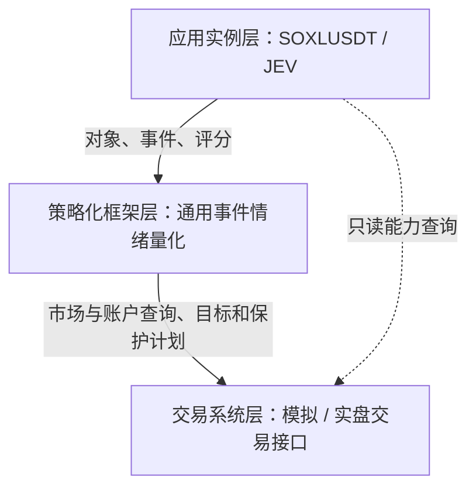

# Factorforge v2.0 文档基线

版本：2.0；日期：2026年10月4日。变更原因：按功能要求与代码设计的职责拆分文档，并将 v1.1 重组为由下至上的三层。

## 阅读顺序与一一对应关系

| 层 | 功能要求 | 对应代码设计 |
| --- | --- | --- |
| 交易系统层 | [01_交易系统层式样书](01_交易系统层式样书.md) | [01_交易系统层设计书](01_交易系统层设计书.md) |
| 策略化框架层 | [02_策略化框架层式样书](02_策略化框架层式样书.md) | [02_策略化框架层设计书](02_策略化框架层设计书.md) |
| 应用实例层 | [03_SOXLUSDT_JEV应用实例式样书](03_SOXLUSDT_JEV应用实例式样书.md) | [03_SOXLUSDT_JEV应用实例设计书](03_SOXLUSDT_JEV应用实例设计书.md) |

上述六本正文及[开发规划书](开发规划书.md)各有同名 Word 文件。另见[v1.1需求迁移与待决事项](v1.1需求迁移与待决事项.md)，用于检查规则没有在拆层时遗漏，不替代新版式样书。

## 依赖与运行

应用实例层 → 策略化框架层 → 交易系统层。应用实例可只读查询交易层的市场及账户能力，所有事件策略的目标仓位经框架提交给交易层。每层自己的数据库、时钟、进程、外部数据端口属于该层的运行设施，不属于对上层的依赖。

交易层独立启动后，可以经自身接口或命令入口获取行情、挂单、撤单、设置止损、查仓位和恢复对账；不需安装策略包。框架层加上交易层后，可以通过手工或固定夹具创建对象、事件及评分，完成量化、模拟执行、观察归因和学习；不需应用包、联网搜索或任何模型。应用层在下两层之上配置 SOXLUSDT 与 JEV，完成采集、搜索、评分和自动编排。

下层通过通用对象标识、交易能力、价格代理和有单位的评分数据兼容未来策略及实例。交易层不解释新闻和情绪；框架层不选择具体标的、模型、搜索供应商或真实 Prompt。实例特有的行业关系、市场日历及交易额度由应用配置绑定通用能力。

## v1.1 结构调整

v1.1 的 Core/Upper 划分不延续为 v2.0 的代码依赖。搜索、证据抽取、JEV及其分析任务迁至应用层；确定性评分准入、情绪、目标与学习迁至框架层；最终账户风控、执行和恢复迁至交易层。原有公共 API 权限与内部信号资格物理分离，以及研究/交易任务资源隔离继续保留。应用是受限的评分生产者，不能自己授予实盘资格或越过最终风控。

4000/400 USDT、全天时基运行、非传统时段双次数规则、模拟账户级亏损保护只观察、实盘保护启用、白名单参数门控后自动生效，均保留在对应式样中。业务阶段 R0～R4 继续使用；开发规划阶段 P1～P5 是工程顺序，两者不是同一概念。

## 实施约定

生成代码时先读本索引、目标层式样书及其设计书，再读该层所用下层接口。设计书每项 S 编号映射到实现章节及 T 验收编号。禁止通过反向引用上层包解决下层缺失能力；下层如需新通用能力，先补该层式样和对应设计。演示数值仅用于夹具，未标定配置用 REQUIRED_UNSET，能力不明用 UNKNOWN，实验配置用 EXPERIMENT_ONLY。各层相关未决项只阻塞依赖它的功能或阶段，不阻塞离线骨架。

目前只交付文档重构。供应商协议冻结、机器接口契约、数据库迁移和运行实现按规划落地；根目录旧 contracts 继续按 v1.1 校验，不能宣称已有 v2.0 服务器。
